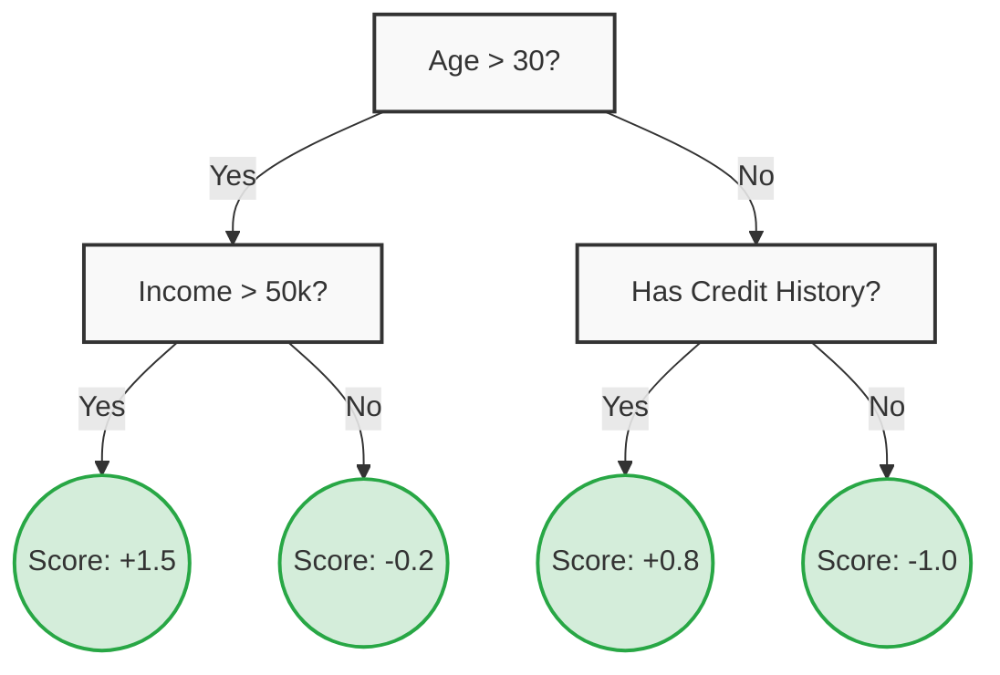
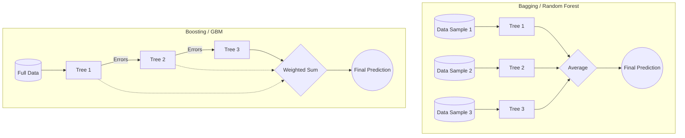

# 01 - Theory Foundations: The Pre-Requisites for XGBoost

Before diving into Extreme Gradient Boosting (XGBoost), it is crucial to understand the foundational algorithms it builds upon: **Decision Trees** and **Ensemble Learning (Bagging vs. Boosting)**. 

This module takes a rigorous, hands-on approach by building these concepts from scratch.

## 1. Decision Trees (CART)
XGBoost is fundamentally an ensemble of Classification and Regression Trees (CART). Unlike standard decision trees that output categorical classes directly, CARTs assign real-valued scores in each of their leaves, regardless of whether the final task is classification or regression.

- **Root Node**: Represents the entire dataset.
- **Internal Nodes**: Represent splitting rules (e.g., `Age > 30`).
- **Leaf Nodes**: Contain the final output values (scores).

**How do trees learn?**
Trees learn by greedily finding splits that maximize information gain or minimize impurity:
- **Regression (MSE)**: Minimizes the Mean Squared Error (variance) in the child nodes.
- **Classification (Gini Impurity)**: Minimizes the probability of misclassification.

## 2. Ensemble Learning: The Wisdom of the Crowd
A single decision tree is prone to **overfitting** (high variance). It tends to memorize the training data. Ensemble methods combine multiple "weak learners" to create a single "strong learner".

- **Bagging (Bootstrap Aggregating)**: Trains multiple independent trees in *parallel* on random subsets of the data (with replacement). Reduces variance (e.g., Random Forest).
- **Boosting**: Trains trees *sequentially*. Each new tree tries to correct the errors (residuals) made by the previous trees. Reduces bias and variance. (e.g., Gradient Boosting).

## 3. Gradient Boosting Machines (GBM)
GBM is the core framework that XGBoost optimizes. Instead of tweaking the weights of misclassified instances (like AdaBoost), GBM fits new models to the **residuals** (the errors) of the previous models.

**The Intuition:**
1. We want to predict target $Y$.
2. Our first model, $F_0(x)$, predicts a baseline (e.g., the mean of $Y$).
3. We calculate the residual error: $r_1 = Y - F_0(x)$.
4. We train a new tree, $T_1(x)$, not to predict $Y$, but to predict the residual $r_1$.
5. Our new model is $F_1(x) = F_0(x) + \eta T_1(x)$, where $\eta$ is the learning rate.

By repeatedly adding trees that predict the remaining errors, the ensemble gradually converges to the true target $Y$. 

> **Note**: Why does XGBoost exist if GBM already does this? 
> Standard GBM is slow and prone to overfitting. XGBoost introduces Second-Order Taylor Expansions, hardware optimization (cache-awareness), and robust regularization to solve these problems (covered in Module 02).

---

## 💻 Module Contents (Code)

To truly master these concepts, we have built them from scratch in pure Python:

1. [01_decision_trees_from_scratch.ipynb](./01_decision_trees_from_scratch.ipynb)
   - Implements both a `DecisionTreeRegressor` (using MSE) and a `DecisionTreeClassifier` (using Gini Impurity) in pure Python and NumPy.
   - Includes visual tests on toy datasets and the famous Iris dataset.

2. [02_gradient_boosting_intuition.ipynb](./02_gradient_boosting_intuition.ipynb)
   - Demonstrates a simple Gradient Boosting Machine (GBM) step-by-step.
   - Visually and programmatically shows the core concept of training a baseline, calculating residuals, fitting a weak learner to the residuals, and updating predictions in a loop.

## 📚 Seminal Reading

For a deeper dive into the original mathematics behind Gradient Boosting, we highly recommend:
- **Jerome H. Friedman (2001):** *"Greedy Function Approximation: A Gradient Boosting Machine"*. The original paper that laid the theoretical groundwork for GBMs.
