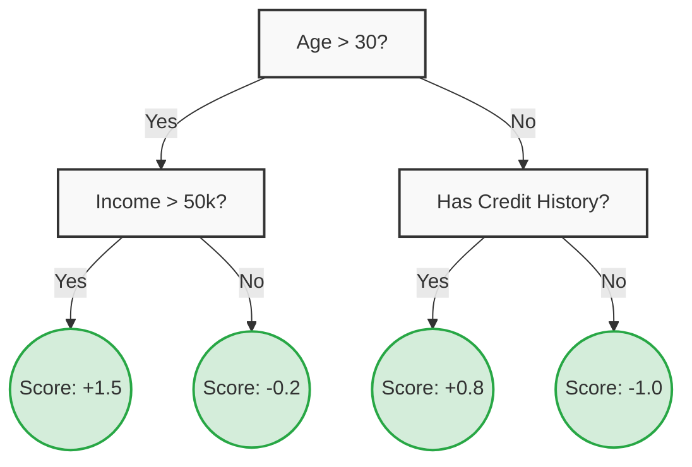
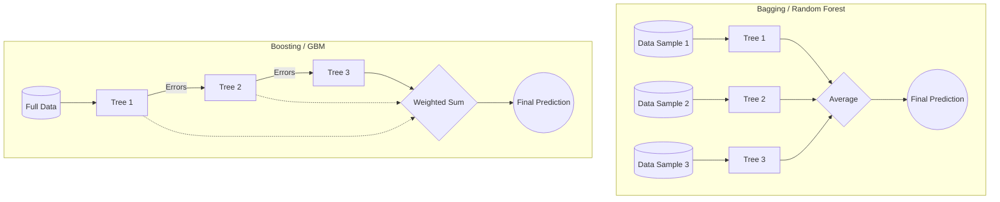

# 01 - Theory Foundations: The Pre-Requisites for XGBoost

Before diving into Extreme Gradient Boosting (XGBoost), it is crucial to understand the foundational algorithms it builds upon: **Decision Trees** and **Ensemble Learning (Bagging vs. Boosting)**. 

This module takes a rigorous, hands-on approach by building these concepts from scratch.

## 1. Decision Trees (CART)
XGBoost is fundamentally an ensemble of Classification and Regression Trees (CART). Unlike standard decision trees that output categorical classes directly, CARTs assign real-valued scores in each of their leaves, regardless of whether the final task is classification or regression.

### How do trees learn?
Trees learn by greedily finding splits that maximize information gain or minimize impurity:
- **Regression (MSE)**: Minimizes the Mean Squared Error (variance) in the child nodes.
- **Classification (Gini Impurity)**: Minimizes the probability of misclassification.

### Feature Importance (Interpretability)
One of the most powerful aspects of tree-based models is interpretability. Every time a feature is used to split a node, it decreases the impurity of the tree. By tracking the total decrease in impurity attributed to each feature across the entire tree, we can calculate **Feature Importance** mathematically. 

### Tree Regularization
Left unchecked, a decision tree will perfectly memorize the training data, leading to massive overfitting. We control this using hyperparameters like `max_depth` (limiting how deep the tree grows) and `min_samples_split` (requiring a minimum number of samples to allow a split).

## 2. Ensemble Learning: The Wisdom of the Crowd
Because single trees are prone to high variance, we use ensemble methods to combine multiple "weak learners" into a single "strong learner".

- **Bagging (Bootstrap Aggregating)**: Trains multiple independent trees in *parallel* on random subsets of the data. Reduces variance (e.g., Random Forest).
- **Boosting**: Trains trees *sequentially*. Each new tree tries to correct the errors made by the previous trees. Reduces bias and variance (e.g., Gradient Boosting).

## 3. Gradient Boosting Machines (GBM)
GBM is the core framework that XGBoost optimizes. Instead of tweaking the weights of misclassified instances (like AdaBoost), GBM fits new models to the **residuals** (the errors) of the previous models.

**The Math of "Gradient":**
Why is it called *Gradient* boosting? If our loss function is Mean Squared Error $L(y, \hat{y}) = \frac{1}{2}(y - \hat{y})^2$, taking the negative derivative (gradient) of this loss with respect to our prediction gives us exactly the residual: $y - \hat{y}$. 
Therefore, by predicting the residual, we are mathematically performing **Gradient Descent in Function Space**.

**The Intuition:**
1. Our first model, $F_0(x)$, predicts a baseline (the mean of target $Y$).
2. We calculate the negative gradient (residual): $r_1 = Y - F_0(x)$.
3. We train a new tree, $T_1(x)$, to predict the residual $r_1$.
4. We update our model: $F_1(x) = F_0(x) + \eta T_1(x)$, where $\eta$ is the **Learning Rate (Shrinkage)**. Shrinkage acts as a powerful regularizer, scaling down the contribution of each tree to prevent overfitting.

> **Note**: Why does XGBoost exist if GBM already does this? 
> Standard GBM is slow and its simple gradient trick only works easily for MSE. XGBoost introduces Second-Order Taylor Expansions to allow for *any* custom loss function, plus heavy hardware optimization (cache-awareness, histograms) to run exponentially faster (covered in Module 02).

---

## 💻 Module Contents (Code)

To truly master these concepts, we have built them entirely from scratch in pure Python:

1. [01_decision_trees_from_scratch.ipynb](./01_decision_trees_from_scratch.ipynb)
   - Implements both a `DecisionTreeRegressor` and a `DecisionTreeClassifier` from scratch.
   - Mathematically tracks and plots **Feature Importances** during training.
   - Tests the from-scratch models visually on toy datasets and the famous Iris dataset.

2. [02_gradient_boosting_intuition.ipynb](./02_gradient_boosting_intuition.ipynb)
   - Discards `scikit-learn` entirely to build a Gradient Boosting Machine using our custom from-scratch tree regressor.
   - Mathematically proves that calculating residuals is equivalent to performing gradient descent.
   - Runs an experiment plotting a GBM with a high learning rate ($\eta=1.0$) vs a low learning rate ($\eta=0.1$) to visually demonstrate how shrinkage prevents overfitting.

## 📚 Seminal Reading

For a deeper dive into the original mathematics behind Gradient Boosting, we highly recommend:
- **Jerome H. Friedman (2001):** *"Greedy Function Approximation: A Gradient Boosting Machine"*. The original paper that laid the theoretical groundwork for GBMs.
