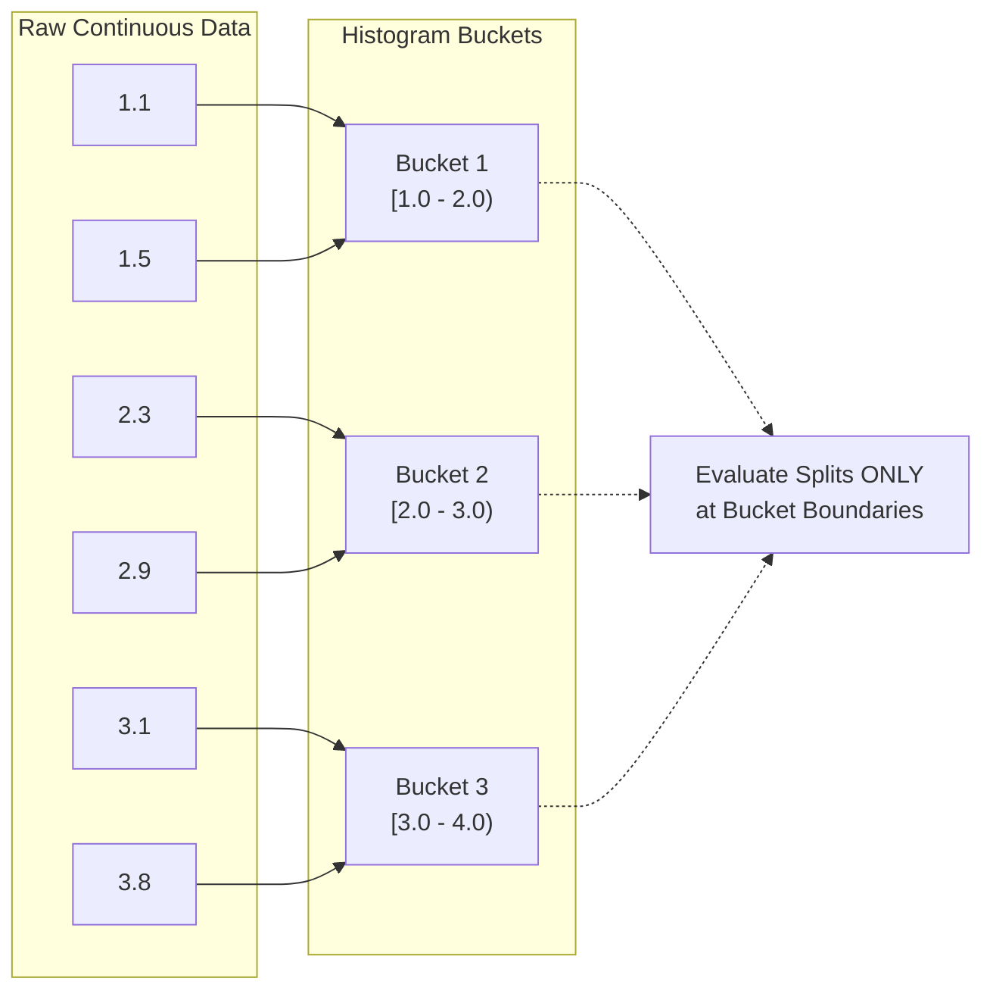
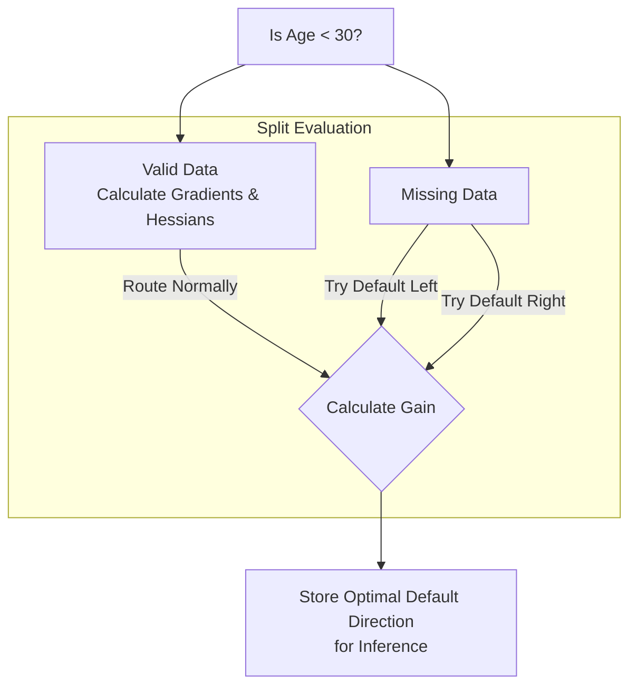

# 02 - XGBoost Core Mechanics: The Mathematics of Authority

To truly master XGBoost, you must understand the mathematical formulations and systems engineering that make it distinct from traditional Gradient Boosting.

## 1. The Regularized Objective Function

In standard machine learning, we optimize a loss function $L(\theta)$. XGBoost optimizes a **regularized objective function**:

$$ \text{Obj}(\theta) = L(\theta) + \Omega(\theta) $$

- **Training Loss $L(\theta)$**: Measures how well the model fits the training data (e.g., MSE, Log Loss).
- **Regularization $\Omega(\theta)$**: Penalizes the complexity of the model to prevent overfitting.
  $$ \Omega(f) = \gamma T + \frac{1}{2} \lambda \sum_{j=1}^{T} w_j^2 $$
  Where $T$ is the number of leaves in the tree, $w_j$ are the leaf weights (scores), $\gamma$ controls the penalty for adding a new leaf (pruning), and $\lambda$ is L2 regularization on leaf weights.

## 2. Second-Order Taylor Expansion

Standard GBM uses the first-order gradient of the loss function (the residuals). XGBoost uses a **second-order Taylor expansion** to approximate the loss function, which converges faster and natively allows for *any* twice-differentiable custom loss function.

For a given prediction at step $t$, the simplified objective for a tree is:
$$ \text{Obj}^{(t)} = \sum_{j=1}^T \left[ \left(\sum_{i \in I_j} g_i\right) w_j + \frac{1}{2} \left(\sum_{i \in I_j} h_i + \lambda\right) w_j^2 \right] + \gamma T $$

Where:
- $g_i$: First-order derivative (**Gradient**) of the loss.
- $h_i$: Second-order derivative (**Hessian**) of the loss.
- $I_j$: The set of indices of data points that fall into leaf $j$.

From this, the optimal weight $w_j^*$ for leaf $j$ is analytically solved as:
$$ w_j^* = - \frac{\sum_{i \in I_j} g_i}{\sum_{i \in I_j} h_i + \lambda} $$

> **Intuition**: Notice how L2 Regularization ($\lambda$) sits in the denominator. A larger $\lambda$ mathematically forces the final leaf weight to shrink closer to zero, heavily regularizing the tree!

## 3. The Gain (Tree Splitting Criterion)

XGBoost evaluates a potential split by calculating the reduction in the objective function, called the **Gain**:

$$ \text{Gain} = \frac{1}{2} \left[ \frac{(\sum_{L} g_i)^2}{\sum_{L} h_i + \lambda} + \frac{(\sum_{R} g_i)^2}{\sum_{R} h_i + \lambda} - \frac{(\sum_{I} g_i)^2}{\sum_{I} h_i + \lambda} \right] - \gamma $$

If $\text{Gain} > 0$, the split is kept. Otherwise, it is pruned. The $\gamma$ parameter acts as the exact threshold the Gain must overcome!

---

## 4. Engineering Marvels (Why XGBoost is Fast)

XGBoost isn't just math; it's heavily optimized systems engineering.

### Approximate Algorithm (Histograms)
Standard trees sort all continuous data to find exact splits ($O(n \log n)$). XGBoost groups features into discrete bins (histograms), reducing the search space to $O(\text{bins})$.

### Sparsity-Aware Split Finding
Real-world data has missing values. Instead of imputing them, XGBoost natively learns the best "default direction" for missing data by calculating the Gain when sending all missing values to the left, and then to the right, picking the best one.

### Column Blocks for Parallel Learning
Standard trees sort data at every single node to find the best split, which is painfully slow. XGBoost sorts the data *once* before training begins and stores it in compressed, in-memory units called **Blocks**. This allows the algorithm to distribute the split-finding process across all available CPU cores in parallel!

## 💻 Module Contents (Code)

1. [core_math_and_custom_loss.ipynb](./core_math_and_custom_loss.ipynb)
   - Discards standard MSE to solve a real business problem using an **Asymmetric Custom Loss Function**.
   - Derives the exact Gradients and Hessians required by XGBoost.
   - Shows how custom objectives fundamentally change the model's predictive behavior.
   - Includes a manual calculation of "Gain" using raw Hessians and Gradients.
