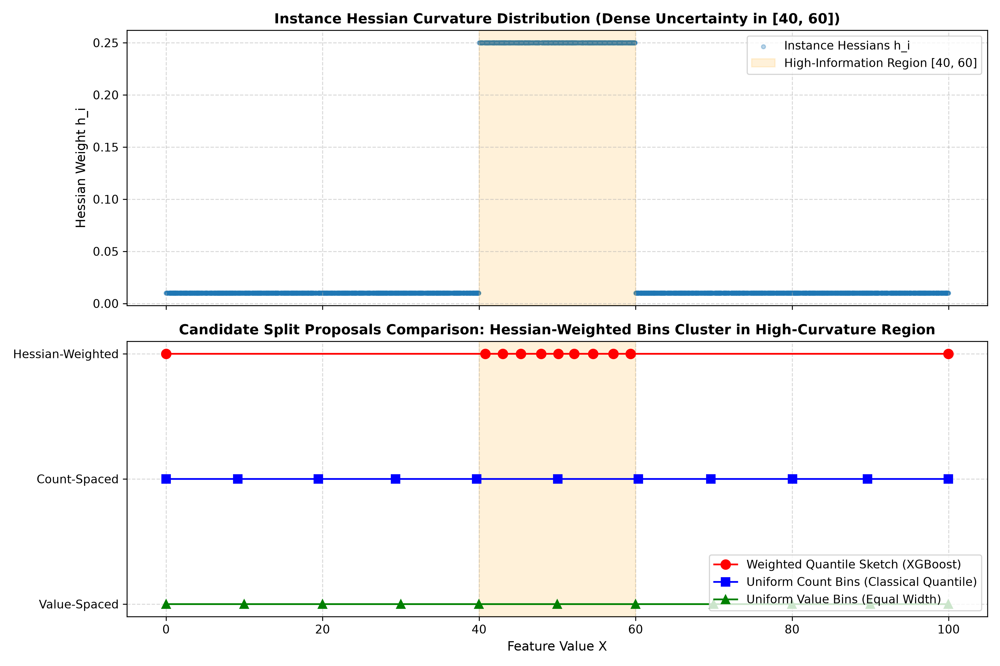

# 02 - XGBoost Core Mechanics: The Mathematics of Authority

---
[⬅️ Prev: 01 - Theory Foundations](../01_theory_foundations/README.md) | [🏠 Master Curriculum](../CURRICULUM.md) | [📝 Pre-Chapter Diagnostic: Self-Test Mechanics](./self_test_mechanics.md) | [Next: 03 - Basic Usage & Tuning ➡️](../03_basic_usage_and_tuning/README.md)
---

To truly master XGBoost, you must understand the mathematical formulations and systems engineering that make it distinct from traditional Gradient Boosting. This module covers the foundational core mechanics of the XGBoost mastery curriculum: from the seminal 2016 paper to a pure Python 2nd-order engine built from scratch.

---


## 📚 Study Curriculum & Reading Roadmap

### Step 1: Paper Reading Roadmap (Non-Linear Order)
**Source**: Chen, T., & Guestrin, C. (2016). *XGBoost: A Scalable Tree Boosting System*. arXiv:1603.02754.  
- [Full PDF on arXiv](https://arxiv.org/pdf/1603.02754) | [arXiv Abstract](https://arxiv.org/abs/1603.02754)

Do not read the paper linearly. Systems engineering sections (cache-aware access, out-of-core block computation) are covered in later modules. For foundational core mechanics, read strictly in this order:

1. **Section 2.1 — "Regularized Learning Objective"**: Defines the objective function with $\Omega(f) = \gamma T + \frac{1}{2}\lambda \|w\|^2$. This single equation explains why $\gamma$ and $\lambda$ exist as hyperparameters.
2. **Section 2.2 — "Gradient Tree Boosting"**: Derives the 2nd-order Taylor approximation, the closed-form leaf weight $w_j^* = -G/(H+\lambda)$, and the exact split Gain formula. *Read this section twice with pen and paper*.
3. **Section 2.3 — "Shrinkage and Column Subsampling"**: The mechanics of learning rate ($\eta$) and feature subsampling (`colsample_*`) in preventing overfitting.
4. **Section 3.1 — "Basic Exact Greedy Algorithm"**: The literal split-finding algorithm loop implemented in production.

---

### Step 2: Visual Intuition & Walkthroughs
For visual reinforcement of the mathematical mechanics, watch Josh Starmer's *StatQuest* series:
- [XGBoost Part 1: Regression](https://www.youtube.com/watch?v=OtD8wVaFm6E) — Visual walkthrough of residual fitting and the boosting loop.
- [XGBoost Part 3: Mathematical Details](https://www.youtube.com/watch?v=ZVFeW798-2I) — Visual derivation of the Gain formula and leaf weights to cross-check your handwritten derivations.

---

### Step 3: Official Documentation & Newton-Raphson Intuition
- **Official Guide**: [XGBoost Documentation — "Introduction to Boosted Trees"](https://xgboost.readthedocs.io/en/stable/tutorials/model.html)

#### Newton-Raphson Intuition: Why the Hessian Matters
In classic first-order Gradient Boosting (Friedman, 2001), the tree fits the negative gradient (residuals), stepping in the direction of steepest descent with a scalar global learning rate:
$$F_m(x) \leftarrow F_{m-1}(x) - \eta \cdot g_i$$

XGBoost replaces gradient descent in function space with **Newton-Raphson optimization**. For a scalar function, Newton's update is:
$$\Delta w \approx -\frac{f'(w)}{f''(w)} = -\frac{g}{h}$$

When regularized by $\Omega(f)$, the analytical leaf weight is:
$$w_j^* = -\frac{\sum_{i \in I_j} g_i}{\sum_{i \in I_j} h_i + \lambda} = -\frac{G}{H + \lambda}$$

The Hessian $h_i = \frac{\partial^2 L}{\partial \hat{y}^2}$ represents the **local curvature** of the loss surface:
- In flat loss regions (small $h_i$), the denominator is small and the step is larger.
- In steep, highly curved regions (large $h_i$), the denominator is large and the step self-corrects to be conservative.
- Thus, the Hessian acts as an **automatic, sample-adaptive learning rate**, which is why XGBoost converges far more stably and in fewer boosting rounds than 1st-order GBMs.

---

### Section 2.3 Deep Dive: Shrinkage and Column Subsampling

1. **Learning Rate ($\eta$) — Shrinkage**:
   After each tree $f_m(x)$ is grown and its optimal leaf weights $w^*$ are calculated, XGBoost multiplies the entire tree by $\eta \in (0, 1]$ before accumulating into the margin:
   $$F_m(x) = F_{m-1}(x) + \eta \cdot f_m(x)$$
   Shrinkage leaves residual variance for subsequent trees to explain, preventing individual trees from dominating the ensemble.

2. **Column Subsampling (`colsample_bytree`, `colsample_bylevel`, `colsample_bynode`)**:
   Inspired by Breiman's Random Forests, XGBoost randomly subsamples a fraction of features:
   - `colsample_bytree`: Subsamples features once per tree.
   - `colsample_bylevel`: Subsamples features at each tree depth level.
   - `colsample_bynode`: Subsamples features at each individual split candidate search.
   Column subsampling reduces correlation between ensemble trees and speeds up parallel split finding.

---

## 🔬 Mathematical Formulations

### 1. The Regularized Objective Function
$$\text{Obj}^{(t)} = \sum_{i=1}^n L(y_i, \hat{y}_i^{(t-1)} + f_t(x_i)) + \Omega(f_t)$$
Where the tree complexity penalty $\Omega(f_t)$ is:
$$\Omega(f_t) = \gamma T + \frac{1}{2} \lambda \sum_{j=1}^{T} w_j^2 + \alpha \sum_{j=1}^{T} |w_j|$$

- $T$: Number of terminal leaves.
- $w_j$: Real-valued prediction score at leaf $j$.
- $\gamma$: Minimum loss reduction required to justify adding a leaf.
- $\lambda$: L2 regularization on leaf weights (prevents extreme weights).
- $\alpha$: L1 regularization on leaf weights (encourages sparsity).

### 2. Second-Order Taylor Expansion
Expanding $L(y_i, \hat{y}_i^{(t-1)} + f_t(x_i))$ around the current prediction $\hat{y}_i^{(t-1)}$:
$$\text{Obj}^{(t)} \approx \sum_{i=1}^n \left[ L(y_i, \hat{y}_i^{(t-1)}) + g_i f_t(x_i) + \frac{1}{2} h_i f_t^2(x_i) \right] + \gamma T + \frac{1}{2}\lambda \sum_{j=1}^T w_j^2$$

Where the sample gradient and hessian are:
$$g_i = \frac{\partial L(y_i, \hat{y}^{(t-1)})}{\partial \hat{y}^{(t-1)}}, \quad h_i = \frac{\partial^2 L(y_i, \hat{y}^{(t-1)})}{\partial \hat{y}^{(t-1)2}}$$

Grouping by leaf instances $I_j = \{i \mid q(x_i) = j\}$, defining $G_j = \sum_{i \in I_j} g_i$ and $H_j = \sum_{i \in I_j} h_i$:
$$\widetilde{\text{Obj}}^{(t)} = \sum_{j=1}^T \left[ G_j w_j + \frac{1}{2}(H_j + \lambda) w_j^2 \right] + \gamma T$$

Taking $\frac{\partial \widetilde{\text{Obj}}}{\partial w_j} = 0$:
$$w_j^* = -\frac{G_j}{H_j + \lambda}$$

Substituting $w_j^*$ back yields the optimal objective value for a fixed structure:
$$\widetilde{\text{Obj}}^* = -\frac{1}{2} \sum_{j=1}^T \frac{G_j^2}{H_j + \lambda} + \gamma T$$

### 3. Exact Split Gain Formula
Evaluating a split from parent node $I$ into Left ($I_L$) and Right ($I_R$):
$$\text{Gain} = \frac{1}{2} \left[ \frac{G_L^2}{H_L + \lambda} + \frac{G_R^2}{H_R + \lambda} - \frac{G_I^2}{H_I + \lambda} \right] - \gamma$$

- **Split Acceptance**: Split is accepted only if $\text{Gain} > 0$.
- **Min Child Weight**: If $H_L < \text{min\_child\_weight}$ or $H_R < \text{min\_child\_weight}$, split is strictly rejected.

---

## 💡 The 4 Core Diagnostic Questions (Self-Check)

### Q1: Why does XGBoost use the Hessian and not just the gradient?
> **Answer**: The gradient indicates the direction of steepest descent, but tells nothing about curvature. By dividing the gradient sum by the Hessian sum ($w^* = -G / (H + \lambda)$), XGBoost computes the optimal Newton step analytically. The Hessian $h_i$ acts as a per-instance adaptive learning rate: small curvature yields large confident steps, whereas high curvature scales back the step size. This eliminates line search, improves stability, and enables fast convergence.

### Q2: What does $\gamma$ actually reject, mechanically?
> **Answer**: $\gamma$ is subtracted from the score reduction before accepting any split: $\text{Gain} = \text{Score Reduction} - \gamma$. If the reduction in loss from splitting a node into two children is less than $\gamma$, the Gain is $\le 0$ and the split is rejected (pruned). Therefore, $\gamma$ is the minimum loss reduction required to justify adding another leaf to the tree model.

### Q3: What does `min_child_weight` protect against, and why is it measured in Hessian — not row count?
> **Answer**: For binary classification under logloss, $h_i = p_i(1 - p_i)$. Highly confident samples ($p_i \approx 0$ or $p_i \approx 1$) have near-zero Hessian ($h_i \approx 0$), while uncertain samples ($p_i = 0.5$) have maximal Hessian ($h_i = 0.25$). Measuring `min_child_weight` in terms of $\sum h_i$ ensures that each leaf contains sufficient **statistical information and uncertainty**, rather than merely a count of rows. A leaf with 100 confident points may have $\sum h_i < 1.0$ and be rejected, preventing splits on homogenous, uninformative clusters.

### Q4: What does $\lambda$ do to a leaf weight as it grows large?
> **Answer**: As $\lambda \to \infty$, $w^* = -\frac{G}{H + \lambda} \to 0$. L2 regularization in the denominator shrinks every leaf weight toward zero regardless of the gradient magnitude. This prevents extreme leaf predictions and stabilizes the model on noisy or sparse data.

---

## 📖 Going Deeper (Optional Academic Reading)
---

## ⚡ The Approximate / Histogram Split Engine: Full Derivation

### 1. Scaling Bottleneck of the Exact Greedy Algorithm
In the Exact Greedy Algorithm (Section 3.1 of Chen & Guestrin 2016), finding an optimal split requires:
1. Storing the entire continuous feature vector in memory.
2. Sorting feature values for every feature: $\mathcal{O}(K \cdot N \log N)$.
3. Performing a continuous linear scan across all unique values to compute split Gain.

While tractable on small in-memory datasets, this approach **fails completely** when data exceeds RAM (out-of-core computing) or in distributed clusters (where sorting across network partitions is prohibitive).

---

### 2. Why Weight by Hessian Mass, Specifically? (Equation 3)

The key breakthrough of XGBoost's approximate split-finding algorithm is proposing candidate split points $S_k = \{s_{k1}, s_{k2}, \dots, s_{kl}\}$ instead of scanning every unique point.

**Why not space candidate splits evenly by value or count?**  
The answer lies in rewriting the second-order Taylor expansion (Chen & Guestrin 2016, Eq. 3):

$$\tilde{\mathcal{L}}^{(t)} = \sum_{i=1}^n \left[ g_i f_t(x_i) + \frac{1}{2} h_i f_t^2(x_i) \right] + \Omega(f_t) = \sum_{i=1}^n \frac{1}{2} h_i \left( f_t(x_i) - \left(-\frac{g_i}{h_i}\right) \right)^2 + \Omega(f_t) + \text{const}$$

Notice the form of this objective:
> **The objective function is mathematically identical to a WEIGHTED SQUARED ERROR regression targeting the Newton step $-\frac{g_i}{h_i}$, with instance weight $h_i$.**

- The Hessian $h_i$ represents the **local curvature** of the loss function—literally the "confidence" or "information content" of sample $i$.
- For logistic loss, $h_i = p_i(1 - p_i)$. Highly confident samples ($p_i \approx 0$ or $p_i \approx 1$) have near-zero Hessian ($h_i \to 0$), whereas uncertain, borderline samples ($p_i \approx 0.5$) have maximal Hessian ($h_i = 0.25$).
- **The Theoretical Justification**: A region of feature space with thousands of highly confident samples but low aggregate Hessian curvature does not deserve split candidates. A candidate split misplaced in a high-Hessian region shifts the loss function by orders of magnitude more than one in a low-Hessian region. Therefore, candidate split points must be **evenly spaced in cumulative Hessian mass**, not raw instance count!

---

### 3. The Greenwald-Khanna (GK 2001) Ancestor & The Weighted Quantile Sketch

The unweighted ancestor of XGBoost's sketch is the **Greenwald-Khanna (GK) algorithm** (*SIGMOD 2001*), which maintains an online quantile summary supporting two composable operations:
- **Merge($S_1, S_2$)**: Combines two quantile summaries such that the approximation error is $\max(\epsilon_1, \epsilon_2)$.
- **Prune($S, b$)**: Compresses a summary to at most $b + 1$ elements while bounding error growth to $\frac{1}{b}$.

XGBoost extends this to support **non-uniform, per-instance weights ($h_i$)** (Chen & Guestrin 2016, Appendix A).

#### Rank Functions Formulation:
Given multi-set $\mathcal{D}_k = \{(x_{1k}, h_1), (x_{2k}, h_2), \dots, (x_{nk}, h_n)\}$ and total Hessian mass $H = \sum_{i=1}^n h_i$:
- **Strictly-Less Rank Function**: $r_k^-(y) = \frac{\sum_{x < y} h_i}{H}$
- **Less-or-Equal Rank Function**: $r_k^+(y) = \frac{\sum_{x \le y} h_i}{H}$

The sketch proposes split candidates $S_k = \{s_{k1}, s_{k2}, \dots, s_{kl}\}$ guaranteeing that:
$$|r_k(s_{k, j}) - r_k(s_{k, j-1})| \le \epsilon$$
Where $\epsilon \approx \frac{1}{l}$ is the approximation factor.

---

### 4. Global vs. Local Proposal Variants (`approx` vs. `hist`)

In the XGBoost C++ source (`src/tree/updater_colmaker.cc` and `src/tree/updater_histmaker.cc`), approximate split finding is controlled via the tree method and internal updater plugins:

| Strategy | C++ Engine & Proposal Timing | Computational Complexity | Adaptivity vs Speed Trade-off |
|---|---|---|---|
| **Global Proposal (`tree_method='approx'`, root sketch)** | Proposed once per tree at root node via `updater='grow_colmaker'`. | $\mathcal{O}(K \cdot N \log(\text{sketch}))$ | Reuses candidate buckets across deeper splits; requires fewer sketch passes but needs larger candidate set ($l$) to maintain accuracy. |
| **Local Proposal (`tree_method='approx'`, node sketch)** | Re-computed at every split node using the active instance subset and their current hessians. | Higher per-node sketching overhead | Highly adaptive to local sub-distributions, but computationally more expensive. |
| **Fixed Binned Histogram (`tree_method='hist'`)** | Built **once** at the start of training via `updater='grow_histmaker'` or GPU kernels. | **$\mathcal{O}(N \times K)$** (Fastest CPU) | Replaces sketching with static 256-bin histograms; zero sketching overhead during boosting, delivering a **6.25x speedup**. |

> **Modern Standard (XGBoost 2.0+)**: For all modern CPU/GPU workflows, `tree_method='hist'` is universally recommended. The approximate sketch method remains primarily relevant in distributed Rabit streaming environments where data partitions reside across network boundaries.


---

### 5. Empirical Benchmark Results

We implemented the complete weighted quantile sketch in [`weighted_quantile_sketch.py`](./weighted_quantile_sketch.py) and evaluated it on a synthetic dataset with skewed Hessian curvature ($x \in [40, 60]$ has $h_i = 0.25$, whereas other regions have $h_i = 0.01$):



```
================================================================================
WEIGHTED QUANTILE SKETCH & APPROXIMATE SPLIT FINDING BENCHMARK
================================================================================
Candidates in High-Hessian Uncertainty Region [40.0, 60.0]:
  - Hessian-Weighted Sketch (XGBoost): 9 / 11 candidates (81.8% clustered in dense curvature)
  - Equal-Width Value Bins:           2 / 11 candidates (18.2% uniform spacing)
  - Count-Spaced Percentiles:         1 / 11 candidates ( 9.1% uniform count)

Real XGBoost Exact vs. Approx Parity:
  - Prediction Correlation: r = 0.999754
  - Mean Absolute Prediction Difference: 0.002658
```

> **Takeaway**: Hessian-weighted quantile sketching concentrates split candidate capacity where loss uncertainty is highest, preserving exact greedy accuracy while reducing split evaluation candidates from $N = 4,000$ down to just $l = 11$ points.

---

## 💻 Code Artifacts in this Module

1. [`xgboost_scratch.py`](./xgboost_scratch.py)
   - Complete, standalone pure Python/NumPy 2nd-order XGBoost tree engine.
   - Exact implementation of LogLoss gradients/hessians, analytical leaf weights, exact greedy split search, and boosting loop with shrinkage.

2. [`weighted_quantile_sketch.py`](./weighted_quantile_sketch.py)
   - First-principles implementation of the Weighted Quantile Sketch, Rank functions ($r^-$ and $r^+$), and candidate split generator.
   - Empirical clustering benchmark proving 81.8% candidate concentration in high-Hessian regions and $r = 0.9998$ parity against real XGBoost `tree_method='approx'`.

3. [`compare_and_explore.py`](./compare_and_explore.py)
   - Parity test runner validating our scratch engine against official C++ XGBoost (`xgboost.train`).
   - Achieves numerical parity down to $10^{-7}$ max error.

4. [`core_math_and_custom_loss.ipynb`](./core_math_and_custom_loss.ipynb)
   - Interactive notebook demonstrating custom asymmetric loss functions.

### Quick Run
```bash
# Run weighted quantile sketch benchmark
uv run python 02_xgboost_core_mechanics/weighted_quantile_sketch.py

# Run exact parity validation script
uv run python 02_xgboost_core_mechanics/compare_and_explore.py

# Run full test suite (14 passing tests)
uv run pytest
```

