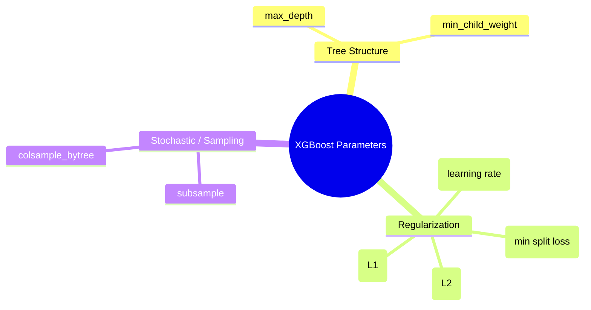

# 03 - Basic Usage and Hyperparameter Tuning

Now that we understand the math, it's time to map it to the API and practical usage. XGBoost is incredibly powerful, but its default parameters are rarely optimal for your specific dataset.

## 1. Native Optimizations (DMatrix & Categoricals)

XGBoost is heavily optimized for speed and memory efficiency, provided you use its native features:

- **`DMatrix`**: The internal data structure that XGBoost uses. It is highly recommended to explicitly convert your Pandas DataFrames or Numpy arrays into `xgb.DMatrix` before training.
- **Native Categorical Support**: Historically, machine learning engineers had to One-Hot Encode categorical variables (creating hundreds of sparse, memory-hogging columns). Modern XGBoost natively supports categorical splits. By setting `enable_categorical=True`, XGBoost handles Pandas `category` dtypes directly, finding optimal splits mathematically without exploding memory.

## 2. The Core Hyperparameters

XGBoost has many hyperparameters, but they can be logically grouped into three categories:

### Tree Structure (Complexity)
- `max_depth` (default=6): Maximum depth of a tree. Higher = more complex / prone to overfit.
- `min_child_weight` (default=1): Minimum sum of Instance Weight (Hessian) needed in a child. Higher = more conservative.

### Regularization
- `eta` / `learning_rate` (default=0.3): Step size shrinkage. After each step, we multiply the new tree's weights by `eta` to prevent overfitting.
- `gamma` / `min_split_loss` (default=0): The $\gamma$ from our math module. The minimum Gain required to make a partition.

### Stochastic / Sampling (Robustness)
- `subsample` (default=1): Ratio of training instances to randomly sample per tree. (0.8 = 80%).
- `colsample_bytree` (default=1): Ratio of features to randomly sample per tree. 

## 3. Early Stopping: The Ultimate Regularizer

Instead of guessing how many trees (`num_boost_round`) to build, we use **Early Stopping**. We provide XGBoost with a separate validation dataset. If the validation loss stops improving for $N$ consecutive rounds, training halts early. 
*Rule of thumb*: Fix a relatively high `eta` (0.1), use early stopping to find the optimal number of trees. For the final model, lower `eta` (0.01) and proportionally increase the tree count.

## 4. Tuning Strategy (Bayesian Optimization)

GridSearch is too slow and exhaustive for XGBoost's large parameter space. We use **Optuna**, a Bayesian optimization framework that:
1. Intelligently guesses the next set of parameters based on past results.
2. Uses **Pruning** to kill unpromising trials halfway through training, saving massive amounts of compute time.

---

## 💻 Module Contents (Code)

1. [tuning_guide.ipynb](./tuning_guide.ipynb)
   - Demonstrates **Native Categorical Support** on a synthetic dataset without One-Hot Encoding.
   - Shows basic `DMatrix` usage and training on a standard dataset (Breast Cancer).
   - Skips GridSearch and jumps straight to **Bayesian Optimization with Optuna**.
   - Integrates the `XGBoostPruningCallback` to demonstrate production-grade, time-saving hyperparameter tuning.
