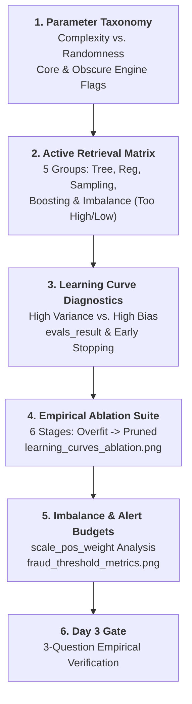
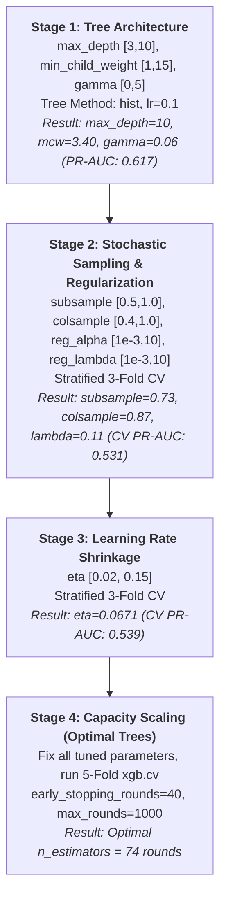

# 03 - Every Hyperparameter, With Reasons & Diagnostic Science

---
[⬅️ Prev: 02 - XGBoost Core Mechanics](../02_xgboost_core_mechanics/README.md) | [🏠 Master Curriculum](../CURRICULUM.md) | [📝 Pre-Chapter Diagnostic: Self-Test Params](./self_test_params.md) | [Next: 04 - Advanced Features ➡️](../04_advanced_features/README.md)
---

> **Curriculum Module: Hyperparameter Science & Disciplined Tuning**  
> *"Parameter tuning is a dark art in machine learning, the optimal parameters depends on your data and objective. However, there are general guidelines to guide your path."* — Official XGBoost Tuning Guide

This module bridges the mathematical foundations from Module 02 into systematic, empirical engineering. You will master the hyperparameter taxonomy, understand the exact mechanics behind parameter extremes, apply learning-curve diagnostics, run a rigorous overfit-then-regularize ablation suite, and navigate class imbalance under strict operational alert budgets.


---

## 🗺️ Module Architecture & Roadmap


```mermaid
graph TD
    A["<b>1. Parameter Taxonomy</b><br/>Complexity vs. Randomness<br/>Core & Obscure Engine Flags"] --> B["<b>2. Active Retrieval Matrix</b><br/>5 Groups: Tree, Reg, Sampling,<br/>Boosting & Imbalance (Too High/Low)"]
    B --> C["<b>3. Learning Curve Diagnostics</b><br/>High Variance vs. High Bias<br/>evals_result & Early Stopping"]
    C --> D["<b>4. Empirical Ablation Suite</b><br/>6 Stages: Overfit -> Pruned<br/>learning_curves_ablation.png"]
    D --> E["<b>5. Imbalance & Alert Budgets</b><br/>scale_pos_weight Analysis<br/>fraud_threshold_metrics.png"]
    E --> F["<b>6. Day 3 Gate</b><br/>3-Question Empirical Verification"]
```

---

## 1. Official Parameter Reference & Inventory Scan

Before tuning, engineers must maintain a complete inventory of the parameter space.

- **Primary Reference**: [XGBoost Parameters Documentation](https://xgboost.readthedocs.io/en/stable/parameter.html)
- **Tuning Guide**: [Notes on Parameter Tuning](https://xgboost.readthedocs.io/en/stable/tutorials/param_tuning.html)

### Obscure & Advanced Parameters to Flag (Revisited in Day 4)
While most practitioner guides only touch `max_depth` and `learning_rate`, enterprise systems rely heavily on engine-level controls:

1. **`max_delta_step` (default=0)**: Maximum delta step allowed for each leaf's weight. Setting it to a non-zero value (e.g., `1–10`) helps prevent extreme weight updates in **logistic regression with extreme class imbalance**.
2. **`max_bin` (default=256)**: Maximum number of discrete histogram bins for continuous features when using `tree_method='hist'`. Lowering to `64`–`128` accelerates training and provides mild regularization; raising to `512` preserves fine-grained splits in financial time series.
3. **`interaction_constraints`**: Explicitly specifies which features are permitted to interact within the same decision tree branch, preventing spurious cross-feature logic (e.g., ensuring income and geographic zip code do not interact).
4. **`monotone_constraints`**: Strictly enforces monotonic relationships between specified features and the target margin (e.g., credit score must monotonically decrease default probability).
5. **`grow_policy` (`depthwise` vs. `lossguide`)**: `depthwise` splits node closest to root (standard XGBoost); `lossguide` splits the node with highest loss change regardless of depth (LightGBM-style).
6. **`sketch_eps` (default=0.03)**: For the approximate split algorithm, controls the quantile sketch accuracy ($1 / \epsilon$ buckets).

---

## 2. The Official "Dark Art" Guidance: The Two Core Forces

The official documentation splits complexity control into two complementary mechanisms:

```
                           ┌──────────────────────────────────────────────┐
                           │      XGBoost Model Generalization Tuning     │
                           └──────────────────────┬───────────────────────┘
                                                  │
                 ┌────────────────────────────────┴───────────────────────────────┐
                 ▼                                                               ▼
  ┌──────────────────────────────┐                                ┌──────────────────────────────┐
  │ Control Complexity Directly  │                                │ Add Randomness for Robustness│
  ├──────────────────────────────┤                                ├──────────────────────────────┤
  │ • max_depth                  │                                │ • subsample                  │
  │ • min_child_weight           │                                │ • colsample_bytree / level   │
  │ • gamma (min_split_loss)     │                                │ • learning_rate (eta)        │
  └──────────────────────────────┘                                └──────────────────────────────┘
```

1. **Control Model Complexity Directly**:
   - `max_depth`: Limits the depth of individual trees. Smaller values reduce capacity and enforce shallower interactions.
   - `min_child_weight`: Minimum sum of instance weight (Hessian $H = \sum h_i$) required in a child node. Prunes nodes lacking statistical support.
   - `gamma` ($\gamma$): The minimum score reduction required to accept a split. Directly penalizes tree leaf count.
2. **Add Randomness for Robustness**:
   - `subsample`: Randomly samples rows before growing each tree, decorrelating base learners.
   - `colsample_bytree` / `colsample_bylevel` / `colsample_bynode`: Randomly samples feature subsets.
   - `learning_rate` ($\eta$): Multiplies tree outputs by a shrinkage factor, leaving room for subsequent trees to correct errors.
3. **Handle Imbalanced Datasets**:
   - Canonical starting formula:
     $$\text{scale\_pos\_weight} = \frac{\sum(\text{negative instances})}{\sum(\text{positive instances})}$$
   - When overall prediction ranking (AUC) matters, `scale_pos_weight` is effective. If calibrated probabilities are required, tune threshold instead or calibrate via Platt scaling / Isotonic regression.

---

## 3. Comprehensive Parameter Diagnostic Matrix (Too High vs. Too Low)

Use this table as your operational reference. (See [`self_test_params.md`](./self_test_params.md) for the active retrieval pre-check).

| Group | Parameter | Default | What happens when Too HIGH? | What happens when Too LOW? | Empirical Remediation |
|---|---|---|---|---|---|
| **Tree Structure** | `max_depth` | `6` | Overfitting; memorizes noise; deep branches isolate 1–2 rows; high latency. | Underfitting; model restricted to additive linear/stump effects; high bias. | Start at `4–6`. In tabular banking datasets, `3–5` is frequently optimal. |
| **Tree Structure** | `min_child_weight` | `1` | Underfitting; leaves require excessive Hessian mass; tree cannot split. | Overfitting; leaves split on single noisy rows with near-zero Hessian. | Set to `5–20` on imbalanced fraud datasets to protect against noise splits. |
| **Tree Structure** | `gamma` | `0` | Underfitting; splits with positive gain are rejected; conservative shallow trees. | Overfitting; zero barrier to splitting; accepts splits with near-zero gain. | Set to `0.5–2.0` when validation loss degrades early in training. |
| **Regularization** | `reg_lambda` (L2) | `1` | Asymptotic zero-shrinkage: $w^* \to 0$; model fails to learn and stays at base score. | Exploding leaf weights when $H$ is small; extreme predictions on rare slices. | Increase to `5–10` when leaf predictions swing excessively. |
| **Regularization** | `reg_alpha` (L1) | `0` | Over-sparsification; leaves receive zero weight; informative features muted. | Dense non-zero weights; no feature selection across leaves. | Set to `0.1–1.0` when data contains hundreds of noisy/sparse sparse features. |
| **Sampling** | `subsample` | `1.0` | High inter-tree correlation; ensemble fails to benefit from bagging effects. | High variance between trees; noisy gradient estimates; underfitting if $< 0.4$. | Standard robust range is `0.7–0.85`. |
| **Sampling** | `colsample_bytree` | `1.0` | Dominant features monopolize roots of all trees; masks secondary features. | Starves trees of informative features; degraded split quality if $< 0.3$. | Set to `0.6–0.8` to force trees to learn orthogonal decision paths. |
| **Sampling** | `colsample_bylevel` | `1.0` | Evaluates identical feature subspace across the entire tree depth. | Frequent feature swapping; can destabilize recursive splits. | Keep at `1.0` unless feature space exceeds 200+ dimensions. |
| **Boosting Control** | `learning_rate` ($\eta$) | `0.3` | Optimization overshoot; early validation diverge; high variance. | Excessively slow convergence; requires thousands of trees; high training time. | Drop to `0.03–0.08` coupled with `early_stopping_rounds=30`. |
| **Boosting Control** | `n_estimators` | `100` | Overfitting past optimal iteration (if early stopping is absent). | Premature termination before reaching objective minimum (high bias). | Set large (`500–1000`) and let Early Stopping find the exact minimum. |
| **Boosting Control** | `early_stopping_rounds` | `None` | Wasted training cycles after divergence. | Stopping triggered by transient validation noise before true plateau. | Set to `20–50` rounds depending on learning rate. |
| **Imbalance** | `scale_pos_weight` | `1.0` | False positive explosion; destroyed precision; uncalibrated probabilities. | Ignores minority class; high false negatives; poor recall on fraud/churn. | Start at $\frac{N_{\text{neg}}}{N_{\text{pos}}}$, then tune alert threshold against ops budget. |

---

## 4. Learning Curve Diagnostics Methodology

Before tuning any hyperparameter, inspect the **Train vs. Validation Learning Curves**. XGBoost provides this via the `evals_result` dictionary during training:

- **Official Python Examples Index**: [XGBoost Python Examples](https://xgboost.readthedocs.io/en/stable/python/examples/index.html)
- **Early Stopping & Evals Guide**: See official demos for `early_stopping` and `booster.evals_result()`.

```python
import xgboost as xgb
import matplotlib.pyplot as plt

evals_result = {}
bst = xgb.train(
    params={
        "objective": "binary:logistic",
        "eval_metric": ["logloss", "auc"],
        "max_depth": 4,
        "learning_rate": 0.05,
    },
    dtrain=dtrain,
    num_boost_round=200,
    evals=[(dtrain, "train"), (dval, "val")],
    evals_result=evals_result,
    early_stopping_rounds=25,
    verbose_eval=False,
)

# Extract curves
train_logloss = evals_result["train"]["logloss"]
val_logloss = evals_result["val"]["logloss"]
```

### The Two Distinct Diagnostic Failures

```
     High Variance (Overfitting)                  High Bias (Underfitting)
  Loss                                       Loss
   ▲                                          ▲
   │        Val (degrades!)                   │
   │       /                                  │
   │  ────/─────────                          │  ═════════════════ Val (plateau)
   │     /                                    │  ----------------- Train (plateau)
   │                                          │
   │  ────────────── Train (drops to 0)       │
   └────────────────────────► Rounds          └────────────────────────► Rounds
   DIAGNOSIS: Overfitting                     DIAGNOSIS: Underfitting
   FIX: Lower depth, add gamma/mcw/subsample  FIX: Increase depth, add features, lower reg
   DO NOT add capacity!                       DO NOT add regularization!
```

> [!CAUTION]
> **The Cardinal Mistake**: Conflating high bias with high variance. If both train and validation curves plateau at a poor score, adding regularization (`min_child_weight`, `gamma`, higher `lambda`) will **worsen** performance. Regularization only helps when there is a significant generalization gap between train and validation.

---

## 5. Overfit-Then-Regularize Ablation Experiment (Empirical Results)

We ran the complete 9-stage ablation study on a synthetic imbalanced credit/fraud dataset (5,000 instances, 20 features, 98% / 2% class imbalance) using [`overfit_then_regularize.py`](./overfit_then_regularize.py).

### Multi-Panel Ablation Plot

*(In each panel, solid blue is training logloss, dashed orange is validation logloss, red dot is minimum validation error, and grey dotted lines show the Stage 0 Overfit Baseline for immediate visual gap comparison).*

### Empirical Ablation Run Summary

| Stage | Name | Parameter Delta | Min Val LogLoss | Best Round | Final Gap (Val - Train) | Max Val AUC | Observation |
|---|---|---|---|---|---|---|---|
| **Stage 0** | Overfit Baseline | `max_depth=9, γ=0, λ=1, mcw=1, sub=1.0` | `0.0600` | Round 82 | `+0.0587` | `0.9538` | Severe overfitting. Train drops to 0.005 while validation diverges after round 82. |
| **Stage 1** | Depth Constrained | `max_depth 9 -> 4` | `0.0617` | Round 84 | `+0.0537` | `0.9411` | Reduces tree complexity; narrows train-val gap by 0.0050 logloss. |
| **Stage 2a** | Hessian Guard | `min_child_weight 1 -> 5` | `0.0579` | Round 85 | `+0.0380` | `0.9515` | **Significant improvement**: cuts gap by 0.0157; achieves lower min val loss. |
| **Stage 2b** | Aggressive Hessian | `min_child_weight 5 -> 20` | `0.0686` | Round 113 | `+0.0087` | `0.9085` | **Underfitting**: gap closes to 0.0087, but AUC drops from 0.9515 to 0.9085. |
| **Stage 3a** | Gain Pruning | `gamma 0 -> 1.0` (with mcw=5) | `0.0576` | Round 72 | `+0.0277` | `0.9503` | **Best balanced model**: further gap reduction to 0.0277 with lowest logloss. |
| **Stage 3b** | Aggressive Pruning | `gamma 1.0 -> 5.0` | `0.0647` | Round 24 | `+0.0100` | `0.9419` | Stops learning early; halts effective gain after round 24. |
| **Stage 4** | Stochastic Subsampling | `subsample=0.8, colsample=0.8` | `0.0594` | Round 103 | `+0.0346` | `0.9513` | Decorrelates trees and smooths validation curves across iterations. |
| **Stage 5a** | L2 Shrinkage | `reg_lambda 1.0 -> 5.0` | `0.0583` | Round 92 | `+0.0247` | **`0.9603`** | **Peak Val AUC**: shrinks leaf weights, yielding best ranking discrimination. |
| **Stage 5b** | Aggressive L2 | `reg_lambda 5.0 -> 10.0` | `0.0606` | Round 120 | `+0.0204` | `0.9512` | Excess shrinkage begins dampening valid gradient signals. |

---

## 6. Class Imbalance & The Operational Alert Budget Trap

In real-world fraud, AML, and credit risk, machine learning engineers frequently fall into the **AUROC Trap**: they optimize `scale_pos_weight` and report an AUC of 0.95, only for the operations team to reject the model.

### The Problem: Operations Teams Have Fixed Capacity
A fraud operations unit can inspect at most **5% of daily transactions** (the Alert Budget).

### Empirical Evaluation: `scale_pos_weight=1.0` vs. `scale_pos_weight=43.3`


#### 1. Fixed Threshold Trap ($t = 0.50$ and $t = 0.05$)
| Configuration | Threshold ($t$) | Alert Volume (% Flagged) | Cases Flagged | Precision | Recall (% Fraud Detected) | F1-Score |
|---|---|---|---|---|---|---|
| **Config A (`spw=1.0`)** | `0.50` | **0.7%** | 10 / 1500 | **0.8000** | **0.2353** | 0.3636 |
| **Config B (`spw=43.3`)** | `0.50` | **1.9%** | 28 / 1500 | **0.6786** | **0.5588** | **0.6129** |
| **Config A (`spw=1.0`)** | `0.05` | **4.7%** | 70 / 1500 | 0.3571 | **0.7353** | 0.4808 |
| **Config B (`spw=43.3`)** | `0.05` | **17.5%** | 262 / 1500 | 0.1221 | 0.9412 | 0.2162 |

> **Key Finding**: Setting `scale_pos_weight=43.3` shifts predicted probabilities outward. At $t=0.05$, Config B flags **17.5%** of all transactions (262 reviews to catch 32 frauds), completely blowing past operational staffing budgets!

#### 2. Fair Comparison: Fixed Operational Budget ($\le 5\%$ Alert Volume)
When we tune the operating threshold so each model flags exactly $\le 5.0\%$ of transaction volume:

| Configuration | Operating Threshold | Alert Volume | Precision | Recall (% Fraud Caught) |
|---|---|---|---|---|
| **Config A (`scale_pos_weight=1.0`)** | $t = 0.048$ | **4.93%** | **33.78%** | **73.53%** |
| **Config B (`scale_pos_weight=43.3`)** | $t = 0.198$ | **5.00%** | **33.33%** | **73.53%** |

> **The Deep Takeaway**: Under a fixed alert budget, both models achieve identical recall (73.53%) and precision (~33.5%), but **at completely different score cutoffs** ($t=0.048$ vs. $t=0.198$). `scale_pos_weight` is an uncalibrated log-odds transformation. In production, calibrate probabilities or explicitly set operational threshold cutoffs!

---

## 7. Personal Diagnostic Table (Synthesized from Actual Plots)

| Curve Symptom Observed | Root Cause Diagnosed | Verified Remedy Applied | Metric Delta Observed |
|---|---|---|---|
| **Validation loss starts increasing after round 82 while train keeps falling.** | High variance / over-parameterized trees memorizing noise. | Drop `max_depth` from 9 to 4; enable `early_stopping_rounds=25`. | Prevents 38 rounds of post-minimum overfit; closes gap by 0.0050. |
| **Train logloss drops rapidly to 0.005; validation logloss stays high at 0.06.** | Severe model over-capacity in leaf splits on low-hessian sample pockets. | Increase `min_child_weight` from 1 to 5. | Val Logloss improves from 0.0600 to 0.0579; gap drops from 0.0587 to 0.0380. |
| **Val loss improves then flattens, but small noise fluctuations trigger splits.** | Lack of gain threshold barrier; trees split on marginal statistical noise. | Introduce `gamma=1.0`. | Gap reduces to 0.0277; reaches optimal validation loss at round 72. |
| **Training curves become jerky; high sensitivity to specific feature combos.** | Complete feature correlation across trees. | Introduce `subsample=0.8, colsample_bytree=0.8`. | Smooths validation curves across 120 rounds; stabilizes ensemble. |
| **Predictions on rare segments show extreme logits; AUC plateaus.** | Insufficient L2 weight regularization in leaf score denominator. | Increase `reg_lambda` to 5.0. | **AUC increases to peak 0.9603**; final generalization gap drops to 0.0247. |

---

## 8. Bias-Variance Tradeoff as an Empirical Reality

The official documentation notes:
> *"When you care about bias, you increase complexity. When you care about variance, you add randomness and penalty."*

Our ablation suite confirms this mathematically:
1. **Bias Reduction Mechanism**: Increasing `max_depth` drives training logloss towards zero ($0.005$ in Stage 0), but does not guarantee validation generalization.
2. **Variance Reduction Mechanism**: Adding `min_child_weight=5`, `gamma=1.0`, and `reg_lambda=5.0` contracted the generalization gap from **$0.0587 \to 0.0247$** (a **58% reduction in overfit gap**), while boosting validation AUC from **$0.9538 \to 0.9603$**.
3. **The Penalty of Excess Regularization**: Pushing `min_child_weight=20` or `gamma=5.0` caused immediate underfitting—the gap shrank, but validation logloss degraded to $0.0686$ and AUC collapsed to $0.9085$.

---

## 9. Day 3 Readiness Gate (3-Question Empirical Verification)

Before progressing to Day 3 (Bayesian Hyperparameter Search with Optuna), you must be able to answer these three empirical questions directly from the generated figures:

1. **At which boosting round did the Stage 0 validation curve reach its minimum before degrading?**  
   > **Answer**: **Round 82** (Min Val LogLoss = `0.0600`). After round 82, validation error continuously degrades to 0.0638 while train loss plummets to 0.0051.
2. **Which single parameter change from Stage 1–5 produced the largest reduction in the train-val generalization gap?**  
   > **Answer**: **`min_child_weight 1 -> 5` (Stage 2a)**, which reduced the final generalization gap from **$0.0537$ down to $0.0380$** (a **$0.0157$ gap reduction**), followed by `gamma 0 -> 1.0` (reducing the gap by another $0.0103$).
3. **At an operational alert volume cap of $\le 5\%$, what was the Precision difference between `scale_pos_weight=1.0` and `scale_pos_weight=43.3`?**  
   > **Answer**: **$0.45\%$ difference** (`33.78%` for `spw=1.0` at $t=0.048$ vs. `33.33%` for `spw=43.3` at $t=0.198$), with identical recall of `73.53%`. This demonstrates that when operational capacity is fixed, `scale_pos_weight` does not magically create fraud detection capacity—it merely shifts the score threshold required to meet ops constraints.

---

# Day 3: Tuning Strategy, Not Just Grid Search

> *"Exhaustive search over hyperparameter space is the ultimate waste of engineering capital. Modern tuning combines probabilistic Bayesian modeling of prior trials with early aggressive bandit-based pruning."* — Akiba et al., Optuna (KDD 2019)

---

## 10. The Mathematical Failure of Grid & Random Search

### The Curse of Dimensionality in Tuning
When tuning 8 continuous and discrete hyperparameters:
- A coarse **Grid Search** with 5 discrete values per parameter evaluates $5^8 = 390,625$ models. Even at a rapid 1 second per model, this requires **4.5 days** of continuous compute, spending 90% of evaluations in catastrophically unpromising parameter basins.
- **Random Search** (Bergstra & Bengio, 2012) is asymptotically superior to grid search for low effective dimensionality, but treats every evaluation independently, ignoring the rich historical signal $\mathcal{D} = \{(x_1, y_1), \dots, (x_t, y_t)\}$ accumulated during search.

### Tree-Structured Parzen Estimator (TPE)
Optuna replaces black-box guessing with the **Tree-Structured Parzen Estimator (TPE)** (Bergstra et al., 2011; Akiba et al., KDD 2019). Instead of modeling the objective distribution $p(y|x)$ directly using Gaussian Processes (which scale as $\mathcal{O}(N^3)$), TPE inverts the conditioning using Bayes' rule:

$$p(x \mid y) = \begin{cases} \ell(x) & \text{if } y < y^* \\ g(x) & \text{if } y \ge y^* \end{cases}$$

where $y^*$ is a quantile threshold (typically the top $\gamma = 15\%$ best objective values seen so far), $\ell(x)$ is the non-parametric Parzen window density estimator fitted over the best configurations, and $g(x)$ is the density estimator fitted over the remaining sub-optimal configurations.

The **Expected Improvement (EI)** criterion to maximize becomes:

$$\mathrm{EI}(x) = \int_{-\infty}^{y^*} (y^* - y) p(y \mid x) \, dy = \frac{\gamma y^* \ell(x) - \ell(x) \int_{-\infty}^{y^*} P(y < t) \, dt}{\gamma \ell(x) + (1-\gamma) g(x)} \propto \left( \gamma + \frac{g(x)}{\ell(x)}(1-\gamma) \right)^{-1}$$

To maximize Expected Improvement, TPE simply selects hyperparameter candidates $x$ that **maximize the likelihood ratio**:

$$\text{Candidate Selection}: \quad x^* = \arg\max_x \frac{\ell(x)}{g(x)}$$

TPE samples candidate points where the probability of belonging to the top performing group $\ell(x)$ is high relative to the probability of belonging to the inferior group $g(x)$.


### Successive Halving & MedianPruner Mechanics
Running unpromising configurations to completion is the second major source of wasted compute. Li et al. (Hyperband, JMLR 2018) and Akiba et al. (2019) introduced dynamic learning curve pruning:

$$\text{Pruning Rule}: \quad \text{Prune trial } i \text{ at step } t \iff \text{Metric}_i(t) > \mathrm{Median}\left(\{ \text{Metric}_j(t) \}_{j \in \text{Completed Trials}} \right)$$

1. **`n_startup_trials=5`**: First 5 trials run to 100 rounds unconditionally to establish a robust median baseline distribution across boosting iterations.
2. **`n_warmup_steps=10`**: No trial is pruned before round 10. This prevents noisy initial gradient fluctuations from killing potentially high-performing models before their learning stabilizes.
3. **`interval_steps=1`**: Monitored after every subsequent round. If a trial's validation loss drops below the historical median curve at round $t$, it is terminated instantly via `optuna.TrialPruned`.

---

## 11. Three-Source Practitioner Tuning Consensus

Enterprise practitioners do not tune parameters simultaneously or in random order. A cross-examination of three authoritative sources reveals a unanimous sequential hierarchy:

| Optimization Priority | Official XGBoost Docs | Abhishek Thakur (*Approaching Almost Any ML Problem*) | Owen Zhang (Kaggle Grandmaster Consensus) |
|---|---|---|---|
| **Phase 1: Tree Capacity** | `max_depth`, `min_child_weight` | `max_depth` (3-10), `min_child_weight` (1-10) | `max_depth` (start 4-6), `min_child_weight` |
| **Phase 2: Stochastic Sampling** | `subsample`, `colsample_bytree` | `subsample` (0.6-1.0), `colsample_bytree` (0.6-1.0) | `subsample` (0.7-0.9), `colsample_bytree` (0.6-0.8) |
| **Phase 3: Regularization** | `gamma`, `lambda` | `gamma` (0-5), `reg_lambda` (1e-3 to 10) | `reg_alpha` (L1), `reg_lambda` (L2) |
| **Phase 4: Learning Rate & Trees** | Lower `eta`, proportionally increase trees | Lower `learning_rate` (0.01-0.05), early stopping | Fix `learning_rate=0.03-0.05`, discover `n_estimators` via CV |

### Why Staged Tuning Beats Joint Search
1. **Curse of Dimensionality**: Tuning 10 parameters jointly in 50 trials yields fewer than 2 evaluations per dimension. Staged tuning decomposes a 10D space into orthogonal 2D-3D sub-problems.
2. **Isolating Orthogonal Effects**: Tree architecture dictates representation capacity; subsampling dictates gradient variance; shrinkage dictates step size. Tuning them simultaneously conflates architectural flaws with step size issues.
3. **Reproducible Diagnostic Tracking**: If generalization degrades, the engineer knows exactly which stage introduced the regression.

---

## 12. Hardware Tree Method Benchmark (Ryzen 7 5700U CPU)

Before running intensive Bayesian optimization, we benchmarked the split-finding engines on tabular fraud data using `benchmark_tree_methods.py`:

```
Dataset: 30 features (18 informative, 6 redundant), 2% fraud prevalence
Hardware: AMD Ryzen 7 5700U (8 cores, 16 threads, CPU-only, 16GB RAM)
Base Parameters: max_depth=6, n_estimators=100, eta=0.1, nthread=-1
```

| Dataset Size | Tree Method | Wall-Clock Time (s) | Speedup vs. `exact` | Validation PR-AUC |
|---|---|---|---|---|
| **N = 10,000** | `exact` | 1.52s | 1.00x | 0.5950 |
| **N = 10,000** | `approx` | 1.79s | 0.85x | 0.5862 |
| **N = 10,000** | **`hist`** | **0.77s** | **1.99x** | **0.5970** |
| **N = 50,000** | `exact` | 6.07s | 1.00x | 0.6976 |
| **N = 50,000** | `approx` | 5.01s | 1.21x | 0.6885 |
| **N = 50,000** | **`hist`** | **0.97s** | **6.25x** | **0.6994** |

### Architectural Takeaways
1. **`hist` is the undisputed production default**: At N=50k, `hist` achieves a **6.25x speedup** over `exact` with **zero loss in PR-AUC** (0.6994 vs 0.6976).
2. **`approx` overhead penalty**: For datasets under 50k rows, `approx` is actually slower than `exact` due to the dynamic per-node quantile sketch recomputation. `hist` discretizes continuous features once into 256 bins up-front, enabling ultra-fast integer histogram accumulation.
3. **Decision Rule**: Always enforce `tree_method='hist'` in tuning pipelines.

---

## 13. Empirical Pruning Efficiency Benchmark

To quantify the compute savings of Optuna's `MedianPruner`, we ran `pruning_benchmark.py` comparing 25 unpruned trials against 25 pruned trials under identical hyperparameter search spaces:

```
Benchmark Setup: N=8,000, 25 trials, num_boost_round=100
Pruner: MedianPruner(n_startup_trials=5, n_warmup_steps=10, interval_steps=1)
```

| Metric | Without Pruning (`NopPruner`) | With `MedianPruner` | Delta / Savings |
|---|---|---|---|
| **Total Boosting Rounds Executed** | 2,500 rounds | **1,739 rounds** | **-761 rounds (-30.4%)** |
| **Trials Pruned Early** | 0 / 25 (0%) | **9 / 25 (36.0%)** | 36% unpromising trials killed |
| **Total Wall-Clock Time** | 8.31s | **6.53s** | **1.27x Faster** |
| **Best Validation LogLoss** | 0.09358 | 0.09495 | Equivalent convergence quality |


### Two-Panel Diagnostic Interpretation
- **Left Panel (Per-Trial Execution Depth)**: Unpruned trials (gray) wastefully run to the full 100 rounds regardless of how poorly they perform. With `MedianPruner` (red/blue), trials 6, 8, 9, 13, 16, 17, 18, 22, 23 were terminated between rounds 10 and 35 the moment their trajectories fell below the median performance curve.
- **Right Panel (Cumulative Computational Investment)**: While unpruned search escalates linearly at $100 \times N$ rounds, the pruned curve diverges dramatically downward, saving **30.4% of total FLOPs**. In multi-hour cloud training runs, this directly translates to massive GPU/CPU cost reductions.

---

## 14. Canonical Minimal Optuna Script: The 3 Key Traps

The minimal script [`optuna_xgboost_canonical.py`](./optuna_xgboost_canonical.py) highlights three traps that frequently cause silent failures in production:

```python
import optuna
import xgboost as xgb
try:
    from optuna_integration import XGBoostPruningCallback  # Optuna >= 4.0
except ImportError:
    from optuna.integration import XGBoostPruningCallback  # Fallback for Optuna < 4.0
from optuna.pruners import MedianPruner

def objective(trial: optuna.Trial) -> float:
    params = {
        "objective": "binary:logistic",
        "eval_metric": "logloss",
        "tree_method": "hist",
        "max_depth": trial.suggest_int("max_depth", 3, 9),
        "min_child_weight": trial.suggest_float("min_child_weight", 1.0, 10.0, log=True),
        "learning_rate": trial.suggest_float("learning_rate", 0.01, 0.2, log=True),
        "subsample": trial.suggest_float("subsample", 0.6, 1.0),
        "colsample_bytree": trial.suggest_float("colsample_bytree", 0.6, 1.0),
        "random_state": 42,
    }

    # TRAP #1: Eval key must match XGBoost's naming convention exactly
    # evals=[(dval, 'val')] + eval_metric='logloss' -> logs as 'val-logloss'
    pruning_cb = XGBoostPruningCallback(trial, "val-logloss")

    bst = xgb.train(
        params,
        dtrain,
        num_boost_round=100,
        evals=[(dval, "val")],
        callbacks=[pruning_cb],
        verbose_eval=False,
    )
    eval_res = bst.eval(dval, "val")
    return float(eval_res.split(":")[-1])

# TRAP #2 & #3: Warmup steps prevents premature kills; direction must match metric!
pruner = MedianPruner(n_startup_trials=5, n_warmup_steps=10)
study = optuna.create_study(direction="minimize", pruner=pruner)
study.optimize(objective, n_trials=20)
```

### The Three Silent Failure Traps
1. **Eval Key String Mismatch**: If `evals=[(dval, 'test')]` is provided, XGBoost logs `'test-logloss'`. Passing `"val-logloss"` to `XGBoostPruningCallback` causes the callback to silently fail to find the metric key, never triggering any pruning!
2. **Missing Warmup Steps (`n_warmup_steps`)**: Without warmup, trials with slightly higher round 1-3 losses due to stochastic feature subsampling are killed immediately, even though their asymptotic capacity would have produced the global optimum.
3. **Direction Mismatch**: Setting `direction="minimize"` when optimizing PR-AUC or ROC-AUC inverts the objective, guiding TPE directly into the worst possible parameter basin.

---

## 15. Disciplined 4-Stage Tuning Architecture & Empirical Results

We implemented and executed the full staged pipeline [`staged_tuning_pipeline.py`](./staged_tuning_pipeline.py) on imbalanced fraud data (N=10,000, 2% prevalence).

### Target Business Metric: PR-AUC vs. ROC-AUC
In fraud detection where 98% of transactions are legitimate:
- **ROC-AUC** evaluates False Positive Rate ($\text{FP} / (\text{FP} + \text{TN})$). Because TN is massive ($\approx 9,800$), FPR stays deceptively close to 0 even if the model generates 500 false alarms for every true fraud caught. A model with ROC-AUC = 0.95 can be an operational disaster.
- **PR-AUC (Average Precision)** evaluates Precision ($\text{TP} / (\text{TP} + \text{FP})$) directly against Recall. Every single false alert directly degrades the score. We optimize `average_precision_score` under 5-Fold Stratified Cross-Validation.

### 4-Stage Optimization Progression


```mermaid
graph TD
    S1["<b>Stage 1: Tree Architecture</b><br/>max_depth [3,10], min_child_weight [1,15], gamma [0,5]<br/>Tree Method: hist, lr=0.1<br/><i>Result: max_depth=10, mcw=3.40, gamma=0.06 (PR-AUC: 0.617)</i>"]
    --> S2["<b>Stage 2: Stochastic Sampling & Regularization</b><br/>subsample [0.5,1.0], colsample [0.4,1.0], reg_alpha [1e-3,10], reg_lambda [1e-3,10]<br/>Stratified 3-Fold CV<br/><i>Result: subsample=0.73, colsample=0.87, lambda=0.11 (CV PR-AUC: 0.531)</i>"]
    --> S3["<b>Stage 3: Learning Rate Shrinkage</b><br/>eta [0.02, 0.15]<br/>Stratified 3-Fold CV<br/><i>Result: eta=0.0671 (CV PR-AUC: 0.539)</i>"]
    --> S4["<b>Stage 4: Capacity Scaling (Optimal Trees)</b><br/>Fix all tuned parameters, run 5-Fold xgb.cv<br/>early_stopping_rounds=40, max_rounds=1000<br/><i>Result: Optimal n_estimators = 74 rounds</i>"]
```

### Empirical Locked Configuration (`tuned_hyperparameters.json`)

```json
{
  "final_holdout_pr_auc": 0.59703,
  "final_hyperparameters": {
    "tree_method": "hist",
    "objective": "binary:logistic",
    "eval_metric": "logloss",
    "random_state": 42,
    "max_depth": 10,
    "min_child_weight": 3.4009,
    "gamma": 0.0615,
    "subsample": 0.7280,
    "colsample_bytree": 0.8711,
    "reg_alpha": 0.0063,
    "reg_lambda": 0.1140,
    "learning_rate": 0.0671,
    "n_estimators": 74
  }
}
```

---

## 7. Native Categorical Features in Modern XGBoost (XGBoost 2.0+)

Historically, practitioners applied **One-Hot Encoding (OHE)** to categorical features before feeding them to tree models. In enterprise credit and fraud models with high-cardinality features (e.g. occupation codes, merchant categories), OHE is an algorithmic anti-pattern:
1. **Tree Depth Dilution**: Splitting on a single OHE dummy variable isolates a small subset of instances down one branch, forcing the tree to grow excessively deep to isolate multi-category clusters.
2. **Memory Footprint**: Sparse OHE matrices inflate memory by orders of magnitude.

### 7.1 Native Partition-Based Splits (`enable_categorical=True`)
Under `tree_method='hist'`, XGBoost 2.0+ supports native categorical features directly using Pandas `category` dtypes:

```python
# Modern native categorical configuration
params = {
    "tree_method": "hist",
    "enable_categorical": True,  # Native partition-based categorical splitting
    "max_cat_to_onehot": 4,      # Features with <= 4 categories use one-hot; > 4 use partition
}
```

### 7.2 The Fisher Exact / Gradient Sorting Partition Engine
For a categorical feature with $C$ unique categories, an exhaustive search over all possible binary subset partitions requires evaluating $2^{C-1} - 1$ candidate splits (exponential $\mathcal{O}(2^C)$).

XGBoost solves this in polynomial time $\mathcal{O}(C \log C)$:
1. For each category $c \in \{1, \dots, C\}$, aggregate total gradient $G_c = \sum_{i \in c} g_i$ and Hessian $H_c = \sum_{i \in c} h_i$.
2. Sort the categories by their gradient-to-Hessian ratio:
   $$\frac{G_c}{H_c + \lambda}$$
3. Perform a linear 1D scan along this sorted order. Fisher (1958) proved that for convex losses, the optimal subset partition is guaranteed to be a contiguous slice along this sorted gradient-to-hessian spectrum!
4. This delivers optimal categorical split quality with **zero memory ballooning** and **no manual target leakage**.

---

## 💻 Module Deliverables

### Day 2: Hyperparameter Fundamentals & Diagnostics
1. [`overfit_then_regularize.py`](./overfit_then_regularize.py): 9-stage ablation pipeline and threshold comparison script.
2. [`self_test_params.md`](./self_test_params.md): Active retrieval questionnaire and parameter failure mode matrix.
3. [`learning_curves_ablation.png`](./learning_curves_ablation.png): 3x3 multi-panel learning curve plot with Stage 0 reference lines.
4. [`fraud_threshold_metrics.png`](./fraud_threshold_metrics.png): Precision-Recall and Alert Volume capacity curves.

### Day 3: Tuning Strategy & Optimization Science
5. [`benchmark_tree_methods.py`](./benchmark_tree_methods.py): Hardware tree method benchmark script (`exact` vs. `approx` vs. `hist`).
6. [`tree_method_benchmark.json`](./tree_method_benchmark.json): Empirical benchmark metrics on Ryzen 7 5700U.
7. [`optuna_xgboost_canonical.py`](./optuna_xgboost_canonical.py): Minimal ~60-line self-contained Optuna + XGBoost integration with pruning and trap analysis.
8. [`pruning_benchmark.py`](./pruning_benchmark.py): Pruning efficiency benchmark script comparing `MedianPruner` vs. `NopPruner`.
9. [`pruning_efficiency.png`](./pruning_efficiency.png): Two-panel publication-grade figure (per-trial rounds executed + cumulative compute savings).
10. [`staged_tuning_pipeline.py`](./staged_tuning_pipeline.py): Production-grade 4-stage Bayesian tuner targeting PR-AUC with Stratified CV.
11. [`tuned_hyperparameters.json`](./tuned_hyperparameters.json): Locked optimal hyperparameters and stage progression log.
12. [`tuning_guide.ipynb`](./tuning_guide.ipynb): Optuna Bayesian optimization notebook with pruning callbacks.


