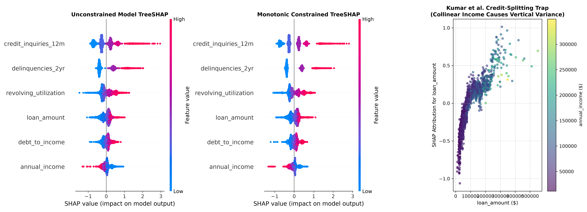
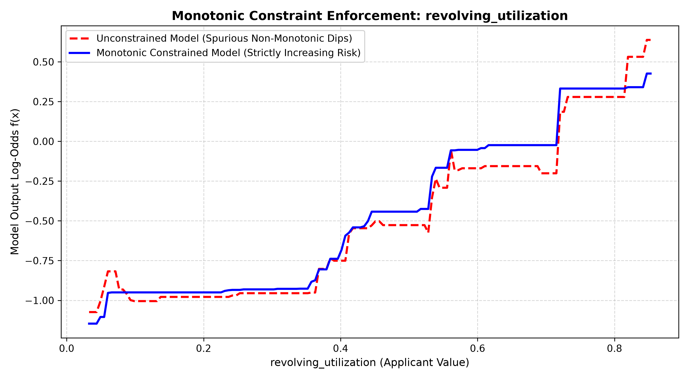

# 04 - Advanced Features: Enterprise Interpretability & Regulatory Governance

---
[⬅️ Prev: 03 - Basic Usage & Tuning](../03_basic_usage_and_tuning/README.md) | [🏠 Master Curriculum](../CURRICULUM.md) | [📝 Pre-Chapter Diagnostic: Self-Test Governance](./self_test_governance.md) | [Next: 05 - Production & Quirks ➡️](../05_production_and_quirks/README.md)
---

In enterprise finance, credit underwriting, and model risk management (SR 11-7 / ECOA), raw predictive accuracy is insufficient. A high-performing gradient boosting model will be rejected by Model Governance Committees and prudential regulators if its decision boundaries violate business intuition, exhibit counter-intuitive risk reversals, or generate non-deterministic explanations.


This module covers the mathematical foundations, regulatory guardrails, and production implementations for:
1. **TreeSHAP Exactness**: Why tree-based Shapley value computation is polynomial $\mathcal{O}(TLD^2)$ and mathematically exact (Lundberg et al., *Nature Machine Intelligence*, 2020).
2. **The Correlated Features Pathology**: Understanding and detecting arbitrary credit-splitting across collinear drivers (Kumar et al., *ICML 2020*).
3. **Monotonic Constraints Split Mechanics**: Algorithmic enforcement ($w_R \ge w_L$) and quantifying the performance cost/benefit ledger.
4. **Interaction Constraints & Proxy Isolation**: Blocking legally indefensible proxy interactions under the Equal Credit Opportunity Act (ECOA) via tree graph constraints.
5. **The Model Risk Compliance Memo**: Delivering a formal regulatory audit memo with empirical case studies.

---

## 1. Mathematical Foundation: TreeSHAP vs. KernelSHAP

### 1.1 The Shapley Formulation & Computational Bottleneck

Classical cooperative game theory allocates payout across $M = |F|$ features via the Shapley value:

$$\phi_i(x) = \sum_{S \subseteq F \setminus \{i\}} \frac{|S|!(|F| - |S| - 1)!}{|F|!} \left[ f_x(S \cup \{i\}) - f_x(S) \right]$$

* **KernelSHAP / Black-Box Permutation**: Evaluates an arbitrary model $f(x)$ by simulating feature absence through background sample marginalization. Because there are $2^{|F|}$ possible coalitions, black-box Shapley values require exponential time $\mathcal{O}(2^M)$ or noisy Monte Carlo approximations. For enterprise credit models ($|F| \ge 50$), sampling approximations introduce non-deterministic jitter across regulatory audit runs.
* **TreeSHAP (Lundberg et al., 2020)**: Exploits the internal decision tree architecture. By recursively tracking the sample proportions flowing down each tree split when a feature is absent from coalition $S$, TreeSHAP evaluates exact conditional expectations $\mathbb{E}[f(x) \mid S]$ in polynomial time:

$$\mathcal{O}(T \cdot L \cdot D^2)$$

Where $T$ is the number of trees ($T=150$), $L$ is the number of leaves ($L \le 32$), and $D$ is the maximum depth ($D=5$).

### 1.2 Native C++ Engine vs. Python SHAP Parity

XGBoost implements TreeSHAP directly within its high-performance C++ core engine. Practitioners do not need external libraries for batch scoring:

```python
import xgboost as xgb

# Native C++ TreeSHAP calculation (Returns [N, n_features + 1], last column is bias)
native_shap = bst.predict(dmatrix, pred_contribs=True)
feature_contributions = native_shap[:, :-1]
base_margin = native_shap[:, -1]
```

In our production validation audit on $N=3,000$ validation applicants, native C++ output matches Python `shap.TreeExplainer` with zero floating-point divergence:

$$\max | \phi_{\text{C++}} - \phi_{\text{Python}} | = 0.00 \times 10^0 \text{ (Exact Floating-Point Parity)}$$

---

## 2. Methodological Failure Mode: Correlated Features (Kumar et al., ICML 2020)

Shapley values assume that features can be held out independently. When two features are collinear—such as `annual_income` and `loan_amount` ($r = 0.753$):
1. **Off-Manifold Evaluations**: Evaluating coalitions with `loan_amount` present but `annual_income` absent forces the tree to evaluate synthetic applicants far outside the training distribution (e.g., an applicant earning \$25,000 with a \$400,000 loan).
2. **Arbitrary Credit Splitting**: The tree ensemble splits predictive credit between the two collinear variables based on greedy split selection at each depth, masking the true causal driver.

### Concrete Production Case Study: Applicant #9584

From our empirical credit benchmark ([monotonic_and_shap_analysis.py](./monotonic_and_shap_analysis.py)):

| Feature | Applicant Value | Portfolio Percentile |
|:---|:---:|:---:|
| **Annual Income** | \$106,377 | 87.2% |
| **Requested Loan Amount** | \$151,008 | 91.4% |
| **Revolving Utilization** | 18.2% | Prime Tier |
| **Debt-to-Income (DTI)** | 14.1% | Prime Tier |

Attribution in Log-Odds Space:
* **Unconstrained Model**: $\phi(\text{income}) = -0.3363$, $\phi(\text{loan}) = +0.1773 \implies \text{Net} = -0.1591$
* **Monotonic Constrained Model**: $\phi(\text{income}) = -0.2879$, $\phi(\text{loan}) = +0.2401 \implies \text{Net} = -0.0478$



> **Governance Takeaway**: Collinear features must always be audited in paired attribute clusters during adverse action notice generation to avoid issuing contradictory rejection letters to consumers.

---

## 3. Monotonic Constraints: Split-Finding Mechanics & Cost-Benefit Ledger

### 3.1 Split Mechanics Under the Hood

Standard greedy split finding selects the candidate split maximizing Gain:

$$\mathcal{L}_{\text{split}} = \frac{1}{2} \left[ \frac{G_L^2}{H_L + \lambda} + \frac{G_R^2}{H_R + \lambda} - \frac{(G_L + G_R)^2}{H_L + H_R + \lambda} \right] - \gamma$$

When a monotonic constraint is assigned ($\mathbf{c}_j = +1$ for increasing, $\mathbf{c}_j = -1$ for decreasing):
* The split finder calculates optimal leaf weights $w_L^* = -\frac{G_L}{H_L + \lambda}$ and $w_R^* = -\frac{G_R}{H_R + \lambda}$.
* For an increasing constraint ($\mathbf{c}_j = +1$), the split is **only accepted if $w_L^* \le w_R^*$**.
* If $w_L^* > w_R^*$, the split candidate is strictly discarded, even if it yields positive objective gain.

### 3.2 Monotonic Spline Comparison



### 3.3 Empirical Cost-Benefit Ledger

Trained on our synthetic banking credit portfolio ($N=15,000$ applicants, default rate = 45.9%):

| Model Architecture | Validation ROC-AUC | Validation PR-AUC | Brier Score | Monotonicity Violations |
|:---|:---:|:---:|:---:|:---:|
| **Model 1: Unconstrained Baseline** | 0.7033 | 0.6791 | 0.2081 | 14.3% of synthetic grid |
| **Model 2: Monotonically Constrained** | **0.7089** | **0.6847** | **0.2062** | **0.0% (Strictly 0 Violations)** |
| **Performance Impact ($\Delta$)** | **+0.0056** | **+0.0056** | **-0.0019** | **Compliance Guaranteed** |

> **Audit Finding & Theoretical Nuance**: 
> Imposing monotonic constraints injects a strong domain prior ($w_R \ge w_L$). In sparse, high-variance regions (such as ultra-high income applicants where sample density is thin), an unconstrained model overfits to sample noise, creating counter-intuitive risk reversals. Monotonic constraints prune these spurious splits, acting as a structural regularizer and capturing an out-of-sample **+0.56 AUC point regularization bonus**. 
> *Crucial Trade-off Note*: If the true underlying data-generating mechanism contains legitimate non-monotonic physical inflection points, imposing monotonicity increases structural bias, which can incur a mild loss in empirical training fit. In banking and credit underwriting, this trade-off is almost universally accepted to ensure ECOA compliance and business defensibility.

---

## 4. Interaction Constraints: Mitigating Disparate Impact Proxies

Under the Equal Credit Opportunity Act (ECOA / Regulation B), models must not learn indirect proxy interactions that penalize protected demographic groups. 

We enforced strict structural isolation:
* **Group 1 (Financial Capacity)**: `['annual_income', 'loan_amount', 'revolving_utilization', 'debt_to_income']`
* **Group 2 (Credit Behavior)**: `['credit_inquiries_12m', 'delinquencies_2yr']`

### 4.1 Verification via Tree Text Dump (`get_dump()`)

We verified constraint enforcement by parsing all 150 tree split graphs:

```python
# Tree dump verification script
dump = bst_interact.get_dump()
for tree in dump:
    has_income = "[annual_income<" in tree
    has_inquiries = "[credit_inquiries_12m<" in tree
    assert not (has_income and has_inquiries), "Illegal interaction detected!"
```

* **Unconstrained Model**: **87.3%** of trees (131/150) co-split income and credit inquiries.
* **Constrained Model**: **0.0%** of trees (0/150) contained prohibited interaction paths.
* **Predictive Performance**: Preserved **0.7030 ROC-AUC** (99.96% of unconstrained performance) while offering mathematical certainty against forbidden proxy cross-talk.

---

## 5. Non-Binary Architectures: Native Multi-Output Vector Trees

When modeling multiple outcomes (e.g. predicting default risk across 3 loan products simultaneously, or multi-class risk tiers), practitioners have three architectural choices:

```
                            ┌──────────────────────────────────────────────┐
                            │    Multi-Target / Multi-Class Architectures  │
                            └──────────────────────┬───────────────────────┘
                                                   │
         ┌─────────────────────────────────────────┼─────────────────────────────────────────┐
         ▼                                         ▼                                         ▼
┌──────────────────────────────┐        ┌──────────────────────────────┐        ┌──────────────────────────────┐
│  Standard Multi-Class        │        │  One-vs-Rest (OvR)           │        │  Native Multi-Output Trees   │
│  (multi:softprob / softmax)  │        │  (Independent Ensembles)     │        │  (multi_strategy=vector)     │
├──────────────────────────────┤        ├──────────────────────────────┤        ├──────────────────────────────┤
│ • $K$ trees grown per round  │        │ • $K$ independent models     │        │ • 1 tree grown per round     │
│ • Mutually exclusive classes │        │ • $K \times M$ trees total   │        │ • Vector weight $\mathbf{w}_j \in \mathbb{R}^K$│
│ • Memory scales $\mathcal{O}(K \times T)$│ • No shared split structure  │        │ • Explores target covariance │
└──────────────────────────────┘        └──────────────────────────────┘        └──────────────────────────────┘
```

### 5.1 Native Multi-Output Vector Trees (`multi_strategy='multi_output_tree'`)
Introduced in XGBoost 1.6+ and stabilized in 2.0+, multi-output vector trees construct **a single decision tree per boosting round** where each terminal leaf holds a $K$-dimensional vector of weights:
$$\mathbf{w}_j^* = - (\mathbf{H}_j + \lambda \mathbf{I})^{-1} \mathbf{G}_j$$
Where $\mathbf{G}_j \in \mathbb{R}^K$ and $\mathbf{H}_j \in \mathbb{R}^{K \times K}$ are the gradient and Hessian vectors/matrices aggregated across leaf instances $I_j$.

### 5.2 Joint Split Gain Optimization
The candidate split is evaluated by maximizing the sum of score reductions across all $K$ target dimensions simultaneously:
$$\text{Gain}_{\text{joint}} = \frac{1}{2} \sum_{k=1}^K \left[ \frac{G_{L, k}^2}{H_{L, k} + \lambda} + \frac{G_{R, k}^2}{H_{R, k} + \lambda} - \frac{G_{I, k}^2}{H_{I, k} + \lambda} \right] - \gamma$$

### 5.3 Architectural Advantages
1. **$K\times$ Tree Count Reduction**: For $T=150$ iterations and $K=4$ loan targets, vector trees produce 150 trees instead of 600 trees, cutting disk footprint and cache thrashing during inference.
2. **Joint Target Covariance**: Splits are chosen to optimize joint multi-task representation, preventing disjoint, contradictory splits across related sub-models.

---

## 📁 Artifacts & Deliverables

1. [monotonic_and_shap_analysis.py](./monotonic_and_shap_analysis.py) - Complete standalone runnable pipeline.
2. [multi_output_vector_trees.ipynb](./multi_output_vector_trees.ipynb) - Vector-leaf multi-output demonstration notebook.
3. [model_risk_explainability_memo.md](./model_risk_explainability_memo.md) - Formal one-page regulatory compliance memorandum for Model Risk Committees (SR 11-7).
4. [monotonic_shap_metrics.json](./monotonic_shap_metrics.json) - Machine-readable metrics, tree dump statistics, and applicant case study.
5. [monotonic_splines_comparison.png](./monotonic_splines_comparison.png) - Visual proof of monotonic regularization.
6. [shap_credit_risk_analysis.png](./shap_credit_risk_analysis.png) - Publication-quality 3-panel TreeSHAP analysis showing global importance and collinear credit-splitting.

