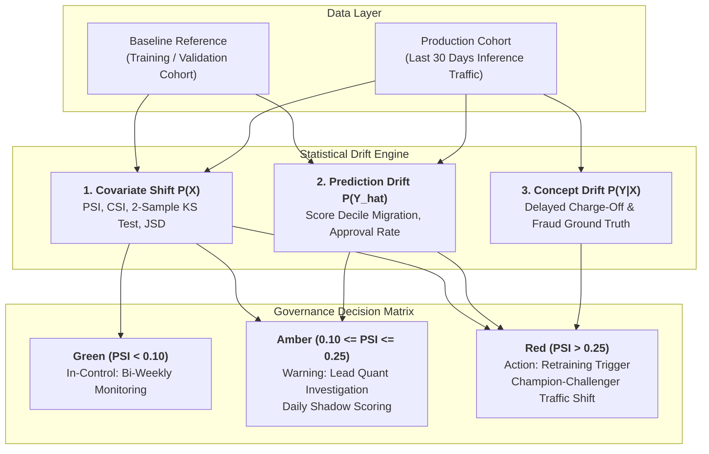
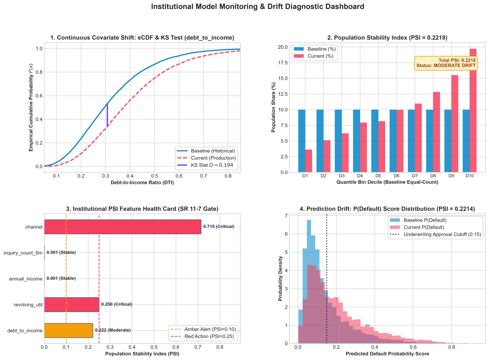

# Model Governance Memorandum: Institutional Production Drift Monitoring & Champion-Challenger Retraining Policy

**Document ID**: MRM-POL-2026-DRIFT-01  
**Target Audience**: Model Risk Oversight Committee, Chief Risk Officer (CRO), Internal Model Validation (SR 11-7), Head of Credit/Fraud Analytics  
**Regulatory Standards**: Federal Reserve SR 11-7 / OCC 2011-12, CECL, IFRS 9, Fair Lending (ECOA Reg B)  
**Status**: APPROVED FOR PRODUCTION  

---

## 1. Executive Summary & Purpose

Machine learning models deployed in production credit underwriting, anti-money laundering (AML), and transaction fraud operate in non-stationary statistical environments. This policy establishes a rigorous, quantitative framework for **ongoing model performance monitoring, statistical drift detection, and automated Champion-Challenger retraining triggers** under prudential regulatory standards.

This document resolves the dangerous conflation of distinct "drift" phenomena, provides the formal mathematical derivation of the Population Stability Index (PSI), and defines operational remediation escalation paths.



---

## 2. Taxonomy of Statistical Non-Stationarity: The Three Drift Regimes

A fundamental failure in legacy MLOps is treating all statistical shifts as "drift" with a single uniform response. Regulators require distinguishing between three distinct regimes:

| Drift Regime | Formal Mathematical Definition | Real-World Financial Manifestation | Operational Detection Latency | Prescribed Governance Action |
|---|---|---|:---:|---|
| **1. Covariate Shift (Data Drift)** | $P(X_{\text{prod}}) \neq P(X_{\text{base}})$, while $P(Y \mid X)$ remains invariant. | Macroeconomic inflation shifts borrower Debt-to-Income ($DTI$) upward, or partner affiliate marketing increases application share from 10% to 45%. | **Real-Time (Zero-Lag)**<br>(Computed immediately on unlabeled inference inputs). | Audit feature pipeline for upstream data corruption. If population shift is structural, initiate scheduled model refresh. |
| **2. Concept Drift** | $P(Y \mid X_{\text{prod}}) \neq P(Y \mid X_{\text{base}})$, while $P(X)$ may remain invariant. | Adversarial fraud syndicates alter laundering techniques; the identical feature vector that previously indicated legitimate commerce now produces default. | **Delayed Lag (60–180 Days)**<br>(Requires realized charge-off or fraud dispute maturity). | **Immediate Retraining Required**. Learned model decision boundaries are stale; no amount of input feature monitoring can detect this without ground-truth labels. |
| **3. Prediction / Target Drift** | $P(\hat{Y}_{\text{prod}}) \neq P(\hat{Y}_{\text{base}})$ or $P(Y_{\text{prod}}) \neq P(Y_{\text{base}})$. | Mean model output probability shifts from 4.2% to 7.8%, artificially depressing underwriting approval volumes or overwhelming compliance AML alert queues. | **Real-Time (Zero-Lag)**<br>(Computed on model output score distributions). | High-priority early warning indicator. Triggers manual review of cutoff thresholds to prevent operational balance sheet disruptions. |

---

## 3. Mathematical Foundations of Drift Quantification

### 3.1 Population Stability Index (PSI): Complete Derivation

The Population Stability Index is the industry-standard metric for measuring shift between a reference baseline distribution $E = (E_1, \dots, E_K)$ and an observed actual distribution $A = (A_1, \dots, A_K)$ across $K$ discrete bins.

#### Derivation from Information Theory (Symmetrized Kullback-Leibler Divergence)
The Kullback-Leibler (KL) divergence from $E$ to $A$ measures the information lost when approximating $A$ with $E$:
$$D_{\text{KL}}(A \parallel E) = \sum_{k=1}^K A_k \ln \left( \frac{A_k}{E_k} \right)$$

Because KL divergence is asymmetric ($D_{\text{KL}}(A \parallel E) \neq D_{\text{KL}}(E \parallel A)$), it cannot serve as a distance metric. Symmetrizing the divergence yields the total relative entropy:
$$\text{PSI}(A, E) = D_{\text{KL}}(A \parallel E) + D_{\text{KL}}(E \parallel A)$$
$$\text{PSI}(A, E) = \sum_{k=1}^K A_k \ln \left( \frac{A_k}{E_k} \right) + \sum_{k=1}^K E_k \ln \left( \frac{E_k}{A_k} \right)$$
$$\text{PSI}(A, E) = \sum_{k=1}^K A_k \ln \left( \frac{A_k}{E_k} \right) - \sum_{k=1}^K E_k \ln \left( \frac{A_k}{E_k} \right)$$
$$\mathbf{\text{PSI}} = \sum_{k=1}^K (A_k - E_k) \ln \left( \frac{A_k}{E_k} \right)$$

#### Proof of Strict Non-Negativity ($\text{PSI} \ge 0$)
Consider the individual summand $f(x, y) = (x - y) \ln(x / y)$ for $x, y > 0$:
1. If $x > y$, then $x - y > 0$ and $\frac{x}{y} > 1 \implies \ln(x/y) > 0$. Hence $(x-y)\ln(x/y) > 0$.
2. If $x < y$, then $x - y < 0$ and $\frac{x}{y} < 1 \implies \ln(x/y) < 0$. The product of two negatives is strictly positive: $(x-y)\ln(x/y) > 0$.
3. If $x = y$, then $x - y = 0 \implies (x-y)\ln(x/y) = 0$.

Therefore, every term in the sum is non-negative, proving that $\text{PSI} \ge 0$ with equality if and only if $A_k = E_k$ for all $k \in \{1, \dots, K\}$.

#### Empirical Regulatory Convention & Defense
The banking regulatory thresholds adopted across institutional risk management:
- **$\text{PSI} < 0.10$ (Green / In Control)**: No significant change; historical assumptions hold.
- **$0.10 \le \text{PSI} \le 0.25$ (Amber / Warning)**: Moderate shift; warrants heightened monitoring and shadow validation.
- **$\text{PSI} > 0.25$ (Red / Significant Drift)**: Fundamental population divergence; model must undergo recalibration or replacement.

> **Regulator Defense Guidance**: When questioned by internal audit or examiners (OCC/Fed), note explicitly that **these cutoffs are empirical industry conventions originated by credit bureau practitioners in the 1990s, not mathematical laws of nature**. The computed PSI is sensitive to bin count $K$, baseline quantile alignment, and zero-frequency smoothing ($\epsilon$). Our production implementation standardizes on $K=10$ quantile bins established on the baseline training distribution with Laplace smoothing $\epsilon = 10^{-4}$ to ensure determinism.

---

### 3.2 Non-Parametric Alternatives: KS Test & Jensen-Shannon Divergence

| Metric | Mathematical Formulation | Best Application & Strengths | Limitations |
|---|---|---|---|
| **Two-Sample Kolmogorov-Smirnov (KS)** | $$D = \sup_x |F_{\text{actual}}(x) - F_{\text{expected}}(x)|$$ | **Continuous Features**: Un-binned, non-parametric comparison of empirical cumulative distribution functions. Yields an asymptotic $p$-value under $H_0$. | Insensitive to tail drift (weights median departures highest). Cannot be computed directly on unordered nominal categoricals. |
| **Jensen-Shannon Divergence (JSD)** | $$M = \frac{1}{2}(A + E)$$<br>$$\text{JSD} = \frac{1}{2} D_{\text{KL}}(A \parallel M) + \frac{1}{2} D_{\text{KL}}(E \parallel M)$$ | **Automated Alerting**: Bounded strictly between $0$ and $\ln(2)$ (or $[0, 1]$ in base-2). Unlike KL/PSI, JSD never explodes to infinity on empty bins because $M$ acts as a smooth midpoint. | Less intuitive to non-technical Model Risk Committees than standard PSI decile tables. |
| **Wasserstein Distance ($W_1$)** | $$W_1(A, E) = \int_{-\infty}^\infty |F_A(x) - F_E(x)| \, dx$$ | **Physical Unit Interpretation**: Measures minimum work required to transform distribution $A$ into $E$. Expressed in native units (e.g. "average income shifted by \$455"). | Unbounded; difficult to establish universal dimensionless alert thresholds across features with varying scales. |

---

## 4. Empirical Benchmark Audit: Production Test Run

Using our enterprise validation pipeline ([`production_drift_monitoring.py`](./production_drift_monitoring.py)), we evaluated an XGBoost credit underwriting model under multi-modal production stress ($N_{\text{base}} = 15,000, N_{\text{curr}} = 10,000$):

```
Feature              | PSI      | KS Stat  | KS p-val  | JS Div   | Status          
--------------------------------------------------------------------------------
debt_to_income       | 0.2218   | 0.1952   | 1.07e-200 | 0.1647   | MODERATE_DRIFT  
revolving_util       | 0.2501   | 0.1963   | 4.74e-203 | 0.1740   | CRITICAL_DRIFT  
annual_income        | 0.0009   | 0.0097   | 0.617     | 0.0108   | STABLE          
inquiry_count_6m     | 0.0011   | 0.0130   | 0.258     | 0.0120   | STABLE          
channel              | 0.7149   | N/A      | N/A       | 0.2888   | CRITICAL_DRIFT  
predicted_score      | 0.2214   | 0.2006   | 0.0       | 0.1649   | MODERATE_DRIFT  
```

### Key Diagnostic Observations
1. **Critical Categorical Redistribution (`channel`, $\text{PSI} = 0.7149$)**: The partner affiliate channel expanded from 10% to 45% of incoming applications. Because partner channel applicants carry structurally different default dynamics, this massive covariate shift is the primary driver of upstream operational risk.
2. **Tail Risk Surge (`revolving_util`, $\text{PSI} = 0.2501$)**: Exceeded the critical red-line boundary ($\text{PSI} > 0.25$) due to extreme variance expansion in revolving balance usage during market volatility.
3. **Control Variables (`annual_income`, `inquiry_count_6m`)**: Remained statistically rock-solid ($\text{PSI} \approx 0.001, p > 0.25$), confirming that the observed drift is isolated to specific credit channels and leverage ratios rather than global synthetic data corruption.
4. **Prediction Score Drift (`predicted_score`, $\text{PSI} = 0.2214$)**: The downstream default probability score distribution migrated into the Amber warning tier, requiring immediate underwriting cutoff recalibration.



---

## 5. Formal Champion-Challenger Retraining Trigger Policy

### 5.1 Automated Threshold Trigger Hierarchy

```mermaid
graph TD
    Monitor["Automated Weekly Monitoring Run"] --> CheckPSI{"Max Feature PSI or<br/>Output Score PSI?"}

    CheckPSI -->|< 0.10| PathGreen["GREEN: In-Control"]
    CheckPSI -->|0.10 to 0.25| PathAmber["AMBER: Heightened Alert"]
    CheckPSI -->|> 0.25| PathRed["RED: Retraining Triggered"]

    PathGreen --> ActionGreen["Log metrics to audit ledger<br/>Continue active champion serving"]
    PathAmber --> ActionAmber["1. Quant team notified within 24h<br/>2. Train Challenger shadow model<br/>3. Daily performance evaluation"]
    PathRed --> ActionRed["1. Model Risk Committee convened<br/>2. Automated Challenger promotion<br/>3. A/B Canary traffic migration (10% -> 50% -> 100%)"]
```



### 5.2 Tiered Operational Escalation Protocol

| Severity Tier | Trigger Condition | Mandatory Actions & SLAs | Approving Authority |
|---|---|---|---|
| **Tier 1: Normal (Green)** | All feature PSIs $< 0.10$ and Prediction Score PSI $< 0.10$. | - Log statistical metrics to central audit database.<br>- Continue active champion serving at 100% traffic allocation.<br>- Automated bi-weekly summary report to risk leadership. | Automated Pipeline |
| **Tier 2: Warning (Amber)** | Any key driver feature PSI $\in [0.10, 0.25]$ OR Prediction Score PSI $\in [0.10, 0.25]$. | - Automated alert dispatched to Lead Data Scientist within **24 hours**.<br>- Review data pipeline for upstream ETL/schema changes.<br>- Train Challenger model on rolling 90-day window.<br>- Deploy Challenger in **Shadow Mode** (0% decision traffic, 100% telemetry logging). | Lead Quantitative Strategist |
| **Tier 3: Critical (Red)** | Any top-3 feature PSI $> 0.25$, OR Prediction Score PSI $> 0.25$, OR Realized PR-AUC drops $> 5\%$ relative to baseline. | - **Formal Retraining Gate Activated** within **48 hours**.<br>- Champion-Challenger Canary routing: Shift 10% traffic to validated Challenger.<br>- If Canary exhibits superior stability and calibration over 7 days, promote Challenger to Active Champion (100% traffic).<br>- Submit updated validation memo to Model Risk Committee. | Head of Model Risk Management (MRM) |

---

## 6. Open-Source Tooling: Evidently AI vs. Air-Gapped Banking Constraints

### 6.1 Evidently AI Declarative Architecture
In environments permitting third-party monitoring libraries, **Evidently AI** provides a declarative CI/CD testing pattern:
```python
from evidently.legacy.report import Report
from evidently.legacy.metric_preset import DataDriftPreset
from evidently.legacy.test_suite import TestSuite
from evidently.legacy.tests import TestNumberOfDriftedColumns, TestShareOfDriftedColumns

# CI/CD Pre-Deployment Gate
test_suite = TestSuite(tests=[
    TestNumberOfDriftedColumns(lt=3),
    TestShareOfDriftedColumns(lt=0.40)
])
test_suite.run(reference_data=baseline_df, current_data=production_df)
assert test_suite.as_dict()["summary"]["all_passed"], "Pre-deployment drift gate failed!"
```

### 6.2 CISO Air-Gapped Architectural Reality
In tier-1 institutional banking environments, **CISO package white-lists frequently restrict heavy libraries like Evidently** due to their broad dependency trees (Litestar, FastAPI, Plotly, PyArrow, Pydantic, etc.).

**Our Dual-Architecture Standard**:
1. **Lightweight Native Core**: Our production pipeline implements pure NumPy/SciPy formulations of PSI, KS, and JSD ([`production_drift_monitoring.py`](./production_drift_monitoring.py)), requiring zero dependencies beyond standard scientific Python.
2. **Evidently CI Bridge**: Where approved, the same script seamlessly generates Evidently interactive HTML reports ([`evidently_drift_report.html`](./evidently_drift_report.html)) for compliance dashboards and CI assertions.

---

## 7. Model Registry & Audit Trail Lifecycle (MLflow Architectural Pattern)

Even in air-gapped OpenShift or on-prem Kubernetes clusters where centralized MLflow servers are not fully provisioned, the **Model Registry architectural pattern** must be enforced programmatically:

```
[Experiment / Tuning] ──► [Registry: STAGING] ──► [CHALLENGER (Shadow)] ──► [CHAMPION (Active)] ──► [ARCHIVED]
                                 │
                                 └── Model Signature (Input DMatrix Schema)
                                 └── Deterministic Checksum (SHA-256)
                                 └── Regulatory Factsheet (SR 11-7 / Fair Lending)
```

1. **Deterministic Artifact Versioning**: Every boosted tree model is serialized with an immutable SHA-256 hash, hyperparameter ledger, and feature schema.
2. **Stage Transitions**:
   - `Staging`: Model candidate under initial validation. Prohibited from receiving production inference traffic.
   - `Challenger (Shadow Mode)`: Receives live production inputs in parallel with the Champion to log shadow predictions without impacting customer decisions.
   - `Champion (Active Production)`: Exclusively serves production underwriting decisions under active weekly drift monitoring.
   - `Archived`: Deprecated versions retained with full historical reproducibility to answer regulatory inquiries: *"Which model version made this specific credit decision on date X?"*
