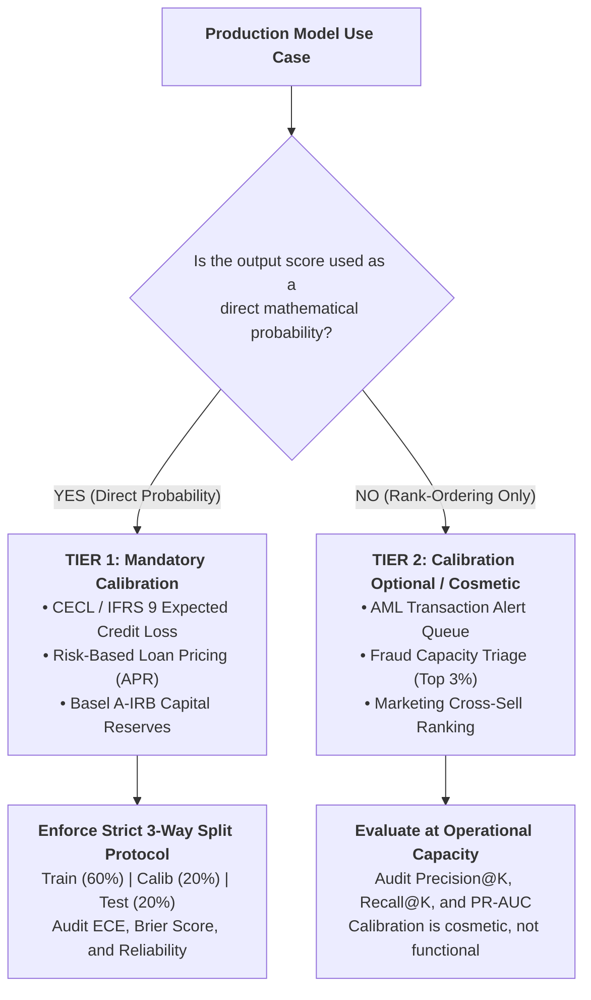

# Model Governance & Regulatory Memorandum: Probability Calibration Standards for GBDT Models

**Document ID**: MRM-GOV-2026-CAL01  
**Classification**: Enterprise Model Risk Management Standard (SR 11-7 / OCC 2011-12 / IFRS 9 / CECL)  
**Author**: Quantitative Risk & Machine Learning Governance  
**Audience**: Model Risk Committee (MRC), Chief Risk Officer, Internal Model Validation, and Head of Credit Underwriting  
**Subject**: Institutional Policy on Probability Calibration, Brier Score Auditing, and Rank-Order Sufficiency for Tree Ensembles  

---

## 1. Executive Summary & Policy Objective

Gradient Boosted Decision Trees (GBDTs), including XGBoost, are the primary engine for tabular predictive modeling across banking operations. However, foundational empirical research (Niculescu-Mizil & Caruana, ICML 2005 & AAAI 2007) demonstrates that **maximum-margin and boosting algorithms produce systematically miscalibrated posterior probabilities**, despite achieving superior discriminative rank-ordering (ROC-AUC and Average Precision). 

Boosted trees push probability mass away from 0 and 1, producing a characteristic **sigmoid-shaped distortion** on reliability diagrams. Furthermore, common banking practices—such as class re-weighting via `scale_pos_weight`—induce massive artificial logit shifts ($+\ln(s)$) that inflate raw model outputs by orders of magnitude.

This memorandum establishes the formal institutional taxonomy governing **which models strictly require post-processing probability calibration** versus **which models operate safely on rank-ordering alone**, preventing multi-million dollar balance sheet provisioning distortions under CECL and IFRS 9.

---

## 2. Institutional Decision Taxonomy: Functional vs. Cosmetic Calibration

### 2.1 Tier 1: Probability-Critical Models (Mandatory Calibration Required)
In Tier 1 applications, the model output $\hat{p}$ is multiplied directly by financial quantities. Any calibration error ($\bar{p}_b \ne \bar{y}_b$) transmits directly into balance sheet misstatements and regulatory non-compliance:

1. **Expected Credit Loss (ECL) Provisions (CECL / IFRS 9)**:
   $$\text{ECL} = \text{PD} \times \text{LGD} \times \text{EAD}$$
   Here, $\text{PD} = \hat{p}(x)$ is the 12-month Probability of Default. If an uncalibrated XGBoost model outputs an average $\hat{p} = 0.08$ on a subprime portfolio whose true historical default rate is $0.05$, the institution will over-allocate loan loss reserves by $+60\%$, unnecessarily locking up regulatory capital.
2. **Basel III / IV Internal Ratings-Based (A-IRB) Capital Adequacy**:
   Regulatory capital buffers are strictly calibrated to conservative default probabilities. Model validators must reject uncalibrated tree ensembles that exhibit non-zero Reliability error in Murphy decomposition.
3. **Risk-Based Credit Pricing & Margin Optimization**:
   $$\text{Loan APR} = \text{Cost of Funds} + \text{Operating Cost} + \frac{\hat{p} \times \text{LGD}}{1 - \hat{p}} + \text{Target ROE}$$
   Under-predicting default risk leads to adverse selection (under-pricing risky borrowers), while over-predicting default risk prices prime borrowers out of the bank's lending funnel.

### 2.2 Tier 2: Pure Rank-Ordered / Triage Models (Calibration Optional / Cosmetic)
In Tier 2 applications, decisions are executed based on a fixed capacity queue where items are sorted descending by risk score $\hat{s}(x)$:

1. **AML Transaction Monitoring & Fraud Alert Triage**:
   - Operations possesses fixed analyst capacity (e.g. 500 alerts/day out of 20,000 transactions, or top $2.5\%$).
   - A decision rule of the form $\text{Flag} \iff \text{Rank}(\hat{s}(x)) \le K$ is completely invariant to any strictly monotonic probability transformation.
   - Because Platt Scaling ($p = \sigma(Az + B), A > 0$) and Isotonic Regression are strictly monotonic, **calibrating a pure alert triage queue changes exactly zero operational alert decisions**.
   - In Tier 2, model teams must prioritize **PR-AUC (Average Precision)** and **Precision@K%** over Brier score.

---

## 3. Calibration Methodology Standards: Platt Scaling vs. Isotonic Regression

Model Risk Management mandates the following selection matrix for Tier 1 models:

| Dimension | Platt Scaling (`method='sigmoid'`) | Isotonic Regression (`method='isotonic'`) | MRM Policy Mandate |
| :--- | :--- | :--- | :--- |
| **Mathematical Nature** | Parametric logistic regression: $p = \frac{1}{1 + \exp(Az + B)}$ | Non-parametric piecewise constant step function (PAVA) | Platt scaling matches boosted tree distortion shape. |
| **Data Sufficiency Threshold** | Robust on small calibration cohorts ($N < 1{,}000$, low defaults) | High variance on small sets; requires **$N_{\text{calib}} \ge 1{,}000$** | Reject Isotonic if calibration set contains $<100$ default events. |
| **Overfitting Risk** | Extremely low (only 2 learned parameters: $A, B$) | High risk of step-function overfitting in data-sparse tails | Isotonic produces flat bins in rare-event fraud tails. |
| **Monotonicity** | Guaranteed strictly monotonic ($A > 0$) | Monotonic by construction, but non-strictly monotonic (ties) | Ties in Isotonic can degrade downstream fine-grained ranking. |

---

## 4. The 3 Inviolable Model Governance Protocols

### Protocol 1: The Three-Way Split Requirement (Zero-Leakage Calibration)
* **Violation**: Fitting a calibrator on the same dataset used to train the base trees ($D_{\text{train}}$).
* **Consequence**: Trees overfit training samples, producing artificially extreme margin scores ($z \to \pm \infty$). Calibrating on $D_{\text{train}}$ fits the calibrator to overconfident training margins, severely understating Expected Calibration Error (ECE) and failing out-of-sample.
* **Standard**: Calibration must occur on a dedicated, held-out calibration partition ($D_{\text{calib}}$) completely independent of $D_{\text{train}}$ and $D_{\text{test}}$.

### Protocol 2: The `scale_pos_weight` Unbiasing Requirement
* **Violation**: Exposing raw predictions from models trained with `scale_pos_weight = s` directly to credit risk systems.
* **Consequence**: In our empirical benchmark ($s = 19.0$), raw `scale_pos_weight` inflated Expected Calibration Error from $0.0062$ to $0.2363$ ($+38\times$ error) and Brier Score from $0.0437$ to $0.1301$ ($+3\times$ error).
* **Standard**: If `scale_pos_weight` is deployed to capture rare-event rank gradients, the model MUST either undergo analytical odds unbiasing ($\text{odds}_{\text{true}} = \text{odds}_{\text{model}} / s$) or post-hoc Platt calibration before score consumption in accounting or pricing engines.

### Protocol 3: Operational Tail-Slice Calibration Auditing
* **Violation**: Reporting only global aggregate Brier score across the entire customer base.
* **Consequence**: In imbalanced banking portfolios (95% non-default), a model predicting $\hat{p} = 0.05$ uniformly achieves a superficially low Brier score ($0.0475$) while being totally blind and grossly miscalibrated in the high-risk operational boundary ($p \in [0.10, 0.50]$).
* **Standard**: Every validation report must tabulate ECE and Brier score restricted specifically to the operational alert decision region ($p \ge p_{\text{alert}}$).

---

## 5. Sign-Off & Implementation Roadmap

1. **Credit Risk Scorecards (CECL / IFRS 9)**: Immediately implement Platt Scaling using a 20% held-out calibration set.
2. **AML Transaction Fraud Detection**: Maintain uncalibrated or odds-unbiased XGBoost with PR-AUC objective, certifying that current thresholding is strictly capacity-based (Tier 2).
3. **Model Validation Checklist**: Internal Audit to incorporate the Murphy (1973) Reliability metric and tail-slice ECE into annual Model Validation reports.
