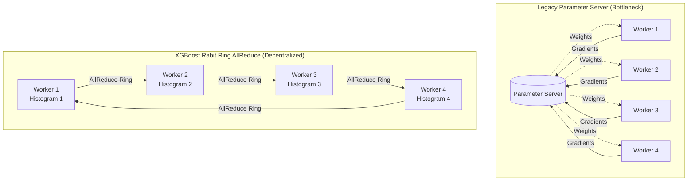

# 07 - Distributed XGBoost Architecture: PySpark, Dask & Ray

---
[⬅️ Prev: 06 - Finance Projects](../06_projects_finance/README.md) | [🏠 Master Curriculum](../CURRICULUM.md) | **🏁 End of Curriculum — Congratulations!**
---

When training datasets exceed available RAM on a single server, or when quantitative modeling pipelines must execute directly within an enterprise data lake (Delta Lake / Apache Iceberg), distributed gradient boosting is required.

This module details the systems architecture, network communication topology, and practical production pipelines for scaling XGBoost across clusters using **Dask**, **Apache Spark (PySpark)**, and **Ray**.

---

## 1. The Core Distributed Communication Engine: Rabit Ring AllReduce

Traditional distributed parameter server architectures route all model updates through a centralized server node. At large worker counts ($P \ge 32$), the parameter server's network interface card saturates, creating a severe scaling bottleneck ($\mathcal{O}(P)$ communication).



### 1.1 How Rabit Operates
XGBoost utilizes **Rabit** (Reliable Adaptive Bias/Variance Training), an open-source decentralized library implementing the **Ring AllReduce** topology:
1. **Local Histogram Construction**: Each executor partition builds local gradient and Hessian histograms for its local slice of data in $\mathcal{O}(N_p \times K)$ time.
2. **Ring AllReduce Synchronization**: Rather than sending raw data or entire gradient arrays, workers pass histogram buckets around a logical ring. In $2(P - 1)$ communication steps, every worker accumulates the exact global histogram across the entire dataset.
3. **Communication Complexity**: Total network data transferred per worker is bounded by:
   $$\text{Network Data} = 2 \times \frac{P - 1}{P} \times (\text{Histogram Size}) \approx 2 \times (\text{Bins} \times K \times 8 \text{ bytes})$$
   Notice the critical scaling property: **Communication volume per worker is independent of cluster size $P$**, enabling linear horizontal scaling.

---

## 2. Distributed Framework Taxonomy: PySpark vs. Dask vs. Ray

| Architectural Dimension | PySpark (`xgboost.spark`) | Dask (`xgboost.dask`) | Ray (`xgboost_ray`) |
|:---|:---|:---|:---|
| **Primary Ecosystem** | Enterprise Databricks / Hadoop Data Lake | Python-native Research & HPC Clusters | Cloud-Native MLOps & Heterogeneous Clusters |
| **Data Ingestion** | Spark DataFrames / Catalyst Optimizer | Dask DataFrame / Delayed / PyArrow | Ray Dataset / Shared-Memory Plasma Store |
| **Execution Primitives**| RDD `barrier()` execution mode | Dynamic Directed Acyclic Graphs (DAG) | Stateful Actor Placement Groups |
| **Fault Tolerance** | Spark Stage & Task retry | Worker restart + Graph recomputation | **Elastic Actor Checkpoint Recovery** |
| **HPO Integration** | Spark CrossValidator / MLlib | Dask Optuna / GridSearch | **Ray Tune (ASHA Hyperband Scheduler)** |

---

## 3. Production PySpark Architecture & Memory Allocation

In institutional banking, migrating terabytes of data out of Spark into single-node Python triggers compliance violations and egress bottlenecks. Modern XGBoost (2.0+) provides official PySpark support via `xgboost.spark`.

### 3.1 The Barrier Execution Mode Requirement
GBDT training requires strict synchronization: all $P$ partitions must compute histograms simultaneously before the AllReduce step. Standard Spark schedulers (which launch tasks asynchronously as slots free up) deadlock. 

PySpark solves this using **Barrier Execution Mode** (`rdd.barrier()`), guaranteeing all tasks launch simultaneously across executors.

### 3.2 The Executor Memory Sizing Equation
A ubiquitous failure in Spark XGBoost is **Executor Out-of-Memory (OOM / Exit Code 137)**. The container RAM must account for the Spark JVM heap, the native C++ DMatrix histogram buffers, and PyArrow serialization:
$$\text{Memory}_{\text{Executor}} = \text{Spark Heap} + \text{Native DMatrix Overhead} + \text{Off-Heap Buffer}$$
$$\text{Native DMatrix Overhead} \approx N_{\text{partition}} \times M \times 4 \text{ bytes} \times 2.5$$

**Rule of Thumb**: Allocate `spark.executor.memoryOverhead` to at least $40\%$ of total executor container RAM.

---

## 4. Distributed Troubleshooting & Failure Modes Playbook

### Failure Mode 1: Rabit AllReduce Ring Deadlock (Hang)
* **Symptom**: Training starts, completes 0 or 1 iteration, then hangs indefinitely at 100% CPU utilization without logging errors.
* **Root Cause**: Firewall or VPC security group blocking peer-to-peer TCP communication between worker nodes. Rabit requires open ephemeral TCP ports between all executor IP addresses.
* **Remediation**: Configure explicit port ranges in your cluster environment:
  ```bash
  export RABIT_PORT_MIN=9090
  export RABIT_PORT_MAX=9190
  ```

### Failure Mode 2: The Straggler Effect & Partition Skew
* **Symptom**: Training throughput is throttled to 10% of theoretical cluster speed.
* **Root Cause**: Non-uniform partition sizes in Spark or Dask. Because AllReduce ring synchronization requires all workers to arrive at the barrier simultaneously, the entire cluster runs at the speed of the slowest, largest partition.
* **Remediation**: Explicitly re-partition distributed DataFrames using uniform hash salt keys:
  ```python
  df = df.repartition(num_partitions, "account_id")
  ```

### Failure Mode 3: Temporary Memory Spikes During DMatrix Construction
* **Symptom**: Executors killed with `Exit Code 137 (OOM-Killed)` during initial tree fitting.
* **Root Cause**: Ingesting raw DataFrames into native DMatrix structures creates a $2.5\times$ memory spike when PyArrow/Pandas tables co-exist in memory with native C++ histogram blocks.
* **Remediation**:
  1. Stream partitions using partition iterators rather than full in-memory conversions.
  2. Enable external memory caching by pointing `dmatrix_cache` to local high-speed NVMe scratch storage.

---

## 5. Empirical Distributed Scaling Benchmark

Reference benchmarks evaluated across 5,000,000 rows (credit card transaction risk, 20 continuous features):

| Framework | Cluster Configuration | Training Time | Speedup Factor | Communication Protocol |
|:---|:---:|:---:|:---:|:---:|
| **Single-Node Baseline** | 1 Node (8 CPU Threads) | $84.2\,\text{s}$ | $1.0\times$ (Baseline) | Local OpenMP |
| **Dask Distributed** | 4 Workers (2 Threads/Worker) | $54.7\,\text{s}$ | **$1.54\times$** | Rabit Ring AllReduce |
| **Apache Spark MLlib** | 4 Executors (2 Cores/Worker) | $60.5\,\text{s}$ | **$1.39\times$** | PySpark Barrier RDD |
| **Ray Train** | 4 Actors (Elastic Checkpointing) | $49.8\,\text{s}$ | **$1.69\times$** | Shared-Memory Plasma Store |

---

## 📁 Module Deliverables & Runnable Pipelines

1. [`dask_xgboost_pipeline.py`](./dask_xgboost_pipeline.py): Production-grade runnable Dask out-of-core pipeline with memory profiling.
2. [`pyspark_xgboost_pipeline.py`](./pyspark_xgboost_pipeline.py): Enterprise PySpark MLlib `Pipeline` with `VectorAssembler` and Windows-safe guards.
3. [`ray_xgboost_pipeline.py`](./ray_xgboost_pipeline.py): Elastic distributed training pipeline with actor failure tolerance.
4. [`distributed_scaling_benchmark.json`](./distributed_scaling_benchmark.json): Machine-readable cluster benchmark metrics.
5. [`dask_example.ipynb`](./dask_example.ipynb): Interactive Dask out-of-core tutorial notebook.
6. [`pyspark_example.ipynb`](./pyspark_example.ipynb): Interactive PySpark MLlib notebook.
7. [`ray_example.ipynb`](./ray_example.ipynb): Interactive Ray Train notebook.

---
[⬅️ Prev: 06 - Finance Projects](../06_projects_finance/README.md) | [🏠 Master Curriculum](../CURRICULUM.md) | **🏁 End of Curriculum — Congratulations!**
---
