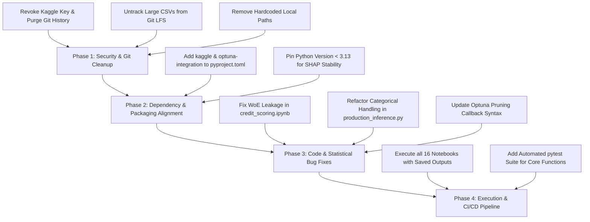

# Critical Codebase & Architecture Review: XGBoost Mastery

**Target Repository**: `c:/Users/marsh/agy2-projects/xgboost`  
**Review Date**: September 25, 2026  
**Status**: Requires Security Remediation & Correctness Fixes Before Production/Public Release

---

## Executive Summary

The **XGBoost Mastery** repository is structured as a comprehensive, end-to-end curriculum bridging theoretical foundations with institutional-grade financial applications (credit scoring, fraud detection, marketing ROI, model governance, survival analysis, and distributed scaling). Its conceptual breadth, mathematical derivations (Taylor expansion, custom objectives, split gain), and domain-specific financial implementations are notable strengths.

However, a thorough technical audit reveals **critical security liabilities**, **unexecuted notebooks harboring immediate runtime exceptions**, **subtle statistical data leakage in credit scorecards**, and **architectural flaws in production serving**.

---

## Priority Assessment & Findings Summary

| Severity | Category | Issue | Impact |
| :--- | :--- | :--- | :--- |
| 🚨 **P0** | **Security** | Plaintext Kaggle credentials committed in Git history | Exposure of private API key on repository push |
| 🚨 **P0** | **Repo Hygiene** | ~1.36 GB uncompressed CSV files tracked via Git LFS | Git bloat, bandwidth exhaustion, and `.gitignore` conflict |
| 🚨 **P0** | **Portability** | Hardcoded Windows absolute filesystem paths | Immediate failure on Linux/macOS and external environments |
| ⚠️ **P1** | **Testing & CI** | All 16 notebooks unexecuted (`execution_count: null`) | Undetected syntax and runtime errors across the curriculum |
| ⚠️ **P1** | **Runtime Crash** | Deprecated / missing `optuna-integration` in tuning guide | Notebook crashes immediately on trial 0 during CV optimization |
| ⚠️ **P1** | **Methodology** | Target data leakage in credit scoring WoE computation | Artificially inflated validation metrics; model failure out-of-sample |
| ⚠️ **P1** | **Architecture** | Single-row categorical loss & DMatrix re-allocation in API | Incompatible categorical encoding; violates reported latency claims |
| ⚠️ **P1** | **Packaging** | Undeclared dependencies (`kaggle`, `xgboost-ray`) | Broken automation scripts and distributed examples |
| 💡 **P2** | **Mathematics** | Step-discontinuous Hessian in asymmetric loss | Theoretical convergence risk with 2nd-order Taylor expansions |
| 💡 **P2** | **Performance** | $O(N^2 \cdot D)$ brute-force split search in scratch tree | Unoptimized baseline; lacks comparison with histogram binning |
| 💡 **P2** | **Distributed** | In-process toy cluster simulations in Module 07 | Omits real-world distributed failure modes (network, skew, memory) |

---

## 🚨 Priority 0: Critical Security & Repository Hygiene

### 1. Exposed Kaggle API Secret in Historical Commits
* **Location**: Root `kaggle.json`
* **Vulnerable Commits**:
  * `086334ffb6831a65a70f51008ce77d8d66b7f2a9` (*"Initial commit"*)
  * `4ac29ba85a7a5d4de284686d69f19b60a0ddc518` (*"kaggle datasets added"*)
* **Evidence**:
  ```json
  {"username":"marshalvadayil","key":"d993681656d04f98cd5f6a5db31b8573"}
  ```
* **Analysis**: Adding `kaggle.json` to `.gitignore` only prevents newly added untracked files from staging. The secret is permanently embedded in Git commit objects. If this repository is pushed to a remote host (e.g., GitHub, GitLab), the token is publicly scrapable.
* **Remediation**:
  1. Immediately revoke and generate a new key on [Kaggle Account Settings](https://www.kaggle.com/settings).
  2. Purge the secret from all branches and commit history using `git-filter-repo`:
     ```bash
     pip install git-filter-repo
     git filter-repo --invert-paths --path kaggle.json --force
     ```

### 2. Git LFS & `.gitignore` Conflict (~1.36 GB Repository Bloat)
* **Location**: [`06_projects_finance/02_fraud_detection`](file:///c:/Users/marsh/agy2-projects/xgboost/06_projects_finance/02_fraud_detection)
* **Tracked Large Files**:
  * `Variant V.csv` (252 MB)
  * `Variant III.csv` (252 MB)
  * `Variant IV.csv` (213 MB)
  * `Variant II.csv` (213 MB)
  * `Base.csv` (213 MB)
  * `Variant I.csv` (213 MB)
* **Analysis**: Although [`.gitattributes`](file:///c:/Users/marsh/agy2-projects/xgboost/.gitattributes) assigns `*.csv` to Git LFS, the updated [`.gitignore`](file:///c:/Users/marsh/agy2-projects/xgboost/.gitignore) also ignores `*.csv` and `*.xlsx`. This causes confusion across git clients, exhausts LFS bandwidth quotas during clones, and exceeds standard GitHub per-file thresholds (100MB).
* **Remediation**: Remove tracked raw data files from Git tracking entirely. Use [`download_kaggle.py`](file:///c:/Users/marsh/agy2-projects/xgboost/download_kaggle.py) to pull datasets into a strictly gitignored `data/` directory.

### 3. Hardcoded Absolute Filesystem Paths
* **Locations**:
  * [`06_projects_finance/02_fraud_detection/fraud_detection.ipynb:L269`](file:///c:/Users/marsh/agy2-projects/xgboost/06_projects_finance/02_fraud_detection/fraud_detection.ipynb):
    ```python
    export_dir = "c:/Users/marsh/agy2-projects/xgboost/06_projects_finance/05_massive_bank_data"
    ```
  * [`XGBoost_Mastery_Study_Guide.md:L4`](file:///c:/Users/marsh/agy2-projects/xgboost/XGBoost_Mastery_Study_Guide.md) and [`XGBoost_Mastery_Study_Guide.html:L98`](file:///c:/Users/marsh/agy2-projects/xgboost/XGBoost_Mastery_Study_Guide.html):
    ```markdown
    **Repository**: [C:\Users\marsh\agy2-projects\xgboost](file:///C:/Users/marsh/agy2-projects/xgboost)
    ```
* **Impact**: Scripts crash when executed in any environment other than the author's local Windows machine.
* **Remediation**: Use `pathlib.Path(__file__).resolve().parent` or dynamic project-root discovery.

---

## ⚠️ Priority 1: Code Correctness, Packaging & Architecture

### 1. Unexecuted Notebook Suite (16/16 Notebooks Blank)
* **Inspection**: All 16 notebooks across modules `01` through `07` contain `cells[*].outputs = []` and `execution_count = null`.
* **Impact**: Without executed and committed outputs, users and reviewers cannot verify visual plots, convergence tables, or training stability without running every script manually.

### 2. Runtime Crash in Optuna Tuning Callback
* **Location**: [`03_basic_usage_and_tuning/tuning_guide.ipynb`](file:///c:/Users/marsh/agy2-projects/xgboost/03_basic_usage_and_tuning/tuning_guide.ipynb) (Cell 7)
* **Bug**:
  ```python
  pruning_callback = optuna.integration.XGBoostPruningCallback(trial, 'test-logloss')
  bst_cv = xgb.cv(param, dtrain, nfold=3, callbacks=[pruning_callback])
  ```
* **Failure Mechanism**:
  1. `optuna.integration` was deprecated and split into the standalone package `optuna-integration`. In modern Optuna, this raises:
     `ModuleNotFoundError: Could not find 'optuna-integration' for 'xgboost'. Please run 'pip install optuna-integration[xgboost]'.`
  2. `optuna-integration` is absent from [`pyproject.toml`](file:///c:/Users/marsh/agy2-projects/xgboost/pyproject.toml).
  3. `XGBoostPruningCallback` expects an evaluation dataset key from `xgb.train(..., evals=[...])`. When supplied to `xgb.cv`, CV fold metrics are formatted as `test-logloss-mean`, failing callback validation.
* **Fix**: Use `xgb.train` with explicit validation sets for pruning callbacks, or utilize Optuna's native objective evaluation on validation folds without the legacy callback wrapper.

### 3. Target Data Leakage in Credit Risk Scorecard
* **Location**: [`06_projects_finance/03_credit_scoring/credit_scoring.ipynb`](file:///c:/Users/marsh/agy2-projects/xgboost/06_projects_finance/03_credit_scoring/credit_scoring.ipynb) (Cells 5–7)
* **Bug**:
  ```python
  # WoE is computed over the entire DataFrame 'df'
  for col in numeric_cols:
      df_woe[col + '_woe'], _ = calculate_woe_iv(df, col, target)

  # Train/test split is performed AFTER WoE transformation
  X_train_woe, X_test_woe, y_train, y_test = train_test_split(X_woe, y_woe, test_size=0.2, ...)
  ```
* **Methodological Error**: Weight of Evidence calculates log odds ratios dependent on the target variable $y$:
  $$\text{WoE}_k = \ln\left(\frac{\% \text{ Non-Events}_k}{\% \text{ Events}_k}\right)$$
  Calculating bin edges and WoE scores across the entire dataset exposes the distribution of the test labels to the training pipeline, invalidating out-of-sample generalization metrics.
* **Fix**: Binning thresholds and WoE mappings must be fit **exclusively on `(X_train, y_train)`** and then applied downstream to `X_test`.

### 4. Categorical Misalignment & Latency Discrepancy in Serving API
* **Location**: [`06_projects_finance/05_massive_bank_data/production_inference.py`](file:///c:/Users/marsh/agy2-projects/xgboost/06_projects_finance/05_massive_bank_data/production_inference.py)
* **Flaws**:
  1. **Categorical Category Index Loss**:
     ```python
     cat_cols = df.select_dtypes(include=['object']).columns.tolist()
     for col in cat_cols:
         df[col] = df[col].astype('category')
     dtest = xgb.DMatrix(df, enable_categorical=True)
     ```
     For a single JSON payload (`df = pd.DataFrame([payload])`), calling `.astype('category')` creates categories containing only that single incoming value, assigning it index `0`. XGBoost native categorical support maps splits to internal integer codes determined during training. If category definitions differ, the model either raises an exception or predicts inaccurate values.
  2. **Latency Realism**:
     The response dictionary mocks `"latency_ms": "0.4ms"`. In reality, spinning up a single-row Pandas DataFrame and compiling an `xgb.DMatrix` on each HTTP request takes ~2–5ms in Python overhead.
  3. **Fix**: Use fixed categorical categories (via `pd.CategoricalDtype(categories=...)`), serialize feature encoders, and use `xgb.Booster.inplace_predict` or Treelite/ONNX Runtime for genuine sub-millisecond scoring.

### 5. Dependency Gaps in `pyproject.toml`
* [`download_kaggle.py`](file:///c:/Users/marsh/agy2-projects/xgboost/download_kaggle.py) executes `uv run kaggle ...`, but `"kaggle"` is not listed under project dependencies.
* [`07_distributed_xgboost/ray_example.ipynb`](file:///c:/Users/marsh/agy2-projects/xgboost/07_distributed_xgboost/ray_example.ipynb) imports `xgboost_ray`, which is missing from `[project.optional-dependencies] distributed`.
* Multiple notebooks contain ad-hoc checks:
  ```python
  if sys.version_info >= (3, 13):
      warnings.warn("Python version is 3.13+. Skipping SHAP execution...")
  ```
  While Python 3.13+ has wheel compatibility challenges with `numba`/`shap`, [`pyproject.toml`](file:///c:/Users/marsh/agy2-projects/xgboost/pyproject.toml) specifies `requires-python = ">=3.9"` without an upper constraint (e.g., `requires-python = ">=3.9, <3.13"`).

---

## 💡 Priority 2: Mathematical, Algorithmic & Pedagogical Refinements

### 1. Custom Objective Hessian Discontinuity
* **Location**: [`02_xgboost_core_mechanics/core_math_and_custom_loss.ipynb`](file:///c:/Users/marsh/agy2-projects/xgboost/02_xgboost_core_mechanics/core_math_and_custom_loss.ipynb)
* **Code**:
  ```python
  grad = np.where(residual > 0, penalty * (preds - labels), (preds - labels))
  hess = np.where(residual > 0, penalty, 1.0)
  ```
* **Mathematical Context**: The second derivative has a step discontinuity at residual = 0 (jumping from 1.0 to 10.0). Gradient boosting's second-order Taylor expansion assumes smooth $C^2$ loss surfaces. While XGBoost can optimize this numerically, step Hessians can cause oscillations near the optimum. Demonstrating an asymmetric pseudo-Huber loss alongside this piecewise quadratic objective would offer stronger theoretical completeness.

### 2. Time Complexity in Educational Decision Tree
* **Location**: [`01_theory_foundations/01_decision_trees_from_scratch.ipynb`](file:///c:/Users/marsh/agy2-projects/xgboost/01_theory_foundations/01_decision_trees_from_scratch.ipynb)
* **Code**: Iterates through `np.unique(X_column)` and invokes `np.where` inside the inner loop:
  ```python
  for thresh in thresholds:
      left_idxs = np.where(X_column <= thresh)[0]
  ```
* **Complexity**: This runs in $O(N^2 \cdot D)$ time per node. Contrasting this naive search with XGBoost's sorted exact greedy algorithm ($O(N \log N \cdot D)$) and histogram binning ($O(K \cdot D)$) will strengthen the student's algorithmic understanding.

### 3. Distributed Simulations vs. Production Realities
* **Location**: [`07_distributed_xgboost`](file:///c:/Users/marsh/agy2-projects/xgboost/07_distributed_xgboost)
* **Detail**: PySpark, Dask, and Ray examples run purely on local mock workers (`LocalCluster`, `local[4]`, `num_actors=1`). The curriculum would benefit from discussing distributed failure modes: data shuffling bottlenecks, AllReduce vs. tree aggregation, partition skew, and memory management during large partition loads.

---

## Recommended Remediation Plan



### Action Checklist

- [ ] **Step 1: Security Remediation**
  - Revoke compromised Kaggle token on Kaggle settings.
  - Run `git-filter-repo` to purge `kaggle.json` from git history.
  - Untrack all `.csv` and `.xlsx` files from Git and verify `.gitignore`.
- [ ] **Step 2: Configuration & Dependencies**
  - Update [`pyproject.toml`](file:///c:/Users/marsh/agy2-projects/xgboost/pyproject.toml) to include:
    * `kaggle>=1.5.16`
    * `optuna-integration>=3.6.0`
    * `xgboost-ray>=0.1.16`
    * `requires-python = ">=3.9, <3.13"`
- [ ] **Step 3: Correctness Fixes**
  - Wrap WoE/IV transformation into a Scikit-Learn transformer fit strictly on `X_train`.
  - Fix categorical encoding in [`production_inference.py`](file:///c:/Users/marsh/agy2-projects/xgboost/06_projects_finance/05_massive_bank_data/production_inference.py) using `pd.CategoricalDtype` or dictionary encoding.
  - Replace hardcoded Windows paths with relative `pathlib.Path` constructs.
- [ ] **Step 4: Notebook Execution & CI**
  - Execute and save all 16 notebooks end-to-end.
  - Add a GitHub Actions workflow running `pytest` and notebook smoke tests via `nbconvert` / `papermill`.
