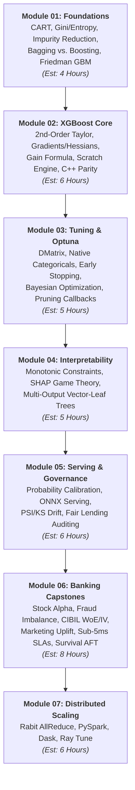

# Enterprise XGBoost Mastery: Master Curriculum & Learning Blueprint

**Author**: Marshal Mathew | Senior Manager & Lead Data Scientist  
**Repository Standard**: Enterprise Production Masterclass (7-Module Architecture)  
**Domain Anchor**: Quantitative Finance, Risk Governance (SR 11-7 / ECOA), and Banking Operations

---

## 🗺️ Master Curriculum Roadmap



---

## 📚 The 3-Tier Document Hierarchy

This repository is intentionally structured into three distinct documentation tiers, each tailored to a specific audience and functional objective:

| Tier | Document | Target Audience | Functional Role | How to Use |
|:---|:---|:---|:---|:---|
| **Tier 1** | **Module Guides (`01_*/` to `07_*/`)** | Data Scientists, ML Engineers, Learners | Progressive hands-on coursework, mathematical proofs, runnable scripts, and diagnostics. | Follow sequentially from Step 01 to Step 07. Each folder contains its own self-contained guide, scripts, and pre-tests. |
| **Tier 2** | **XGBoost Mastery Study Guide ([`XGBoost_Mastery_Study_Guide.md`](./XGBoost_Mastery_Study_Guide.md))** | Reference Readers, Quantitative Researchers | Monolithic textbook & complete algorithmic encyclopedia (exportable to HTML/PDF via [`export_study_guide_pdf.py`](./export_study_guide_pdf.py)). | Use for global keyword search, offline study, or deep mathematical lookup across the complete 2,000-line syllabus. |
| **Tier 3** | **Enterprise Production Playbook ([`XGBoost_Playbook.md`](./XGBoost_Playbook.md))** | Model Risk Committees, Engineering Leads | Institutional governance standard, 3 deployable banking proposals, compliance protocols. | Submit to Model Governance Committees (SR 11-7) or Engineering Architecture for deployment sign-off. |

---

## 🧭 Module Breakdown & Learning Progression

### [Module 01: Theoretical Foundations](./01_theory_foundations/README.md)
* **Objective**: Understand CART, ensemble variance reduction (Bagging), and functional gradient descent (Friedman GBM).
* **Key Implementations**: Pure Python Decision Tree and Gradient Boosting Machine built strictly from scratch.
* **Pre-Chapter Diagnostic**: [`01_theory_foundations/self_test_foundations.md`](./01_theory_foundations/self_test_foundations.md).

### [Module 02: XGBoost Core Mechanics](./02_xgboost_core_mechanics/README.md)
* **Objective**: Derive the second-order Taylor expansion, Newton-Raphson leaf weights ($w^* = -G/(H+\lambda)$), the exact split Gain formula, and the Weighted Quantile Sketch.
* **Key Implementations**: Standalone 2nd-order engine ([`xgboost_scratch.py`](./02_xgboost_core_mechanics/xgboost_scratch.py)) validated against C++ XGBoost to $10^{-7}$ parity.
* **Pre-Chapter Diagnostic**: [`02_xgboost_core_mechanics/self_test_mechanics.md`](./02_xgboost_core_mechanics/self_test_mechanics.md).

### [Module 03: Hyperparameter Science & Tuning Strategy](./03_basic_usage_and_tuning/README.md)
* **Objective**: Move beyond naive grid search with the Tree-structured Parzen Estimator (TPE), Successive Halving / MedianPruner, and learning curve diagnostics.
* **Key Implementations**: 4-stage stratified Bayesian tuning pipeline targeting PR-AUC under alert budget constraints.
* **Pre-Chapter Diagnostic**: [`03_basic_usage_and_tuning/self_test_params.md`](./03_basic_usage_and_tuning/self_test_params.md).

### [Module 04: Advanced Enterprise Features & Governance](./04_advanced_features/README.md)
* **Objective**: Enforce business intuition via monotonic constraints ($w_R \ge w_L$), block illegal proxy interactions under ECOA Reg B, and audit TreeSHAP collinearity.
* **Key Implementations**: SR 11-7 Model Risk compliance memo, tree split graph parser, and native multi-output vector trees.
* **Pre-Chapter Diagnostic**: [`04_advanced_features/self_test_governance.md`](./04_advanced_features/self_test_governance.md).

### [Module 05: Production Deployment & Serving](./05_production_and_quirks/README.md)
* **Objective**: Avoid the raw margin trap in custom loss functions, measure convexity and silent Hessian clipping, calibrate probabilities, and build drift monitoring (PSI/CSI).
* **Key Implementations**: Hand-derived asymmetric AML loss ($k=10$), ONNX serving benchmarks, and Evidently drift dashboards.
* **Pre-Chapter Diagnostic**: [`05_production_and_quirks/self_test_production.md`](./05_production_and_quirks/self_test_production.md).

### [Module 06: Capstone Banking Projects](./06_projects_finance/README.md)
* **Objective**: Apply theory to institutional banking datasets across stock forecasting, transaction fraud, credit underwriting, marketing propensity, massive scale, and survival analysis.
* **Key Implementations**: Accelerated Failure Time (`survival:aft`) for IFRS 9 / CECL Lifetime Expected Credit Loss.

### [Module 07: Distributed XGBoost Architecture](./07_distributed_xgboost/README.md)
* **Objective**: Scale training across multi-node clusters using the Rabit ring AllReduce topology ($\mathcal{O}(\log P)$ communication) without parameter server bottlenecks.
* **Key Implementations**: Runnable Dask out-of-core pipelines, PySpark MLlib integration, and Ray Train elastic scaling.

---

## ⚠️ Enterprise FAQ & The 5 Lethal Production Footguns

### Footgun 1: The Raw Margin Space Trap in Custom Objectives
* **The Trap**: In custom objective functions (`custom_obj(preds, dtrain)`), `preds` is passed as **untransformed margin values ($z \in \mathbb{R}$)**, not probabilities. If you write $g = \text{preds} - y$, gradient descent diverges instantly.
* **The Fix**: In binary classification, explicitly apply the sigmoid link function:
  ```python
  p = 1.0 / (1.0 + np.exp(-preds))
  p = np.clip(p, 1e-15, 1.0 - 1e-15)
  grad = p - labels
  hess = p * (1.0 - p)
  ```
  *Note*: When using custom evaluation metrics (`custom_metric(preds, dtrain)`), `preds` is also passed in margin space unless explicitly mapped.

### Footgun 2: `base_score` Initialization Shift in XGBoost 2.0+
* **The Trap**: In XGBoost `<2.0`, `base_score` defaulted to a hardcoded `0.50`. In XGBoost `2.0+`, it defaults to the empirical target mean ($\bar{y}$). If you hand-calculate margins or compare leaf weight offsets across versions, predictions will diverge.
* **The Fix**: Explicitly pass `base_score=0.5` in parameters if exact backward reproducibility or symmetric margin centering is required.

### Footgun 3: Missing Value Default Split Routing
* **The Trap**: XGBoost learns default split directions for missing (`NaN`) values during training by assigning them to whichever child yields the highest Gain. If test data contains missing values on features that had zero missing values during training, XGBoost defaults to the right branch by convention, potentially routing outliers into high-risk leaves.
* **The Fix**: Test explicit missing value handling in development using `missing=np.nan` and verify split routing via `bst.dump_model()`.

### Footgun 4: OpenMP vs. BLAS/NumPy CPU Thread Contention
* **The Trap**: Setting `n_jobs=-1` on shared institutional Linux/Windows servers causes XGBoost's OpenMP thread pool to fight with MKL/OpenBLAS threads, resulting in severe CPU context-switching thrashing and $3\times$ slower training.
* **The Fix**: Explicitly cap thread count: `params['n_jobs'] = os.cpu_count() // 2` and export `OMP_NUM_THREADS=4`.

### Footgun 5: Collinear Feature Credit Splitting in TreeSHAP
* **The Trap**: TreeSHAP assumes feature independence during coalition evaluation. When collinear variables exist (e.g. `annual_income` and `loan_amount`, $r > 0.70$), the tree ensemble arbitrarily splits attribution between them, generating contradictory adverse action notices under ECOA.
* **The Fix**: Audit correlated feature pairs in adverse action pipelines, enforce interaction constraints, or group collinear features into single composite scores.

---

## 💾 Data Acquisition & Provenance Strategy

To ensure zero setup friction, this repository supports two complementary data paths:

1. **Instant Offline Deterministic Generation (Zero Credentials Required)**:
   ```bash
   uv run python scripts/generate_synthetic_data.py --dataset all --samples 20000 --output-dir data/
   ```
   Generates reproducible datasets for credit risk, AML fraud, quantile sketch, and AFT survival analysis in under 5 seconds.

2. **Official Kaggle Competition Datasets**:
   - Place your `kaggle.json` API token in the root directory.
   - Run the automated downloader:
     ```bash
     uv run python download_kaggle.py
     ```
