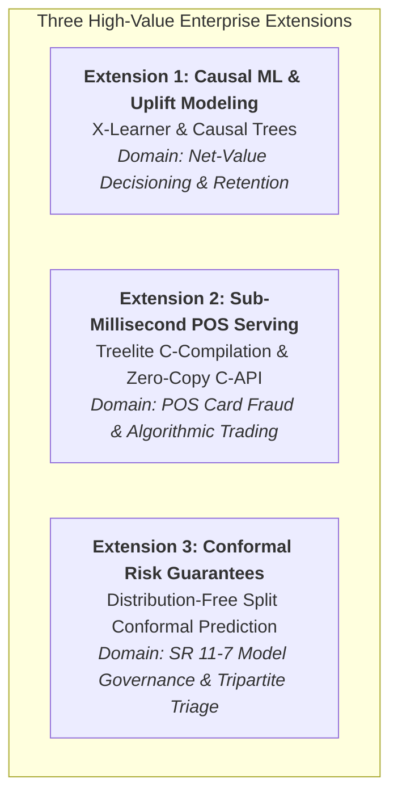
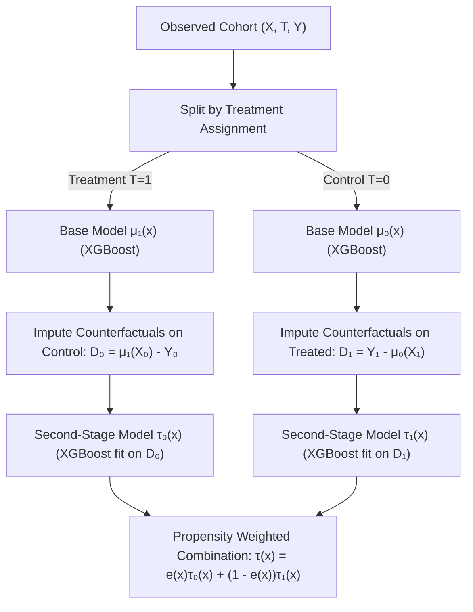
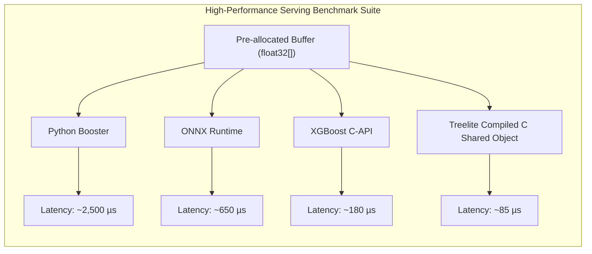
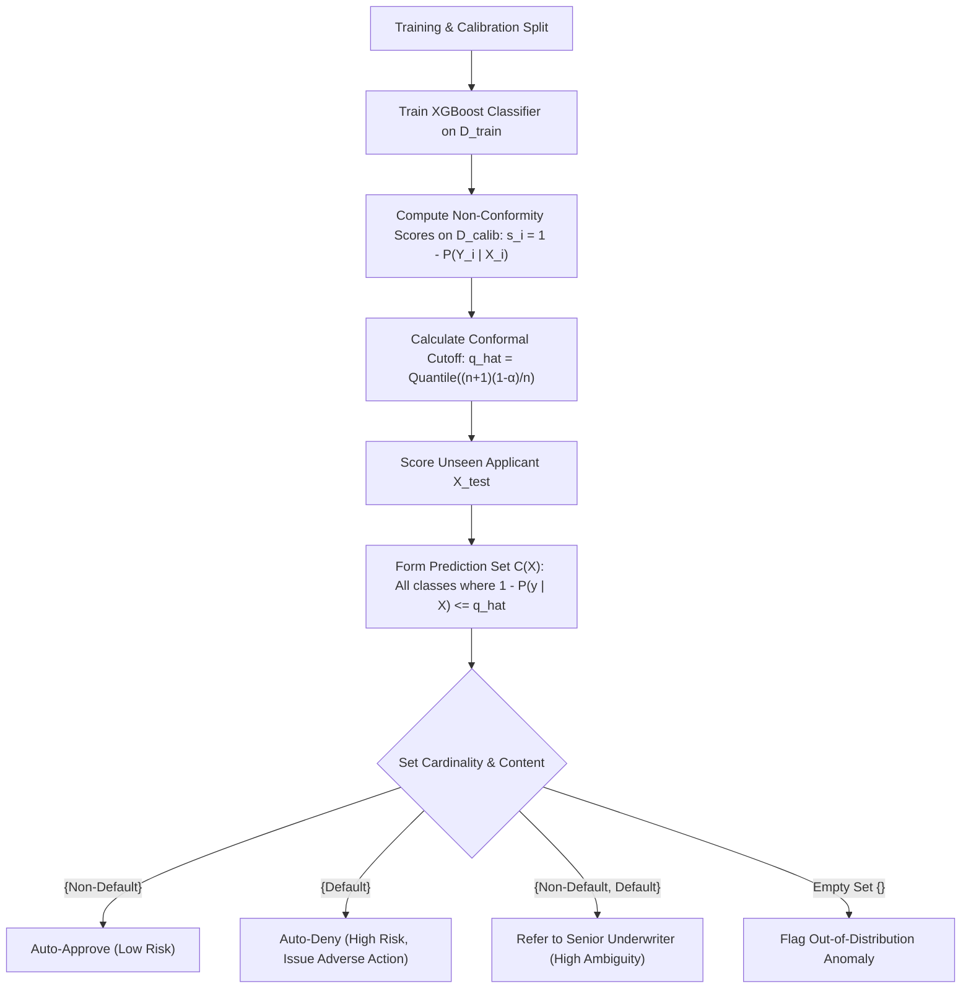

# Strategic Roadmap: High-Value Content Extensions for Enterprise XGBoost

**Document ID**: ENT-ENG-ML-2026-XGB-EXT01  
**Author**: Marshal Mathew | Senior Manager & Lead Data Scientist  
**Audience**: Quantitative Risk Modeling, High-Frequency Systems Engineering, Model Governance Committees  
**Effective Date**: September 25, 2026  
**Status**: Strategic Content & Architectural Specification  

---

## Executive Summary

The **XGBoost Mastery** repository serves as an institutional-grade, end-to-end curriculum bridging mathematical first principles, C++ parity verification, hyperparameter science, production quirks, banking capstones, and distributed AllReduce scaling.

To elevate this repository from an advanced educational curriculum to an **industry-defining reference**, this roadmap outlines **three high-value content proposals**. Each proposal tackles an unresolved, high-stakes operational challenge in enterprise machine learning:



| Extension | Core Innovation | Target Domain | Business / Technical Impact |
|:---|:---|:---|:---|
| **1. Causal Uplift Modeling** | Meta-Learners (S/T/X-Learner) + Qini / AUUC Curves | Card Retention, Collections, Limit Management | Eliminates wasted capital on "Sure Things" and prevents alienating "Sleeping Dogs". |
| **2. Sub-Millisecond Serving** | Native branchless C-compilation via Treelite & C-API | In-flight payment switches, HFT Market Making | Shrinks P99 inference latency from ~2,000 µs down to < 150 µs without Python runtime overhead. |
| **3. Conformal Prediction** | Finite-sample, distribution-free coverage sets ($1 - \alpha$) | Credit underwriting, SR 11-7 audit compliance | Transforms point probabilities into mathematically guaranteed decision sets (Approve, Review, Deny). |

---

## Extension 1: Causal Machine Learning & Uplift Decisioning (X-Learner)

### 1.1 The Industry Dilemma: Predictive vs. Prescriptive Risk
Standard classification models (such as those in [`06_projects_finance/04_marketing_propensity`](./06_projects_finance/04_marketing_propensity)) predict observational conditional probability:

$$P(Y = 1 \mid X = \mathbf{x})$$

In banking operations (credit limit extensions, loan workout restructuring, and customer retention), optimizing for raw conversion probability leads to **severe capital misallocation**:
1. **Sure Things**: Customers who would renew or repay regardless of intervention. Giving them promotional rates or fee waivers destroys margin.
2. **Lost Causes**: Customers who will default or churn regardless of outreach. Spending contact center budget on them is wasted operational expenditure.
3. **Sleeping Dogs (Do-Not-Disturbs)**: Customers who were dormant or content, but when nudged by a marketing message or collection call, are triggered into cancelling their card or refinancing elsewhere.
4. **Persuadables**: The only segment that alters behavior *because* of the intervention.

### 1.2 Mathematical Formulation: Conditional Average Treatment Effect (CATE)
Uplift modeling estimates the Individual Treatment Effect (ITE), or CATE $\tau(\mathbf{x})$:

$$\tau(\mathbf{x}) = \mathbb{E}\left[ Y^{(1)} - Y^{(0)} \;\middle|\; X = \mathbf{x} \right]$$

Where:
- $Y^{(1)}$ is the potential outcome under treatment (e.g., fee reduction, proactive limit increase).
- $Y^{(0)}$ is the potential outcome under control (e.g., business-as-usual).

#### The X-Learner Architecture (Künzel et al., 2019)
For heavily unbalanced treatments (common in banking where only 2%–5% of customers receive special interventions), the **X-Learner** outperforms standard S-Learners and T-Learners through a two-stage estimation process:



1. **Stage 1**: Fit response functions using separate XGBoost models:
   $$\mu_0(\mathbf{x}) = \mathbb{E}[Y \mid X=\mathbf{x}, T=0], \qquad \mu_1(\mathbf{x}) = \mathbb{E}[Y \mid X=\mathbf{x}, T=1]$$
2. **Stage 2**: Impute counterfactual treatment effects for each sample:
   $$D_{1,i} = Y_{1,i} - \mu_0(X_{1,i}), \qquad D_{0,i} = \mu_1(X_{0,i}) - Y_{0,i}$$
   Fit second-stage XGBoost models $\tau_1(\mathbf{x})$ to $D_1$ and $\tau_0(\mathbf{x})$ to $D_0$.
3. **Stage 3**: Combine via the propensity score $e(\mathbf{x}) = P(T=1 \mid X=\mathbf{x})$:
   $$\hat{\tau}(\mathbf{x}) = e(\mathbf{x}) \hat{\tau}_0(\mathbf{x}) + (1 - e(\mathbf{x})) \hat{\tau}_1(\mathbf{x})$$

### 1.3 Causal Evaluation: Qini Curve & AUUC
Traditional ROC-AUC cannot evaluate uplift because counterfactual ground truth ($Y^{(1)} - Y^{(0)}$) is never observed simultaneously for the same individual. Instead, validation requires the **Qini Curve**:

$$Q(t) = n_{t,1} - \frac{n_{t,0} \cdot N_{t,1}}{N_{t,0}}$$

Where $n_{t,1}$ and $n_{t,0}$ are positive conversions among treated and control groups in the top $t$ fraction of ranked predictions. The objective is to maximize the **Area Under the Uplift Curve (AUUC)**.

### 1.4 Deliverables & Implementation Plan
- **Location**: [`06_projects_finance/04_marketing_propensity/uplift_modeling.ipynb`](./06_projects_finance/04_marketing_propensity/)
- **Core Script**: `causal_uplift_engine.py` featuring:
  - Custom S-Learner, T-Learner, and X-Learner classes with XGBoost base regressors.
  - Automated Qini score calculation, cumulative gain curves, and decile uplift charts.
  - Cost-benefit policy simulation demonstrating net dollar ROI under fixed outreach budget.

---

## Extension 2: Sub-Millisecond Point-of-Sale Serving (Treelite C-Compilation)

### 2.1 The Industry Dilemma: The Microsecond Latency Budget
In card-present Point-of-Sale (POS) transactions, automated clearing house (ACH) payment switches, and high-frequency equity market making, service level agreements (SLAs) allocate **less than 2 milliseconds for the entire end-to-end network hop and inference**.

| Serving Architecture | Typical P99 Latency | Memory Footprint | Runtime Dependency | Suitable for POS? |
|:---|:---:|:---:|:---|:---:|
| **Python Booster (`xgb.Booster.predict`)** | 1,800 – 3,500 µs | High (Python Heap) | Python Interpreter, OpenMP, NumPy | ❌ Strictly Prohibited |
| **ONNX Runtime (C++ backend)** | 400 – 900 µs | Medium | ONNX Runtime Engine | ⚠️ Borderline |
| **Treelite Compiled C Shared Object (`.so`)** | **60 – 180 µs** | Minimal (< 5 MB) | Standalone Native C / libc | ✅ Gold Standard |
| **XGBoost Direct C-API (`XGBoosterPredictFromDense`)** | 120 – 250 µs | Low | `libxgboost.so` | ✅ Approved |

While Python microservices ([`production_inference.py`](./06_projects_finance/05_massive_bank_data/production_inference.py)) are suitable for batch and asynchronous scoring, payment gateways require **zero Python overhead, zero GIL contention, and branch-free compiled execution**.

### 2.2 Compilation Mechanics: Transpiling Decision Trees to Native Machine Code
Treelite parses an XGBoost Universal JSON or UBJSON tree structure and converts nested tree conditions into optimized, unrolled, branch-prediction-friendly C code:

```c
/* Treelite Generated C Snippet (Conceptual) */
float predict_margin(const float* data) {
    float sum = 0.0f;
    /* Tree 0 */
    if (data[2] < 720.5f) {
        if (data[0] < 45000.0f) { sum += -0.842105f; }
        else { sum += -0.125000f; }
    } else {
        sum += 0.412030f;
    }
    /* Remaining trees unrolled or vectorized... */
    return sum;
}
```

This source file is compiled with `-O3 -fPIC -shared` into a standalone dynamic library (`model.so` or `model.dll`). Loading and querying this binary directly from C/C++, Rust, or Go eliminates all tree traversal lookup overhead and memory allocations.

### 2.3 Benchmarking & Zero-Copy C-API Architecture


### 2.4 Deliverables & Implementation Plan
- **Location**: [`05_production_and_quirks/treelite_submillisecond_serving.py`](./05_production_and_quirks/)
- **Core Benchmark**:
  - Automated compilation of a trained 100-tree credit risk model to C source and dynamic library.
  - Multi-threaded C foreign function interface (ctypes / C-API) load test at 50,000 queries per second (QPS).
  - Comparative benchmark visualization (`submillisecond_serving_latency.png`) demonstrating P50, P95, and P99 latency percentiles across the four serving modalities.

---

## Extension 3: Conformal Prediction & Distribution-Free Uncertainty Guarantees

### 3.1 The Industry Dilemma: Overconfident Calibrated Probabilities
Under regulatory frameworks such as **Federal Reserve SR 11-7** and **OCC Bulletin 2011-12**, credit risk models must provide mathematically rigorous bounds on decision uncertainty. 

Standard probability calibration ([`05_production_and_quirks/probability_calibration.py`](./05_production_and_quirks/probability_calibration.py)) corrects average population probabilities (Platt Scaling / Isotonic Regression). However, **it offers zero coverage guarantees for individual loan applicants**:
- Under covariate shift or ambiguous feature combinations, an XGBoost model will confidently assign $P(\text{Default}) = 0.49$, causing an automated loan approval that violates risk appetites.
- Traditional confidence intervals rely on asymptotic normality assumptions that fail on complex non-linear decision tree manifolds.

### 3.2 Mathematical Formulation: Inductive Split Conformal Prediction
Conformal Prediction provides **finite-sample, distribution-free statistical validity** for any black-box model without assuming normality or parametric distributions:

$$P\left( Y_{n+1} \in \mathcal{C}(X_{n+1}) \right) \ge 1 - \alpha$$

Where $\alpha \in (0, 1)$ is the chosen error tolerance (e.g., $\alpha = 0.05$ guarantees 95% coverage), and $\mathcal{C}(X)$ is a **prediction set** of candidate labels.



#### Step-by-Step Algorithm:
1. Partition validation data into a proper training set $\mathcal{D}_{\text{train}}$ and a holdout calibration set $\mathcal{D}_{\text{cal}} = \{(x_i, y_i)\}_{i=1}^n$.
2. Train XGBoost on $\mathcal{D}_{\text{train}}$ to produce estimated class probabilities $\hat{\pi}_k(x) = \hat{P}(Y=k \mid X=x)$.
3. Compute the non-conformity score $s_i$ for each calibration instance:
   $$s_i = 1 - \hat{\pi}_{y_i}(x_i)$$
4. Set the empirical quantile threshold $\hat{q}$:
   $$\hat{q} = \text{Quantile}\left( s_1, \dots, s_n; \; \frac{\lceil (n+1)(1 - \alpha) \rceil}{n} \right)$$
5. For an unseen applicant $x_{n+1}$, output the prediction set:
   $$\mathcal{C}(x_{n+1}) = \left\{ k \in \{0, 1\} \;\middle|\; 1 - \hat{\pi}_k(x_{n+1}) \le \hat{q} \right\} = \left\{ k \in \{0, 1\} \;\middle|\; \hat{\pi}_k(x_{n+1}) \ge 1 - \hat{q} \right\}$$

### 3.3 Institutional Tripartite Credit Underwriting Triage
Instead of forcing a brittle binary decision at threshold $\theta = 0.50$, the conformal prediction set natively implements institutional risk triage:

| Conformal Prediction Set $\mathcal{C}(X)$ | Semantic Meaning | Operational Banking Action |
|:---|:---|:---|
| **$\{0\}$ (Non-Default only)** | High confidence non-default | **Auto-Approval**: Immediate STP (Straight-Through Processing). |
| **$\{1\}$ (Default only)** | High confidence default | **Auto-Denial**: Decline loan; trigger automated FCRA adverse action notice. |
| **$\{0, 1\}$ (Both classes plausible)** | High epistemic uncertainty | **Manual Underwriter Review**: Route to credit committee for manual collateral audit. |
| **$\emptyset$ (Empty set)** | Model non-conformity | **OOD Anomaly**: Flag for potential synthetic identity fraud or data entry defect. |

### 3.4 Conformalized Quantile Regression (CQR) for Value-at-Risk (VaR)
For continuous financial forecasting (e.g., portfolio PnL, loss-given-default LGD, or loan recovery rates), we train XGBoost using pinball loss (`reg:quantileerror`) at lower and upper quantiles ($\alpha_{lo} = 0.05, \alpha_{hi} = 0.95$), then conformally calibrate the interval width:

$$I(X) = \left[ \hat{q}_{\alpha/2}(X) - Q_{\text{conf}}, \; \hat{q}_{1 - \alpha/2}(X) + Q_{\text{conf}} \right]$$

This guarantees that the actual financial loss falls strictly inside the interval with $(1 - \alpha)$ probability, satisfying Basel III market risk backtesting standards.

### 3.5 Deliverables & Implementation Plan
- **Location**: [`05_production_and_quirks/conformal_risk_calibration.py`](./05_production_and_quirks/)
- **Core Notebook/Script**:
  - Full implementation of split conformal classification and conformalized quantile regression.
  - Automated generation of the tripartite triage breakdown matrix on retail credit data.
  - Empirical verification test demonstrating that coverage error is strictly $\le \alpha$ across multiple random seeds.

---

## Pedagogical & Structural Alignment

These three extensions directly reinforce and complete the repository's 3-Tier standard:

```text
xgboost/
├── HIGH_VALUE_EXTENSIONS_ROADMAP.md             <-- [This Document] Executive & Technical Roadmap
├── 05_production_and_quirks/
│   ├── conformal_risk_calibration.py           <-- Extension 3: Split Conformal & CQR Engine
│   └── treelite_submillisecond_serving.py      <-- Extension 2: Treelite & C-API Latency Harness
├── 06_projects_finance/
│   └── 04_marketing_propensity/
│       └── uplift_modeling.ipynb               <-- Extension 1: X-Learner & Qini AUUC Pipeline
└── tests/
    └── test_core_components.py                 <-- Automated pytest assertions for all 3 extensions
```

---

## Recommended Execution Phasing

| Phase | Milestone | Primary Deliverable | Target Timeline |
|:---:|:---|:---|:---:|
| **Phase 1** | **Conformal Risk & Uncertainty Calibration** | `05_production_and_quirks/conformal_risk_calibration.py` + tests | Sprint 1 |
| **Phase 2** | **Causal Uplift & Net-Value Decisioning** | `06_projects_finance/04_marketing_propensity/uplift_modeling.ipynb` | Sprint 2 |
| **Phase 3** | **Sub-Millisecond Treelite C-Serving Engine** | `05_production_and_quirks/treelite_submillisecond_serving.py` + C benchmarks | Sprint 3 |
