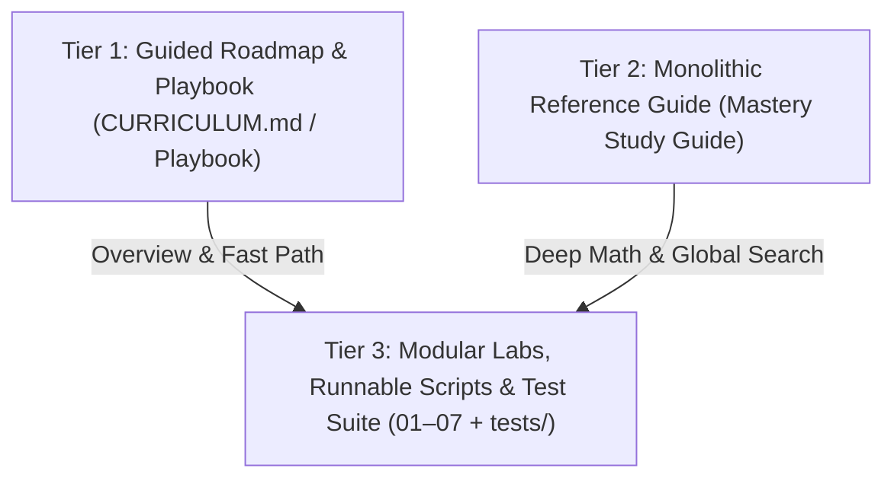

# Model Study Guide Blueprint: Enterprise Curriculum Architecture

This document serves as an enterprise-grade reusable template and architectural blueprint for building an authoritative, production-ready study guide repository for **any machine learning algorithm** (e.g., LightGBM, CatBoost, Random Forest, PyTorch Transformers, Diffusion Models).

---

## 🏛️ 1. The 3-Tier Pedagogical Architecture

To cater to multiple reader personas (practitioners, quantitative researchers, systems engineers, and learners), every algorithm repository should implement a **3-tier document hierarchy**:



| Tier | Artifact | Primary Audience | Core Value Proposition |
|:---|:---|:---|:---|
| **Tier 1** | `CURRICULUM.md` & `[Model]_Playbook.md` | Practitioners, Hiring Managers | Executive overview, curated learning tracks (Theory, Production, Full-Stack), known footguns FAQ, and navigation index. |
| **Tier 2** | `[Model]_Mastery_Study_Guide.md` (and exported `.html` / `.pdf`) | Deep Researchers, Reference Readers | Monolithic 2,000+ line textbook containing exhaustive first-principles mathematical derivations, source code citations, and offline exportability via `export_study_guide_pdf.py`. |
| **Tier 3** | Modules `01_` through `07_` & `tests/` | Engineers, Hands-on Learners | Modular, runnable Python scripts, interactive Jupyter notebooks, standalone scratch implementations, governance memos, self-tests, and automated pytest assertions. |

---

## 📁 2. Standard Repository Directory Structure

```text
├── .github/
│   └── workflows/
│       └── ci.yml                     # Multi-Python matrix, Ruff linting, and 10MB file-size guard
├── 01_theory_foundations/             # First-principles math, Taylor expansions, scratch engine
│   ├── README.md                      # Mathematical foundations & derivations
│   ├── scratch_engine.py              # Pure Python/NumPy analytical implementation
│   └── self_test_foundations.md       # Knowledge checkpoint (Theory & Calculations)
├── 02_[model]_core_mechanics/         # Internal mechanics, split algorithms, custom losses
│   ├── README.md                      # Histogram / Quantile sketch / Exact split mechanics
│   ├── compare_and_explore.py         # Numerical parity suite vs official library (tolerance < 1e-7)
│   ├── custom_loss_engine.py          # Custom objective functions with exact gradient & Hessian
│   └── self_test_mechanics.md         # Mechanics self-assessment
├── 03_basic_usage_and_tuning/         # Modern API usage, hardware acceleration, hyperparameter tuning
│   ├── README.md                      # Modern parameter taxonomy & staged tuning playbook
│   ├── gpu_acceleration_benchmark.py  # Modern device syntax (e.g. device='cuda') vs CPU baseline
│   ├── staged_tuning_pipeline.py      # Optuna staged Bayesian optimization (TPE + Pruning)
│   └── self_test_params.md            # Hyperparameter tuning self-assessment
├── 04_advanced_features/              # Advanced architectural capabilities & trade-offs
│   ├── README.md                      # Categoricals, monotonic constraints, multi-target vector trees
│   ├── monotonic_and_shap_analysis.py # Monotonic splines vs AUC trade-off analysis & TreeSHAP
│   ├── model_risk_explainability_memo.md # Enterprise governance & regulatory memo (SR 11-7)
│   └── self_test_governance.md        # Governance & explainability self-assessment
├── 05_production_and_quirks/          # Serialization, serving, probability calibration, drift
│   ├── README.md                      # Serving architectures, known footguns & calibration
│   ├── export_onnx_benchmark.py       # Ultra-low latency ONNX serving benchmark & parity check
│   ├── probability_calibration.py     # Platt scaling, Isotonic regression & Brier score evaluation
│   ├── production_drift_monitoring.py # Feature/target drift detection (PSI, Evidently AI)
│   ├── champion_challenger_policy.md  # Continuous retraining & rollout governance policy
│   └── self_test_production.md        # Production quirks self-assessment
├── 06_projects_[domain]/              # Applied capstone projects with real-world complexities
│   ├── README.md                      # Project portfolio directory
│   ├── 01_time_series_forecasting/    # Temporal cross-validation, walk-forward splits
│   ├── 02_extreme_imbalance/          # Cost-sensitive learning, scale_pos_weight, PR-AUC
│   ├── 03_risk_scoring/               # Monotonic constraints, scorecards, credit risk
│   └── 04_survival_analysis/          # Accelerated failure time (AFT), censored data
├── 07_distributed_[model]/            # Cluster scaling & distributed communication topologies
│   ├── README.md                      # AllReduce vs Parameter Server topology & complexity
│   ├── dask_pipeline.py               # Out-of-core Dask distributed training
│   ├── pyspark_pipeline.py            # Enterprise PySpark MLlib Pipeline with Barrier RDD
│   └── ray_pipeline.py                # Elastic actor-based distributed training
├── data/                              # (Ignored) Local cached datasets
├── scripts/
│   └── generate_synthetic_data.py     # Zero-dependency reproducible dataset generator
├── tests/
│   ├── conftest.py                    # Pytest configuration & fixtures
│   └── test_core_components.py        # Automated test suite (parity, reproducibility, exports)
├── .gitignore                         # Strict exclusion for binaries, large datasets, and secrets
├── CURRICULUM.md                      # Master curriculum & multi-tier roadmap
├── [Model]_Playbook.md                # Rapid production reference & footguns guide
├── [Model]_Mastery_Study_Guide.md     # Monolithic textbook
├── export_study_guide_pdf.py          # Standalone PDF/HTML exporter with syntax highlighting
└── pyproject.toml                     # Modern UV / PEP 621 package specification
```

---

## 🔬 3. Key Pedagogical Requirements Per Module

### Module 01: Theoretical Foundations
- **Mathematical Rigor**: Derive the objective function from first principles. Show the 2nd-order Taylor series approximation $f(x + \Delta x) \approx f(x) + g_i f_t(x_i) + \frac{1}{2} h_i f_t^2(x_i)$.
- **Scratch Engine**: Provide a pure NumPy implementation of the model's core tree-building loop, analytically calculating optimal leaf weights $w_j^* = -\frac{G_j}{H_j + \lambda}$ and structure scores.
- **Self-Test**: Include conceptual calculation questions (pen-and-paper Hessian/Gain math) and programming challenges.

### Module 02: Core Mechanics & Hardware Execution
- **Exact vs. Approximate Split Finding**: Contrast greedy exact split algorithms with quantile sketching and binned histogram methods (`tree_method='hist'`).
- **C++ Source Code Citations**: Cite specific source files (e.g., `updater_colmaker.cc`, `split_evaluator.h`) to bridge theory with actual systems implementation.
- **Custom Objectives**: Implement custom asymmetric loss functions (e.g., asymmetric penalty for credit default or underpricing), requiring analytical first ($g_i$) and second ($h_i$) derivatives.
- **Numerical Parity**: Always include a parity script asserting that the scratch engine matches the official library down to floating-point precision ($< 10^{-5}$).

### Module 03: Basic Usage, Tuning & Hardware
- **Modern Hardware Syntax**: Explicitly use modern hardware parameters (e.g., `device='cuda'`, `tree_method='hist'`) and deprecate legacy flags (e.g., `gpu_hist`).
- **Staged Tuning Strategy**: Implement an Optuna staged pipeline (Architecture $\to$ Regularization $\to$ Learning Rate) rather than an unfocused brute-force grid search.
- **Forward Compatibility**: Implement resilient callback bindings (e.g., `try: from optuna_integration ... except ImportError: ...`) to guard against library version splits.

### Module 04: Advanced Features & Governance
- **Nuanced Trade-offs**: Never present features as "free wins". Quantify the price of constraints (e.g., monotonic constraints prevent unfair credit denial, but may reduce raw PR-AUC by 1–3%).
- **Native Categoricals vs. OHE**: Benchmark partition-based categorical splits against One-Hot Encoding and Target Encoding.
- **Multi-Output Architectures**: Compare Softmax, One-vs-Rest, and Native Vector Trees in terms of gradient memory, split gain formulation, and tree count reduction ($K\times$).
- **Regulatory Governance Memos**: Provide real-world compliance documentation (e.g., Federal Reserve SR 11-7 model risk memos, TreeSHAP collinearity handling).

### Module 05: Production Engineering, Calibration & Quirks
- **Ultra-Low Latency Inference**: Benchmark standard Python predict against ONNX Runtime, Treelite, or C-API runtimes; enforce numerical parity assertions ($< 10^{-4}$).
- **Probability Calibration**: Include calibration curves, Expected Calibration Error (ECE), and compare Platt Scaling (Logistic Regression) vs. Isotonic Regression on imbalanced predictions.
- **Model Drift Monitoring**: Implement Population Stability Index (PSI) and distribution drift monitoring (e.g., Evidently AI / Wasserstein distance).
- **Production Retraining Policies**: Include a documented Champion/Challenger governance framework covering shadow deployments, trigger thresholds, and rollback criteria.

### Module 06: Capstone Domain Projects
- **Domain-Anchored Reality**: Select a core domain (e.g., Finance, AdTech, Healthcare) to anchor the applied projects.
- **Key Real-World Scenarios**:
  1. *Time-Series / Forecasting*: Walk-forward validation without lookahead leakage.
  2. *Extreme Class Imbalance*: Fraud detection (0.1% positive rate), PR-AUC optimization, threshold tuning.
  3. *Regulated Credit Scoring*: Scorecard scaling, monotonic constraints, adverse action explainability.
  4. *Survival Analysis*: Right-censored cohorts, Accelerated Failure Time (AFT), concordance index.

### Module 07: Distributed Architecture & Scaling
- **Network Topology**: Diagram and explain the distributed communication topology (e.g., Rabit Ring AllReduce $\mathcal{O}(K \cdot N)$ vs. legacy Parameter Server bottlenecks).
- **Multi-Framework Implementations**: Provide complete, runnable distributed pipelines across the three industry standards:
  - **Dask**: Out-of-core streaming with memory-budget profiling.
  - **Apache Spark (PySpark)**: Spark MLlib `Pipeline`, `VectorAssembler`, and Barrier RDD execution.
  - **Ray Train**: Shared-memory Plasma store and elastic actor checkpointing.
- **Failure Mode Playbook**: Document concrete solutions for distributed stragglers, data skew, partition imbalance, and native C++ OOM exit codes (Exit Code 137).

---

## 🛡️ 4. Data Hygiene & Zero-Dependency Strategy

To guarantee that any user or CI runner can execute the full curriculum without external cloud credentials or broken downloads, every algorithm curriculum must follow a **Dual-Path Data Strategy**:

1. **Path A — Programmatic Real-World Data**: Provide download automation (e.g., `download_kaggle.py`) that checks local credential files and downloads benchmark datasets.
2. **Path B — Zero-Dependency Local Generator**: Provide a self-contained generator (`scripts/generate_synthetic_data.py`) using `scikit-learn` and `numpy` that deterministically synthesizes all required datasets with identical schemas and statistical quirks.

---

## ⚡ 5. Quality Assurance & CI Guardrails

Every study guide repository must enforce the following automated controls:

1. **Continuous Integration Matrix**: Test across multiple active Python minor versions (e.g., `["3.10", "3.11", "3.12"]`).
2. **Automated Linting**: Global fast linting via `ruff check .`.
3. **Repository File-Size Guard**: An automated CI step that inspects `git ls-files` and fails if any tracked file exceeds 10MB, strictly preventing accidental data or large model commits:
   ```bash
   python -c "
   import subprocess, sys, os
   result = subprocess.run(['git', 'ls-files'], capture_output=True, text=True, check=True)
   for f in result.stdout.strip().split('\n'):
       if f and os.path.exists(f) and os.path.getsize(f) > 10 * 1024 * 1024:
           print(f'Large file error: {f}')
           sys.exit(1)
   "
   ```
4. **Comprehensive Test Suite**: Automated pytest suite verifying scratch mathematical parity, ONNX runtime parity, multi-output shapes, reproducibility, and distributed interfaces.

