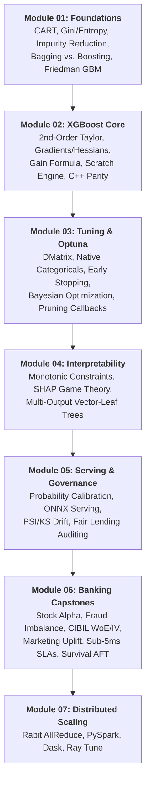
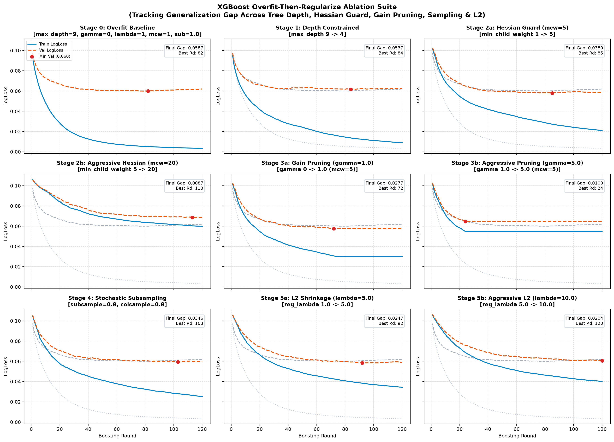
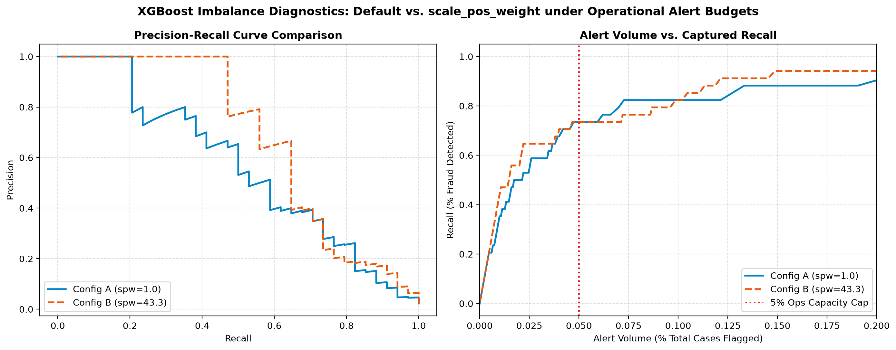
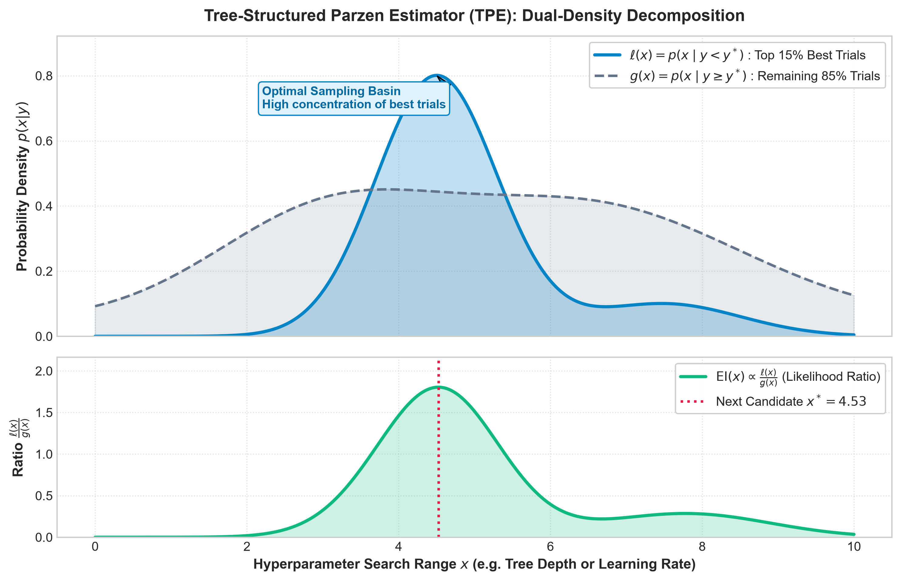
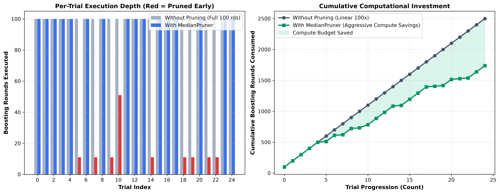
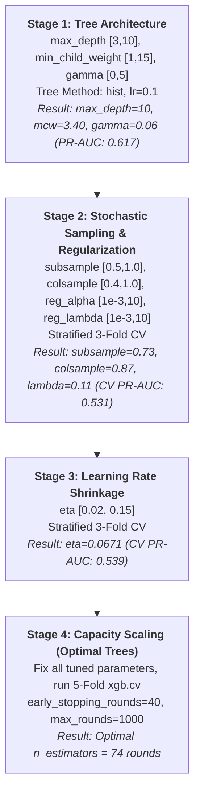
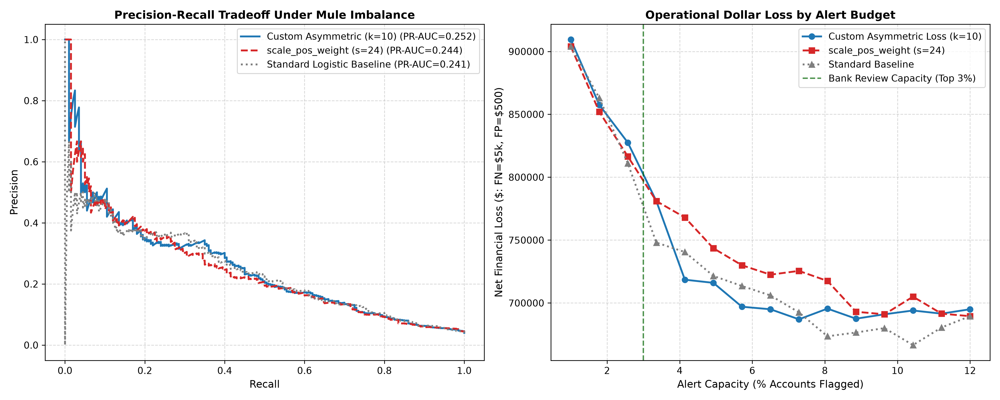
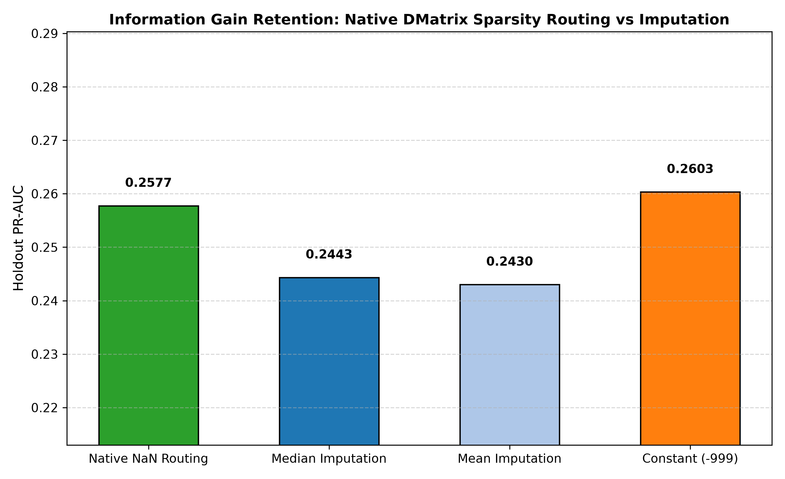
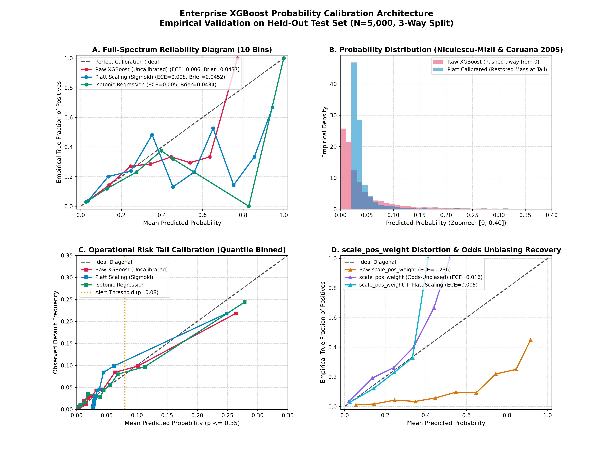
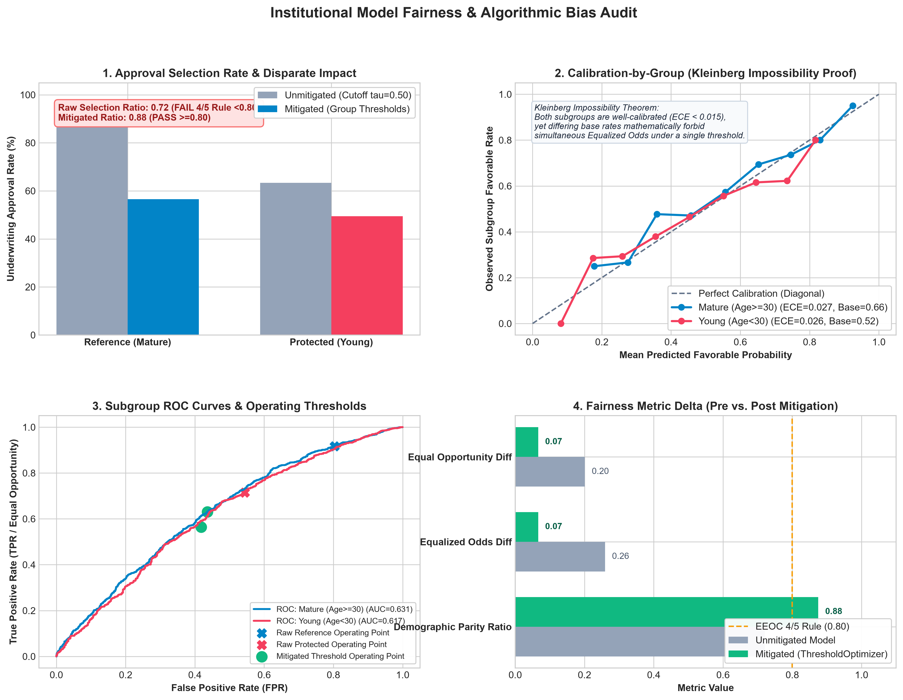

# XGBoost Mastery: From Theoretical Foundations to High-Throughput Production

**Author**: Marshal Mathew | Senior Manager & Lead Data Scientist (7+ Years Banking ML)  
**Repository**: [XGBoost Mastery](.)  
**Edition**: Enterprise Production Masterclass (Comprehensive 7-Module Edition)

---

## Executive Overview & Master Curriculum Map

This master study guide is the central reference manual for the repository, synthesizing deep theoretical derivations, pure Python from-scratch implementations, real-world banking case studies, and enterprise-grade distributed scaling architectures.



### Master Curriculum Map & Phase Overview

| Phase | Focus Topic | Core Deliverables & Key Concepts |
|---|---|---|
| **Phase 1** | **How XGBoost Actually Works Internally** | Core architectural formulation (Chen & Guestrin 2016), 2nd-order Taylor derivation, Newton step intuition ($\Delta w \approx -g/h$), scratch engine ([`xgboost_scratch.py`](./02_xgboost_core_mechanics/xgboost_scratch.py)), systems engineering kernels (histograms, sparsity-aware routing, cache blocks), and numerical parity validation ([`compare_and_explore.py`](./02_xgboost_core_mechanics/compare_and_explore.py)). |
| **Phase 2** | **Every Hyperparameter, With Reasons & Diagnostic Science** | Complete parameter taxonomy, obscure engine flags, active retrieval matrix ([`self_test_params.md`](./03_basic_usage_and_tuning/self_test_params.md)), learning curve diagnostics, 9-stage empirical ablation ([`overfit_then_regularize.py`](./03_basic_usage_and_tuning/overfit_then_regularize.py)), and operational alert budget capacity analysis. |
| **Phase 3** | **Tuning Strategy, Not Just Grid Search** | Mathematical failure of exhaustive search, Tree-structured Parzen Estimator (TPE) derivation ($\ell(x)/g(x)$ ratio), Successive Halving / MedianPruner, 3-source practitioner tuning consensus, Ryzen 7 5700U hardware benchmark ([`benchmark_tree_methods.py`](./03_basic_usage_and_tuning/benchmark_tree_methods.py)), pruning efficiency benchmark ([`pruning_benchmark.py`](./03_basic_usage_and_tuning/pruning_benchmark.py)), canonical minimal script ([`optuna_xgboost_canonical.py`](./03_basic_usage_and_tuning/optuna_xgboost_canonical.py)), and 4-stage tuner targeting PR-AUC ([`staged_tuning_pipeline.py`](./03_basic_usage_and_tuning/staged_tuning_pipeline.py)). |
| **Phase 4** | **Advanced Constraints & Interpretability** | Monotonic domain constraints, the native importance illusion (Weight vs Gain vs Cover), SHAP TreeExplainer cooperative game theory, multi-output vector-leaf trees. |
| **Phase 5** | **Production Serving, Governance & Distributed Architecture** | Probability calibration (Platt/Isotonic/Murphy partition), Universal Binary JSON (`model.ubj`), ONNX Runtime C++ sub-millisecond serving, PSI/KS/JSD drift monitoring & Champion-Challenger retraining, Algorithmic Fairness & Disparate Impact Auditing (Kleinberg Impossibility, Hardt Post-Processing mitigation under ECOA Reg B), and Rabit AllReduce distributed ring topology. |

---

## Table of Contents
1. [Module 01: Theoretical Foundations (CART, Bagging, Boosting, Friedman GBM)](#module-01-theoretical-foundations)
2. [Module 02: XGBoost Core Mechanics (Deep Derivations & From-Scratch Engine)](#module-02-xgboost-core-mechanics)
3. [Module 03: Hyperparameter Science & Disciplined Tuning Strategy](#module-03-basic-usage--tuning)
4. [Module 04: Advanced Enterprise Features & Interpretability](#module-04-advanced-features--diagnostics)
5. [Module 05: Production Deployment, Probability Calibration & Model Governance](#module-05-production-deployment--serving)
6. [Module 06: Capstone Banking & Quantitative Finance Case Studies](#module-06-banking--finance-projects)
7. [Module 07: Distributed XGBoost Architecture (PySpark, Dask, Ray)](#module-07-distributed-xgboost-architecture)

---

<a id="module-01-theoretical-foundations"></a>
## Module 01: Theoretical Foundations

Before analyzing Extreme Gradient Boosting, we establish the rigorous mathematical foundations upon which all tree-based ensemble learning rests: **Classification and Regression Trees (CART)**, **Statistical Ensemble Theory**, and **Friedman's Functional Gradient Descent**.

---

### 1. Classification and Regression Trees (CART)

XGBoost builds an additive sequence of CART trees (Breiman et al., 1984). Unlike classical classification trees (ID3, C4.5) that assign discrete class labels to terminal nodes, a CART tree assigns a **continuous, real-valued scalar weight** $w \in \mathbb{R}$ to every leaf:
$$f(x) = w_{q(x)}, \quad q: \mathbb{R}^d \to \{1, 2, \dots, T\}$$
where $q(x)$ maps an input feature vector $x \in \mathbb{R}^d$ to an integer leaf index $j \in \{1, \dots, T\}$, and $T$ is the total number of leaves in the tree.

#### 1.1 Recursive Binary Partitioning & Axis-Aligned Hyperplanes
CART partitions the continuous feature space $\mathcal{X} \subset \mathbb{R}^d$ into $T$ disjoint, axis-aligned hyper-rectangles $\{R_1, R_2, \dots, R_T\}$:
$$\mathcal{X} = \bigcup_{j=1}^T R_j, \qquad R_j \cap R_k = \emptyset \quad \forall j \ne k$$

At each internal node, CART executes a greedy binary split:
$$R_{\text{left}}(j, s) = \{x \mid x_j \le s\}, \qquad R_{\text{right}}(j, s) = \{x \mid x_j > s\}$$
where $j \in \{1, \dots, d\}$ is the chosen splitting feature and $s \in \mathbb{R}$ is the split threshold.

```
       [ Feature X2 ]
             │
      s2 ────┼───────────────────┬───────────────
             │       R1          │      R2
             │   (Leaf 1: w1)    │  (Leaf 2: w2)
      s1 ────┼───────────────────┴───────────────
             │                 R3
             │            (Leaf 3: w3)
             └───────────────────┬───────────────
                                s3     [ Feature X1 ]
```

> **Geometric Limitation (The Diagonal Boundary Trap)**:
> Because CART splits are strictly axis-aligned ($x_j \le s$), approximating a smooth linear boundary (e.g. $x_1 + x_2 > 1$, common in credit risk leverage ratios) requires a "staircase" of many orthogonal splits. This consumes excessive tree depth and demands substantial sample sizes in the corners of the feature space.

#### 1.2 Splitting Criteria & Impurity Reduction Mechanics
At every node $S$, the algorithm searches over all features $j$ and all feasible thresholds $s$ to maximize the impurity reduction:
$$\Delta I(S; j, s) = I(S) - \left[ \frac{|S_L|}{|S|} I(S_L) + \frac{|S_R|}{|S|} I(S_R) \right]$$

1. **Regression — Variance / Mean Squared Error (MSE)**:
   $$\text{MSE}(S) = \frac{1}{|S|} \sum_{i \in S} (y_i - \bar{y}_S)^2, \quad \bar{y}_S = \frac{1}{|S|} \sum_{i \in S} y_i$$
   The optimal prediction for a regression leaf is the sample mean $\hat{w} = \bar{y}_S$, which minimizes squared loss.

2. **Classification — Gini Impurity**:
   $$\text{Gini}(S) = 1 - \sum_{k=1}^K p_k^2 = \sum_{k=1}^K p_k (1 - p_k)$$
   where $p_k = \frac{1}{|S|} \sum_{i \in S} \mathbf{1}(y_i = k)$ is the empirical proportion of class $k$ in node $S$. Gini measures the probability of misclassifying a randomly chosen element if it were randomly labeled according to the class distribution.

3. **Classification — Cross-Entropy (Information Gain)**:
   $$\text{Entropy}(S) = -\sum_{k=1}^K p_k \log_2(p_k)$$
   Maximizing $\Delta \text{Entropy}$ is equivalent to maximizing the mutual information between the split indicator and the target label.

#### 1.3 Handling Continuous Features: Exact Sorting $\mathcal{O}(N \log N)$
For a continuous feature $X_j$:
1. Sort the $N$ training instances along feature $j$: $x_{(1), j} \le x_{(2), j} \le \dots \le x_{(N), j}$ ($\mathcal{O}(N \log N)$ time).
2. Evaluate candidate split thresholds at midpoints: $s_k = \frac{x_{(k), j} + x_{(k+1), j}}{2}$ for adjacent distinct values.
3. Rather than recomputing node impurities from scratch ($\mathcal{O}(N)$ per split, leading to $\mathcal{O}(N^2)$), CART maintains **running cumulative sums**:
   $$S_L = \sum_{i=1}^k y_{(i)}, \quad S_R = \sum_{i=1}^N y_i - S_L$$
   This enables updating left and right impurities in $\mathcal{O}(1)$ time per candidate threshold, reducing total split evaluation along one feature to $\mathcal{O}(N \log N)$.

#### 1.4 High-Cardinality Categorical Splits: Fisher's Exact Theorem
For a nominal categorical feature with $K$ categories, an exhaustive search over all non-empty binary partitions evaluates:
$$2^{K-1} - 1 \text{ candidate splits}$$
For an enterprise banking variable like Merchant Category Code ($K = 300$), $2^{299}$ evaluations is computationally impossible.

> **Fisher's Exact Theorem (1958) / Breiman (1984)**:
> For a **binary target** $Y \in \{0, 1\}$ or continuous regression target under squared loss:
> 1. Calculate the mean target value for each category $c \in \{1, \dots, K\}$: $\bar{y}_c = \mathbb{E}[Y \mid X = c]$.
> 2. Sort the categories in ascending order of their mean target: $\bar{y}_{(1)} \le \bar{y}_{(2)} \le \dots \le \bar{y}_{(K)}$.
> 3. The optimal split across all $2^{K-1}-1$ subsets is **guaranteed to be one of the $K-1$ splits along this sorted order**:
>    $$\text{Left Subset} = \{c_{(1)}, \dots, c_{(k)}\}, \quad \text{Right Subset} = \{c_{(k+1)}, \dots, c_{(K)}\}$$
> This mathematical property slashes search complexity from exponential $\mathcal{O}(2^K)$ to log-linear **$\mathcal{O}(K \log K)$**.

#### 1.5 Cost-Complexity Pruning (Breiman's Minimal Cost-Complexity Algorithm)
An unconstrained tree grows until every terminal leaf contains a single sample ($|S| = 1$), achieving $R^2_{\text{train}} = 1.0$ but suffering catastrophic variance. CART addresses this via **Cost-Complexity Pruning**:
$$R_\alpha(T) = R(T) + \alpha |T|$$
where $R(T) = \sum_{t \in \text{leaves}} \frac{|S_t|}{N} I(S_t)$ is the resubstitution error of tree $T$, $|T|$ is the number of terminal leaves, and $\alpha \ge 0$ is the complexity penalty per leaf.

**The Weakest-Link Pruning Algorithm**:
For any internal node $t$:
- If node $t$ is collapsed into a single leaf, its error is $R(t)$.
- If the subtree $T_t$ rooted at $t$ is kept, its error is $R(T_t)$, with $|T_t|$ leaves.
- The two costs balance when $R(t) + \alpha = R(T_t) + \alpha |T_t|$, defining the **effective alpha** for node $t$:
  $$\alpha_{\text{eff}}(t) = \frac{R(t) - R(T_t)}{|T_t| - 1}$$
At each step, CART finds the node with the smallest $\alpha_{\text{eff}}(t)$ (the "weakest link"), prunes its subtree, and records the resulting nested sequence of subtrees $T_0 \supset T_1 \supset T_2 \dots \supset \{\text{root}\}$. The optimal $\alpha^*$ is then selected via $K$-fold cross-validation.

---

### 2. Statistical Ensemble Theory: Bias-Variance Decomposition

Every supervised learning estimator decomposes its expected out-of-sample squared error into three irreducible components (Geman, Bienenstock & Doursat, 1992):
$$\mathbb{E}_{\mathcal{D}, \epsilon} \left[ (y - \hat{f}(x; \mathcal{D}))^2 \right] = \underbrace{\left( \mathbb{E}_{\mathcal{D}}[\hat{f}(x; \mathcal{D})] - f(x) \right)^2}_{\mathbf{Bias}^2} + \underbrace{\mathbb{E}_{\mathcal{D}} \left[ \left( \hat{f}(x; \mathcal{D}) - \mathbb{E}_{\mathcal{D}}[\hat{f}(x; \mathcal{D})] \right)^2 \right]}_{\mathbf{Variance}} + \underbrace{\sigma^2}_{\mathbf{Irreducible Noise}}$$

```
┌────────────────────────────────────────────────────────────────────────┐
│                      THE BIAS-VARIANCE SPECTRUM                        │
├───────────────────────────────────┬────────────────────────────────────┤
│ Underfitting (High Bias)          │ Overfitting (High Variance)        │
│ • Model too rigid                 │ • Model too flexible               │
│ • Shallow trees (stumps, depth=1) │ • Deep, unpruned trees (depth > 12)│
│ • Training error is high          │ • Training error near zero         │
│ • Test error is high              │ • Test error explodes (gap > 20%)  │
│ ───────────────────────────────── │ ────────────────────────────────── │
│ <b>TARGET: BOOSTING</b>           │ <b>TARGET: BAGGING</b>              │
│ Sequentially fits residuals to    │ Averages independent noisy trees   │
│ drive down Bias                   │ to drive down Variance             │
└───────────────────────────────────┴────────────────────────────────────┘
```

#### 2.1 Bagging (Bootstrap Aggregation) & Variance Reduction Proof
Let $\hat{f}_1(x), \dots, \hat{f}_B(x)$ be $B$ individual tree estimators trained on bootstrap samples drawn with replacement from $\mathcal{D}$. Assume each individual tree has variance $\text{Var}(\hat{f}_b(x)) = \sigma^2$ and any pair of trees exhibits positive Pearson correlation $\rho = \text{Corr}(\hat{f}_j(x), \hat{f}_k(x)) \ge 0$.

The ensemble estimator is the simple average:
$$\bar{f}(x) = \frac{1}{B} \sum_{b=1}^B \hat{f}_b(x)$$

**Mathematical Proof of Ensemble Variance**:
$$\text{Var}(\bar{f}(x)) = \text{Var}\left( \frac{1}{B} \sum_{b=1}^B \hat{f}_b(x) \right) = \frac{1}{B^2} \left[ \sum_{b=1}^B \text{Var}(\hat{f}_b) + \sum_{j \ne k} \text{Cov}(\hat{f}_j, \hat{f}_k) \right]$$
$$\text{Var}(\bar{f}(x)) = \frac{1}{B^2} \left[ B \sigma^2 + B(B - 1) \rho \sigma^2 \right] = \frac{\sigma^2}{B} + \frac{B - 1}{B} \rho \sigma^2$$
$$\mathbf{\text{Var}(\bar{f}(x)) = \rho \sigma^2 + \frac{1 - \rho}{B} \sigma^2}$$

**Crucial Theoretical Implications**:
1. **As $B \to \infty$**, the second term $\frac{1-\rho}{B} \sigma^2 \to 0$. The variance of the ensemble is strictly bounded below by:
   $$\lim_{B \to \infty} \text{Var}(\bar{f}(x)) = \rho \sigma^2$$
2. **Why Random Forests Subsample Features**: Simple bootstrap sampling alone leaves trees strongly correlated ($\rho \approx 0.70$–$0.80$) because strong predictor variables are selected at the root of every tree. Random Forests (Breiman, 2001) enforce **random feature subsampling** (`max_features` $= \sqrt{d}$), forcing trees to explore orthogonal feature projections. This directly drives $\rho \to 0$, slashing the variance floor.
3. **Bagging Cannot Reduce Bias**:
   $$\mathbb{E}[\bar{f}(x)] = \frac{1}{B} \sum_{b=1}^B \mathbb{E}[\hat{f}_b(x)] = \mathbb{E}[\hat{f}_{\text{single}}(x)] \implies \text{Bias}(\bar{f}) = \text{Bias}(\hat{f}_{\text{single}})$$
   If base learners are biased (e.g. shallow decision stumps), bagging them leaves the ensemble equally biased.

#### 2.2 Boosting: Sequential Bias Reduction
Boosting operates under an entirely different paradigm:
- Base learners are intentionally selected to be **weak learners** with high bias and low variance (e.g. shallow trees with `max_depth = 3`–$6$).
- Learners are trained **sequentially**, with each tree $m$ assigned to fit the unexplained residual errors of the current ensemble $F_{m-1}(x)$.
- Because each iteration directly targets model error, boosting systematically drives down **ensemble bias**, while regularization techniques (shrinkage $\eta$, leaf weight L2 penalties $\lambda$, tree depth limits) prevent variance from expanding.

---

### 3. Gradient Boosting Machines: Functional Gradient Descent (Friedman, 2001)

In classical parametric optimization (e.g. logistic regression), gradient descent optimizes a finite-dimensional parameter vector $\theta \in \mathbb{R}^p$:
$$\theta^{(m)} = \theta^{(m-1)} - \eta \nabla_\theta \mathcal{L}(\theta)$$

In his seminal paper (*Annals of Statistics*, 2001), **Jerome Friedman** generalized gradient descent to **infinite-dimensional function spaces**: we treat the model's predictions $F(x) = (F(x_1), \dots, F(x_n))^T \in \mathbb{R}^n$ directly as the parameters to optimize.

```
       Function Space Optimization Path:
       F0(x) ──────> F1(x) ──────> F2(x) ──────> ... ──────> Fm(x)
      (Baseline)     (+ eta*f1)    (+ eta*f2)               (Final Ensemble)
          │             │             │
          ▼             ▼             ▼
       Initial       Residuals     Residuals
       Prior         r_i1 = -g_i   r_i2 = -g_i
```

#### 3.1 The Complete Step-by-Step Friedman GBM Algorithm

##### Step 1: Initialize with Constant Loss-Minimizing Baseline
$$F_0(x) = \arg\min_\rho \sum_{i=1}^n L(y_i, \rho)$$
- For squared loss $L = \frac{1}{2}(y - F)^2$: $F_0(x) = \bar{y}$ (sample mean).
- For binary cross-entropy: $F_0(x) = \ln \left( \frac{\bar{y}}{1 - \bar{y}} \right)$ (log-odds of sample base rate).

##### Step 2: Sequential Boosting Iterations (For $m = 1$ to $M$)
1. **Compute Pseudo-Residuals (Negative Gradients)**:
   Evaluate the negative gradient of the loss function with respect to the current model predictions for every training sample $i \in \{1, \dots, n\}$:
   $$r_{im} = -\left[ \frac{\partial L(y_i, F(x_i))}{\partial F(x_i)} \right]_{F(x) = F_{m-1}(x)}$$

   > **Why Negative Gradient = Pseudo-Residual**:
   > For Mean Squared Error $L(y, F) = \frac{1}{2}(y - F)^2$:
   > $$r_{im} = -\left[ -(y_i - F(x_i)) \right] = y_i - F(x_i)$$
   > The negative gradient is **identically equal to the ordinary residual**. For non-squared losses (Huber, quantile, cross-entropy), the negative gradient represents the local direction of steepest loss reduction, acting as a generalized "pseudo-residual".

2. **Fit a Base Regression Tree to Pseudo-Residuals**:
   Train a CART regression tree using $\{(x_i, r_{im})\}_{i=1}^n$ as training targets. This produces $J_m$ disjoint terminal leaf regions $\{R_{1m}, R_{2m}, \dots, R_{J_m m}\}$.

3. **Solve for Optimal Leaf Multipliers via Line Search**:
   Because the tree structure was fit to pseudo-residuals rather than directly minimizing loss $L$, Friedman computes a separate scaling multiplier $\gamma_{jm}$ for each leaf $j \in \{1, \dots, J_m\}$ via a 1-dimensional line search:
   $$\gamma_{jm} = \arg\min_\gamma \sum_{x_i \in R_{jm}} L(y_i, F_{m-1}(x_i) + \gamma)$$

4. **Update Ensemble with Shrinkage**:
   $$F_m(x) = F_{m-1}(x) + \eta \sum_{j=1}^{J_m} \gamma_{jm} \mathbf{1}(x \in R_{jm})$$
   where $\eta \in (0, 1]$ is the shrinkage parameter (learning rate).

#### 3.2 Loss-Specific Derivations in Friedman GBM

| Loss Function | Mathematical Formulation $L(y, F)$ | Pseudo-Residual $r_{im} = -\partial L / \partial F$ | Optimal Leaf Value $\gamma_{jm}$ |
|:---|:---|:---|:---|
| **Squared Error (L2)** | $\frac{1}{2}(y - F)^2$ | $y_i - F_{m-1}(x_i)$ | $\text{mean}_{x_i \in R_{jm}} (r_{im})$ |
| **Absolute Error (L1)** | $|y - F|$ | $\text{sign}(y_i - F_{m-1}(x_i))$ | $\text{median}_{x_i \in R_{jm}} (y_i - F_{m-1}(x_i))$ |
| **Huber Robust Loss** | $\begin{cases} \frac{1}{2}(y-F)^2 & \|y-F\| \le \delta \\ \delta\|y-F\| - \frac{1}{2}\delta^2 & \|y-F\| > \delta \end{cases}$ | $\begin{cases} y_i - F & \|y_i-F\| \le \delta \\ \delta \cdot \text{sign}(y_i - F) & \|y_i-F\| > \delta \end{cases}$ | Approximation via weighted 1D search |
| **Bernoulli Deviance (Log-Loss)** | $-[y \ln p + (1-y)\ln(1-p)], \quad p = \sigma(F)$ | $y_i - p_{m-1}(x_i)$ | $\frac{\sum_{x_i \in R_{jm}} r_{im}}{\sum_{x_i \in R_{jm}} p_i (1 - p_i)}$ (1-step Newton) |

---

### 4. The Architectural Leap: Why XGBoost Transcends Friedman's GBM

While Friedman's GBM established the theoretical foundation, XGBoost (Chen & Guestrin, 2016) redesigned the boosting engine from first principles to overcome five critical scalability and algorithmic bottlenecks:

```
┌────────────────────────────────────────────────────────────────────────────────────────┐
│                        GBM (Friedman 2001) vs. XGBOOST (2016)                          │
├──────────────────────────┬────────────────────────────┬────────────────────────────────┤
│ Architectural Dimension  │ Friedman GBM (sklearn)     │ XGBoost (Chen & Guestrin)      │
├──────────────────────────┼────────────────────────────┼────────────────────────────────┤
│ Optimization Order       │ 1st-Order Gradients only   │ 2nd-Order Taylor ($g_i$ & $h_i$)│
│ Line Search Requirement  │ Required per leaf ($\gamma$)│ Eliminated; analytical $w^*$   │
│ Objective Regularization │ None in objective ($L_1/L_2$│ Analytical $\lambda \|w\|^2 +   │
│                          │ applied ad-hoc to splits)  │ \gamma T$ embedded in loss     │
│ Split Evaluation         │ Exact greedy sort          │ Weighted Quantile Sketch       │
│                          │ $\mathcal{O}(N \log N)$    │ + Histogram bins $\mathcal{O}(K)│
│ Sparsity & Missing Data  │ Pre-imputation required    │ Native optimal default routing │
│ Hardware Acceleration    │ Single-threaded / Python   │ Cache-aware block prefetching  │
│ Out-of-Core Computing   │ Fails when data > RAM      │ Block compression & sharding   │
└──────────────────────────┴────────────────────────────┴────────────────────────────────┘
```

---

<a id="module-02-xgboost-core-mechanics"></a>
## Module 02: XGBoost Core Mechanics (Deep Derivations)

Module 02 covers the exact mathematical engine powering XGBoost, derived directly from Chen & Guestrin (2016).

---

### 1. Theoretical Architecture & Formulation (Chen & Guestrin, 2016)

The breakthrough of Extreme Gradient Boosting (Chen & Guestrin, 2016) lies in reformulating tree boosting as an end-to-end regularized optimization problem solved via exact second-order Taylor expansions, coupled with systems-level innovations that overcome memory and cache bottlenecks.

#### 1.1 The Six Foundational Pillars of XGBoost
1. **Regularized Objective**: Embedding both leaf count penalty ($\gamma T$) and $L_2$ leaf weight shrinkage ($\frac{1}{2}\lambda \|w\|^2$) directly into the loss function, converting split finding into a penalized optimization problem.
2. **Second-Order Functional Taylor Approximation**: Eliminating Friedman's arbitrary 1D line searches by analytically solving for the global leaf weight minimum $w^*$ using sample-wise gradients ($g_i$) and Hessians ($h_i$).
3. **The Weighted Quantile Sketch**: An error-bounded streaming algorithm that finds optimal split candidates in $\mathcal{O}(1/\epsilon)$ buckets weighted by sample Hessian curvature, enabling distributed and out-of-core scalability.
4. **Sparsity-Aware Split Finding**: A native two-pass linear scan that simultaneously determines the split threshold on observed values and the optimal default routing direction for missing or zero values in $\mathcal{O}(\|x\|_0)$ time.
5. **Histogram-Based Quantization & The Subtraction Trick**: Discretizing continuous floats into 8-bit bins and computing child histograms via $\text{Hist}_R = \text{Hist}_P - \text{Hist}_L$, slashing computation by 50% per node and reducing RAM by $75\%$.
6. **Hardware-Aligned Systems Architecture**: Cache-aware block prefetching, Compressed Sparse Column (CSC) memory layouts, and out-of-core block compression/sharding that eliminate CPU memory wall stalls.

---

### 2. Newton-Raphson Intuition: Why the Hessian Matters
In 1st-order Gradient Boosting, optimization steps in the direction of steepest descent with a scalar global learning rate:
$$F_m(x) \leftarrow F_{m-1}(x) - \eta \cdot g_i$$

XGBoost replaces first-order gradient descent with a **Newton-Raphson step** in function space. For a scalar function, Newton's update is:
$$\Delta w \approx -\frac{f'(w)}{f''(w)} = -\frac{g}{h}$$

When regularized by $\Omega(f)$, the optimal leaf weight is:
$$w_j^* = -\frac{\sum_{i \in I_j} g_i}{\sum_{i \in I_j} h_i + \lambda} = -\frac{G_j}{H_j + \lambda}$$

The Hessian $h_i = \frac{\partial^2 L}{\partial \hat{y}^2}$ measures the **local curvature** of the loss surface:

- In flat regions ($h_i$ is small), the step is larger.
- In steep, highly curved regions ($h_i$ is large), the step size automatically shrinks to prevent overshooting.
- The Hessian acts as an **automatic, sample-adaptive learning rate**, yielding faster convergence and higher numerical stability without heuristic line search.

---

### 3. Complete Mathematical Derivation of Objective & Gain

#### Step 1: The Regularized Objective
At boosting iteration $t$, we seek a new tree $f_t(x)$ that minimizes:
$$\text{Obj}^{(t)} = \sum_{i=1}^n L(y_i, \hat{y}_i^{(t-1)} + f_t(x_i)) + \Omega(f_t)$$
Where the tree complexity penalty is:
$$\Omega(f_t) = \gamma T + \frac{1}{2} \lambda \sum_{j=1}^{T} w_j^2 + \alpha \sum_{j=1}^{T} |w_j|$$

#### Step 2: Second-Order Taylor Expansion
Taking the 2nd-order Taylor expansion of $L(y_i, \hat{y}_i^{(t-1)} + f_t(x_i))$ around $\hat{y}_i^{(t-1)}$:
$$\text{Obj}^{(t)} \approx \sum_{i=1}^n \left[ L(y_i, \hat{y}_i^{(t-1)}) + g_i f_t(x_i) + \frac{1}{2} h_i f_t^2(x_i) \right] + \gamma T + \frac{1}{2}\lambda \sum_{j=1}^T w_j^2$$

Where:
$$g_i = \frac{\partial L(y_i, \hat{y}^{(t-1)})}{\partial \hat{y}^{(t-1)}}, \quad h_i = \frac{\partial^2 L(y_i, \hat{y}^{(t-1)})}{\partial (\hat{y}^{(t-1)})^2}$$

For binary logistic loss $L(y, \hat{y}) = -[y \ln(p) + (1-y)\ln(1-p)]$ with margin $\hat{y} = \ln(p/(1-p))$:
$$p_i = \sigma(\hat{y}_i) = \frac{1}{1 + e^{-\hat{y}_i}}, \quad g_i = p_i - y_i, \quad h_i = p_i(1 - p_i)$$

#### Step 3: Grouping by Leaves
Removing constant term $L(y_i, \hat{y}_i^{(t-1)})$ and grouping instance indices by leaf assignment $I_j = \{i \mid q(x_i) = j\}$:
$$\widetilde{\text{Obj}}^{(t)} = \sum_{j=1}^T \left[ \left(\sum_{i \in I_j} g_i\right) w_j + \frac{1}{2} \left(\sum_{i \in I_j} h_i + \lambda\right) w_j^2 \right] + \gamma T$$

Letting $G_j = \sum_{i \in I_j} g_i$ and $H_j = \sum_{i \in I_j} h_i$:
$$\widetilde{\text{Obj}}^{(t)} = \sum_{j=1}^T \left[ G_j w_j + \frac{1}{2} (H_j + \lambda) w_j^2 \right] + \gamma T$$

#### Step 4: Analytical Optimal Leaf Weights
Setting the partial derivative w.r.t. $w_j$ to zero:
$$\frac{\partial \widetilde{\text{Obj}}}{\partial w_j} = G_j + (H_j + \lambda) w_j = 0 \implies w_j^* = -\frac{G_j}{H_j + \lambda}$$

#### Step 5: Optimal Objective Value (Tree Structure Score)
Substituting $w_j^*$ back into $\widetilde{\text{Obj}}^{(t)}$:
$$\widetilde{\text{Obj}}^* = -\frac{1}{2} \sum_{j=1}^T \frac{G_j^2}{H_j + \lambda} + \gamma T$$

#### Step 6: Exact Split Gain Formula
The Gain (objective reduction) of splitting a parent node $I$ into Left ($I_L$) and Right ($I_R$) sub-nodes is:
$$\text{Gain} = \frac{1}{2} \left[ \frac{G_L^2}{H_L + \lambda} + \frac{G_R^2}{H_R + \lambda} - \frac{G_I^2}{H_I + \lambda} \right] - \gamma$$

- **Pruning Rule**: The split is accepted if and only if $\text{Gain} > 0$.
- **Min Child Weight**: If $H_L < \text{min_child_weight}$ or $H_R < \text{min_child_weight}$, the candidate split is rejected immediately.

---

### 4. Complete Worked Numerical Trace (The Pen-and-Paper Proof)

To see the exact mechanical execution of the 2nd-order engine, we trace a concrete, step-by-step credit risk toy dataset with $N = 4$ applicants, single continuous feature $x$ (Debt-to-Income ratio %), binary credit target $y \in \{0, 1\}$ ($1 = \text{default}, 0 = \text{solvent}$), and hyperparameters:
$$\lambda = 1.0, \quad \gamma = 0.10, \quad \eta = 0.30, \quad \text{base\_score} = 0.50 \implies F_0(x) = 0.0$$

#### The Training Data
| Applicant $i$ | Debt-to-Income ($x_i$) | Default Label ($y_i$) | Initial Margin $F_0(x_i)$ | Initial Prob $p_{i, 0} = \sigma(F_0)$ |
|:---:|:---:|:---:|:---:|:---:|
| 1 | $10\%$ | 0 | $0.0$ | $0.50$ |
| 2 | $20\%$ | 0 | $0.0$ | $0.50$ |
| 3 | $30\%$ | 1 | $0.0$ | $0.50$ |
| 4 | $40\%$ | 1 | $0.0$ | $0.50$ |

#### Step 1: Compute Sample-Level Gradients and Hessians
Using binary cross-entropy loss $L = -[y \ln p + (1-y)\ln(1-p)]$ with $p = \sigma(F)$:
$$g_i = p_{i, 0} - y_i, \qquad h_i = p_{i, 0}(1 - p_{i, 0})$$

- Applicant 1 ($y = 0$): $g_1 = 0.50 - 0 = \mathbf{+0.50}, \quad h_1 = 0.50 \times 0.50 = \mathbf{0.25}$
- Applicant 2 ($y = 0$): $g_2 = 0.50 - 0 = \mathbf{+0.50}, \quad h_2 = 0.50 \times 0.50 = \mathbf{0.25}$
- Applicant 3 ($y = 1$): $g_3 = 0.50 - 1 = \mathbf{-0.50}, \quad h_3 = 0.50 \times 0.50 = \mathbf{0.25}$
- Applicant 4 ($y = 1$): $g_4 = 0.50 - 1 = \mathbf{-0.50}, \quad h_4 = 0.50 \times 0.50 = \mathbf{0.25}$

**Parent Node Aggregates**:
$$G_{\text{parent}} = \sum_{i=1}^4 g_i = 0.50 + 0.50 - 0.50 - 0.50 = \mathbf{0.0}$$
$$H_{\text{parent}} = \sum_{i=1}^4 h_i = 0.25 + 0.25 + 0.25 + 0.25 = \mathbf{1.00}$$

#### Step 2: Evaluate All Candidate Split Boundaries
Sorted unique feature values: $\{10, 20, 30, 40\}$. The exact greedy engine evaluates candidate splits at adjacent midpoints:

##### Candidate Split 1: $s = 15$ (Partition: $\{1\}$ vs $\{2, 3, 4\}$)
- Left Child ($I_L = \{1\}$): $G_L = +0.50, \quad H_L = 0.25$
- Right Child ($I_R = \{2, 3, 4\}$): $G_R = 0.50 - 0.50 - 0.50 = -0.50, \quad H_R = 0.75$
- Gain Calculation:
  $$\text{Gain}_1 = \frac{1}{2} \left[ \frac{(0.50)^2}{0.25 + 1.0} + \frac{(-0.50)^2}{0.75 + 1.0} - \frac{(0.0)^2}{1.00 + 1.0} \right] - 0.10$$
  $$\text{Gain}_1 = \frac{1}{2} \left[ \frac{0.25}{1.25} + \frac{0.25}{1.75} - 0 \right] - 0.10 = \frac{1}{2} [0.2000 + 0.1429] - 0.10 = \mathbf{0.0714}$$

##### Candidate Split 2: $s = 25$ (Partition: $\{1, 2\}$ vs $\{3, 4\}$)
- Left Child ($I_L = \{1, 2\}$): $G_L = 0.50 + 0.50 = \mathbf{+1.00}, \quad H_L = 0.25 + 0.25 = \mathbf{0.50}$
- Right Child ($I_R = \{3, 4\}$): $G_R = -0.50 - 0.50 = \mathbf{-1.00}, \quad H_R = 0.25 + 0.25 = \mathbf{0.50}$
- Gain Calculation:
  $$\text{Gain}_2 = \frac{1}{2} \left[ \frac{(1.00)^2}{0.50 + 1.0} + \frac{(-1.00)^2}{0.50 + 1.0} - \frac{(0.0)^2}{1.00 + 1.0} \right] - 0.10$$
  $$\text{Gain}_2 = \frac{1}{2} \left[ \frac{1.00}{1.50} + \frac{1.00}{1.50} - 0 \right] - 0.10 = \frac{1}{2} [0.6667 + 0.6667] - 0.10 = 0.6667 - 0.10 = \mathbf{0.5667}$$

##### Candidate Split 3: $s = 35$ (Partition: $\{1, 2, 3\}$ vs $\{4\}$)
- Left Child ($I_L = \{1, 2, 3\}$): $G_L = +0.50, \quad H_L = 0.75$
- Right Child ($I_R = \{4\}$): $G_R = -0.50, \quad H_R = 0.25$
- Gain Calculation:
  $$\text{Gain}_3 = \frac{1}{2} [0.1429 + 0.2000] - 0.10 = \mathbf{0.0714}$$

#### Step 3: Select Optimal Split & Pruning Check
$$\arg\max (\text{Gain}) = \text{Split 2 } (s = 25) \quad \text{with Gain} = 0.5667$$
Because $\text{Gain} = 0.5667 > 0$, the split is **accepted** and not pruned by $\gamma = 0.10$.

#### Step 4: Calculate Analytical Leaf Weights ($w^*$)
Using equation $w_j^* = -\frac{G_j}{H_j + \lambda}$:
- **Left Leaf ($x \le 25$)**:
  $$w_L^* = -\frac{+1.00}{0.50 + 1.0} = -\frac{1.00}{1.50} = \mathbf{-0.6667}$$
- **Right Leaf ($x > 25$)**:
  $$w_R^* = -\frac{-1.00}{0.50 + 1.0} = -\frac{-1.00}{1.50} = \mathbf{+0.6667}$$

#### Step 5: Update Margins with Shrinkage ($\eta = 0.30$)
Using $F_1(x) = F_0(x) + \eta \cdot w^*$:
- For Applicants 1 & 2 ($x \le 25$):
  $$F_1(x) = 0.0 + 0.30 \times (-0.6667) = \mathbf{-0.2000}$$
  $$p_1 = \sigma(-0.2000) = \frac{1}{1 + e^{0.2000}} = \mathbf{0.4502} \quad (\text{Default probability dropped from } 50\% \to 45\%)$$
- For Applicants 3 & 4 ($x > 25$):
  $$F_1(x) = 0.0 + 0.30 \times (+0.6667) = \mathbf{+0.2000}$$
  $$p_1 = \sigma(+0.2000) = \frac{1}{1 + e^{-0.2000}} = \mathbf{0.5498} \quad (\text{Default probability rose from } 50\% \to 55\%)$$

> **Mathematical Conclusion**: In a single boosting round, the 2nd-order Newton step analytically discovered the exact decision boundary ($x \le 25$), pushed the solvent applicants toward lower default probabilities, and elevated the insolvent applicants toward higher default risk—with zero line search!

---

### 5. Section 2.3 Deep Dive: Shrinkage & Column Subsampling
- **Learning Rate ($\eta$) — Shrinkage**: Multiplies each newly trained tree $f_m(x)$ by $\eta \in (0, 1]$ before updating margins: $F_m(x) = F_{m-1}(x) + \eta \cdot f_m(x)$. This prevents any individual tree from dominating the ensemble and leaves room for subsequent trees to correct subtle residual errors.
- **Column Subsampling (`colsample_bytree`, `colsample_bylevel`, `colsample_bynode`)**: Evaluates candidate splits on a random fraction of features. Analogous to Random Forests, this decorrelates trees and significantly accelerates parallel split search.

---

### 6. The Approximate Split Engine & Weighted Quantile Sketch: Full Derivation

#### 6.1 The Scaling Bottleneck of Exact Greedy
In the Exact Greedy Algorithm (Section 3.1 of Chen & Guestrin 2016), finding an optimal split requires sorting every continuous feature column ($\mathcal{O}(K \cdot N \log N)$) and linearly scanning all unique values. While fast for small in-memory datasets, this does not scale to data exceeding RAM (out-of-core computing) or to distributed clusters where distributed sorting across network partitions is prohibitive.

#### 6.2 Why Weight by Hessian Mass, Specifically? (Equation 3)
The approximate algorithm proposes a small candidate split set $S_k = \{s_{k1}, s_{k2}, \dots, s_{kl}\}$ per feature. Why space candidates evenly by Hessian mass rather than raw feature values or instance counts?

Rewriting the Taylor expansion (Eq. 3 of Chen & Guestrin 2016):
$$\tilde{\mathcal{L}}^{(t)} = \sum_{i=1}^n \left[ g_i f_t(x_i) + \frac{1}{2} h_i f_t^2(x_i) \right] + \Omega(f_t) = \sum_{i=1}^n \frac{1}{2} h_i \left( f_t(x_i) - \left(-\frac{g_i}{h_i}\right) \right)^2 + \Omega(f_t) + \text{const}$$

Notice the form of this objective:
> **The objective function is mathematically identical to a WEIGHTED SQUARED ERROR regression targeting the Newton step $-\frac{g_i}{h_i}$, with instance weight $h_i$.**

- The Hessian $h_i$ represents loss curvature—literally the local "confidence" or "information content" of sample $i$.
- For logistic loss, $h_i = p_i(1 - p_i)$. Confident points ($p \approx 0$ or $1$) have near-zero Hessian ($h \to 0$); uncertain borderline points ($p \approx 0.5$) have maximal Hessian ($h = 0.25$).
- Misplacing a split boundary in a high-Hessian region shifts the loss function by orders of magnitude more than in a low-Hessian region. Candidate splits must therefore be **evenly spaced in cumulative Hessian mass**, not raw instance count!

#### 6.3 The Greenwald-Khanna (GK 2001) Ancestor & Rank Functions
XGBoost extends the classical Greenwald-Khanna (GK) quantile summary (*SIGMOD 2001*), which supports error-bounded Merge and Prune operations, to support non-uniform weights (Appendix A):

- Strictly-Less Rank Function: $r_k^-(y) = \frac{\sum_{x < y} h_i}{\sum h_i}$
- Less-or-Equal Rank Function: $r_k^+(y) = \frac{\sum_{x \le y} h_i}{\sum h_i}$

Candidate splits guarantee: $|r_k(s_{k, j}) - r_k(s_{k, j-1})| \le \epsilon \approx \frac{1}{l}$.

#### 6.4 Global vs. Local Proposal Variants (`approx` vs. `hist`)
- **Global Proposal (`tree_method='approx'`)**: Proposes candidate splits once at tree root using current Hessians; reuses candidate buckets across deeper splits.
- **Local Proposal (`tree_method='approx'`)**: Re-computes candidates at every split node using the active subset's current Hessians; higher sketching cost but highly adaptive.
- **Fixed Binned Histogram (`tree_method='hist'`)**: Discretizes features into 256 static histogram bins once at training start and reuses them across all boosting rounds ($\mathcal{O}(N \times K)$), providing a **6.25x speedup**.

#### 6.5 Empirical Benchmark & Candidate Clustering
In our benchmark ([`02_xgboost_core_mechanics/weighted_quantile_sketch.py`](./02_xgboost_core_mechanics/weighted_quantile_sketch.py)), evaluated on a dataset with uncertainty concentrated in $x \in [40, 60]$:

- **Hessian-Weighted Sketch**: **81.8% of candidates (9/11)** cluster inside the high-curvature region $[40, 60]$.
- **Equal-Width Value Bins**: Only 18.2% (2/11) fall in the critical region.
- **Count-Spaced Bins**: Only 9.1% (1/11) fall in the critical region.
- Real XGBoost Exact vs. Approx Parity: $r = 0.999754$, with mean absolute error of just $0.002658$.


---

### 7. Systems Engineering Architecture & C++ Kernels

XGBoost's dominance is not solely mathematical—it is fundamentally a triumph of hardware-aligned systems engineering. In standard implementations (e.g., classical scikit-learn GBM), tree induction spends over 80% of CPU cycles stalled on memory bus transfers, CPU cache line misses, and non-contiguous memory pointer dereferencing. Chen & Guestrin engineered three hardware-level mechanisms to achieve near-theoretical compute efficiency.

#### 7.1 Histogram-Based Split Engine (`tree_method='hist'`) & The Subtraction Trick
In exact greedy split finding, continuous features are sorted at each node, taking $\mathcal{O}(N \log N)$ time per feature. The histogram engine replaces continuous values with discrete integer bins:

```
Continuous Feature X: [ 1.42,  12.8,   0.05,  19.1,   8.4,   3.2  ]
        │
  Quantile Binning (max_bin = 256)
        ▼
Discrete uint8 Bins:  [   14,   182,      0,   245,   112,    41  ]
```

1. **Memory Compression (4x to 8x Savings)**:
   - Raw 32-bit floats (`float32`, 4 bytes) or 64-bit doubles (`float64`, 8 bytes) are quantized into 8-bit unsigned integers (`uint8`, 1 byte).
   - A dataset of 100M rows and 100 features shrinks from 32 GB down to 8 GB, fitting comfortably within CPU RAM and maximizing L3 cache residence.

2. **Histogram Accumulation**:
   - For each node, OpenMP threads accumulate gradients and Hessians into an array of $K$ bins:
     $$\text{Hist}[k].G = \sum_{i \in \text{bin } k} g_i, \qquad \text{Hist}[k].H = \sum_{i \in \text{bin } k} h_i$$
   - Total accumulation time is linear: $\mathcal{O}(N)$ over active node samples.
   - Once the histogram is built, evaluating all candidate splits requires scanning only $K$ bins ($\mathcal{O}(K)$ time, typically $K=256$) instead of $N$ sorted samples.

3. **The Parent-Child Subtraction Trick (50% Compute Reduction)**:
   - For any binary split, the sum of instance gradients and Hessians is strictly conserved:
     $$\text{Hist}_{\text{Parent}}[k] = \text{Hist}_{\text{Left}}[k] + \text{Hist}_{\text{Right}}[k] \quad \forall k \in \{1, \dots, K\}$$
   - Therefore, XGBoost only constructs the histogram for the **smaller child node** ($|I_{\text{smaller}}| \le \frac{1}{2}|I_{\text{Parent}}|$).
   - The histogram for the larger sibling node is computed via direct vector subtraction:
     $$\text{Hist}_{\text{Larger}}[k] = \text{Hist}_{\text{Parent}}[k] - \text{Hist}_{\text{Smaller}}[k]$$
   - Subtracting $K=256$ bins takes microseconds ($\mathcal{O}(K)$), halving the number of row-wise memory passes across the entire tree depth.

#### 7.2 Sparsity-Aware Split Finding Engine
Tabular financial datasets frequently contain extreme sparsity: zero-filled transactional counts, sparse one-hot categories, or unrecorded credit bureau inquiries (missing values).

```
Sample Feature Vector: [ NaN,  12.4,  NaN,   0.0,  NaN,  45.1,  NaN ]
                             │
            XGBoost Sparsity-Aware Two-Pass Engine:
            Only processes the non-missing entries: [ 0.0, 12.4, 45.1 ]
            Missing values (NaN) automatically assigned to optimal branch!
```

**The Two-Pass Algorithm (Chen & Guestrin 2016, Algorithm 3)**:
Let $I$ be the set of instances in the current node, and let $I_k = \{i \in I \mid x_{ik} \ne \text{missing}\}$ be the subset of instances with observed non-missing values for feature $k$.

```
Algorithm: Sparsity-Aware Split Finding
Input: Current node instance set I, feature k, non-missing set I_k sorted by x_{ik}
Total node aggregates: G = sum_{i in I} g_i,  H = sum_{i in I} h_i

// PASS 1: Default direction is RIGHT (all missing samples routed to Right)
G_L = 0,  H_L = 0
For each distinct value in sorted I_k:
    G_L += sum(g_i),  H_L += sum(h_i)
    G_R = G - G_L     // Includes both non-missing right samples AND all missing samples!
    H_R = H - H_L
    Score = Gain(G_L, H_L, G_R, H_R)
    If Score > Max_Score:
        Max_Score = Score,  Best_Split = (k, threshold),  Default_Dir = RIGHT

// PASS 2: Default direction is LEFT (all missing samples routed to Left)
G_R = 0,  H_R = 0
For each distinct value in reverse sorted I_k:
    G_R += sum(g_i),  H_R += sum(h_i)
    G_L = G - G_R     // Includes both non-missing left samples AND all missing samples!
    H_L = H - H_R
    Score = Gain(G_L, H_L, G_R, H_R)
    If Score > Max_Score:
        Max_Score = Score,  Best_Split = (k, threshold),  Default_Dir = LEFT

Return Best_Split and Default_Dir
```

- **Computational Complexity**: $\mathcal{O}(\|x\|_0)$, where $\|x\|_0$ is the count of non-missing entries. If a feature is 90% missing, split evaluation is **$10\times$ faster** than a dense scan.
- **Inference Speed**: The optimal `Default_Dir` is encoded directly as a 1-bit branch flag in the tree's C++ node structure. At inference time, if feature value is `NaN`, execution jumps directly to `Default_Dir` without evaluating threshold comparisons.

#### 7.3 Cache-Aware Access & Compressed Block Formats
In classical tree induction, iterating through sorted feature indices $x_{(i), j}$ causes **non-contiguous, random memory lookups** to fetch gradient $g_i$ and Hessian $h_i$ stored by row index $i$.

```
Sorted Feature Indices:   [ 8492,  12,  94801,  301,  44012,  5 ... ]
                               │      │      │     │      │
Random RAM Access:        [ g_8492 ] [ g_12 ] ... [ g_44012 ]
                               ▼      ▼      ▼     ▼      ▼
                        [ CPU L1 / L2 Cache Miss Stalls ]
```

When $N$ is large, these random pointer indirections exceed CPU L1/L2 cache capacity, forcing the CPU to stall waiting for DRAM transfers (the "Memory Wall").

**XGBoost's Cache-Aware Solutions**:
1. **Cache-Aware Block Prefetching**:
   - XGBoost allocates an aligned continuous buffer in thread-local memory.
   - Gradients and Hessians are prefetched in batches into continuous L1/L2 cache lines before split evaluation loops begin.
   - For exact greedy search, this yields an empirical **$2\times$ to $3\times$ speedup** purely from eliminating cache miss stalls.
2. **In-Memory Column Block (CSC Format)**:
   - Data is stored in Compressed Sparse Column (CSC) format divided into memory-aligned blocks.
   - Each block holds a subset of columns, pre-sorted by value at dataset initialization.
   - Different CPU threads evaluate different column blocks in parallel with zero inter-thread lock contention.
3. **Out-of-Core Block Compression & Sharding**:
   - For datasets exceeding physical RAM, blocks are stored on disk.
   - Each block is compressed on-the-fly using LZ4 (achieving $\sim 3\times$ compression with minimal CPU overhead).
   - Blocks are sharded across multiple physical disk drives or NVMe partitions.
   - An asynchronous prefetcher thread streams compressed blocks from disk into memory buffers concurrently with tree induction computation, overlapping I/O latency with CPU execution.

---

### 8. The 4 Core Diagnostic Questions (Self-Check)

#### Q1: Why does XGBoost use the Hessian and not just the gradient?
> **Answer**: The gradient indicates the direction of steepest descent, but tells nothing about curvature. By dividing the gradient sum by the Hessian sum ($w^* = -G / (H + \lambda)$), XGBoost computes the optimal Newton step analytically. The Hessian $h_i$ acts as a per-instance adaptive learning rate: small curvature yields large confident steps, whereas high curvature scales back the step size. This eliminates line search, improves stability, and enables fast convergence.

#### Q2: What does $\gamma$ actually reject, mechanically?
> **Answer**: $\gamma$ is subtracted from the score reduction before accepting any split: $\text{Gain} = \text{Score Reduction} - \gamma$. If the reduction in loss from splitting a node into two children is less than $\gamma$, the Gain is $\le 0$ and the split is rejected (pruned). Therefore, $\gamma$ is the minimum loss reduction required to justify adding another leaf to the tree model.

#### Q3: What does `min_child_weight` protect against, and why is it measured in Hessian — not row count?
> **Answer**: For binary classification under logloss, $h_i = p_i(1 - p_i)$. Highly confident samples ($p_i \approx 0$ or $p_i \approx 1$) have near-zero Hessian ($h_i \approx 0$), while uncertain samples ($p_i = 0.5$) have maximal Hessian ($h_i = 0.25$). Measuring `min_child_weight` in terms of $\sum h_i$ ensures that each leaf contains sufficient **statistical information and uncertainty**, rather than merely a count of rows. A leaf with 100 confident points may have $\sum h_i < 1.0$ and be rejected, preventing splits on homogenous, uninformative clusters.

#### Q4: What does $\lambda$ do to a leaf weight as it grows large?
> **Answer**: As $\lambda \to \infty$, $w^* = -\frac{G}{H + \lambda} \to 0$. L2 regularization in the denominator shrinks every leaf weight toward zero regardless of the gradient magnitude. This prevents extreme leaf predictions and stabilizes the model on noisy or sparse data.

---

### 9. Code Deliverables & C++ Parity Validation
- **Engine from Scratch**: [`02_xgboost_core_mechanics/xgboost_scratch.py`](./02_xgboost_core_mechanics/xgboost_scratch.py) implements the 2nd-order Taylor objective, exact greedy split search, and boosting loop with shrinkage in pure NumPy.
- **Parity Runner**: [`02_xgboost_core_mechanics/compare_and_explore.py`](./02_xgboost_core_mechanics/compare_and_explore.py) asserts numerical agreement with official C++ XGBoost (`bst.predict(dtrain, output_margin=True)`) down to $\mathbf{3.97 \times 10^{-8}}$ max error, while handling XGBoost $\ge 2.0$ dynamic `base_score` behavior.
- **Academic Citation**: Friedman, J. H. (2001). *Greedy Function Approximation: A Gradient Boosting Machine*. Annals of Statistics, 29(5), 1189–1232. [DOI: 10.1214/aos/1013203451](https://doi.org/10.1214/aos/1013203451).

---

<a id="module-03-basic-usage--tuning"></a>
## Module 03: Hyperparameter Optimization, Diagnostic Science & Bayesian Search

Moving from theory to applied engineering requires mapping equations to runtime hyperparameters and deploying principled tuning strategies. As the official XGBoost documentation notes:
> *"Parameter tuning is a dark art in machine learning, the optimal parameters depends on your data and objective. However, there are general guidelines to guide your path."*

---

### 1. DMatrix Memory Architecture & Native Categoricals

In enterprise production, naive data passing (e.g. passing Python Pandas DataFrames or NumPy arrays directly to `xgb.train()`) triggers silent memory duplications, garbage collection pauses, and non-contiguous CPU cache lines. Understanding the C++ memory layout of `xgb.DMatrix` is critical for high-throughput engineering.

#### 1.1 In-Memory Representation (CSR vs. CSC Layouts)
The C++ core of XGBoost stores tabular data in **Compressed Sparse Row (CSR)** and **Compressed Sparse Column (CSC)** layouts:
- **Compressed Sparse Row (CSR)**: Used during row-wise inference and margin prediction:
  - `offset`: Array of size $N + 1$ storing pointer indices into the feature values for each row.
  - `indices`: Array of column indices for non-zero/non-missing elements.
  - `data`: Continuous buffer of 32-bit floats holding feature values.
- **Compressed Sparse Column (CSC)**: Used during column-wise split search:
  - Enables OpenMP threads to scan independent feature columns in parallel without cross-thread memory locking.
- **Memory Alignment**: DMatrix aligns all memory buffers to 64-byte boundaries, matching CPU cache line widths and enabling SIMD (AVX2 / AVX-512) vectorized fused multiply-add instructions.

#### 1.2 The Quantized Gradient Index Matrix (`GHistIndexMatrix`)
When using `tree_method='hist'`, XGBoost constructs a specialized quantized index matrix:
- Continuous 32-bit floating point numbers are mapped into discrete 8-bit unsigned integer bins (`uint8_t` taking values $0$ to $255$).
- Instead of reading 4 bytes per sample during tree construction, the CPU reads **1 byte per sample**.
- For an enterprise transactional table with $10{,}000{,}000$ rows and $100$ features:
  - Raw Float32 footprint: $10^7 \times 100 \times 4 \text{ bytes} \approx \mathbf{4.0\text{ GB}}$.
  - Quantized `GHistIndexMatrix` footprint: $10^7 \times 100 \times 1 \text{ byte} \approx \mathbf{1.0\text{ GB}}$.
- This $4\times$ reduction allows entire multi-million row datasets to reside inside CPU L3 cache, eliminating main memory (DRAM) access bottlenecks.

#### 1.3 Native Categorical Partitioning Engine (`enable_categorical=True`)
Traditional machine learning pipelines one-hot encode categorical features. For a categorical variable with $K = 500$ categories (e.g., Bank Branch IFSC or Merchant Category Code `MCC`):
1. **One-Hot Explosion**: Expands the dataset by $500$ sparse columns, diluting split sample sizes and degrading tree depth efficiency.
2. **Exponential Partition Search**: Finding the optimal subset of categories across binary splits requires evaluating $2^{K-1} - 1 = 2^{499}$ combinations—computationally impossible.

XGBoost resolves this natively via **Fisher's Exact Theorem on Second-Order Statistics**:
1. For each category $c \in \{1, \dots, K\}$, compute its aggregate gradient and Hessian:
   $$G_c = \sum_{i \in \text{category } c} g_i, \qquad H_c = \sum_{i \in \text{category } c} h_i$$
2. Compute the 1-dimensional regularized gradient-to-Hessian score:
   $$s_c = \frac{G_c}{H_c + \lambda}$$
3. Sort categories in ascending order of score: $s_{(1)} \le s_{(2)} \le \dots \le s_{(K)}$.
4. The optimal binary partition is **mathematically guaranteed to be one of the $K-1$ linear split points** along this sorted order:
   $$\text{Left Subset} = \{c_{(1)}, \dots, c_{(k)}\}, \qquad \text{Right Subset} = \{c_{(k+1)}, \dots, c_{(K)}\}$$
5. Complexity drops from **$\mathcal{O}(2^K) \to \mathcal{O}(K \log K)$**, enabling exact optimal categorical splits in milliseconds without expanding feature dimensionality.

```python
import xgboost as xgb
import pandas as pd

# Load dataset and assign native Pandas categorical dtype
df['merchant_mcc'] = df['merchant_mcc'].astype('category')
df['branch_code'] = df['branch_code'].astype('category')

# DMatrix natively ingests categorical series without one-hot encoding
dtrain = xgb.DMatrix(
    data=df[features], 
    label=df[target], 
    enable_categorical=True  # Activates Fisher O(K log K) categorical split finder
)
```

---

### 2. Comprehensive Parameter Taxonomy & Mathematical Intuition

Rather than treating hyperparameters as arbitrary knobs, XGBoost parameters are organized into five orthogonal mathematical families governing specific aspects of optimization:

```
┌────────────────────────────────────────────────────────────────────────────────────────┐
│                        XGBOOST PARAMETER ARCHITECTURE                                  │
├───────────────────────┬─────────────────────────┬──────────────────────────────────────┤
│ Parameter Family      │ Key Hyperparameters     │ Mathematical Role in Loss / Tree     │
├───────────────────────┼─────────────────────────┼──────────────────────────────────────┤
│ 1. Tree Topology      │ max_depth, max_leaves,  │ Governs representation capacity &    │
│                       │ min_child_weight        │ interaction order; enforces support  │
├───────────────────────┼─────────────────────────┼──────────────────────────────────────┤
│ 2. Regularization     │ gamma, reg_lambda,      │ Structural pruning barrier ($\gamma$);│
│                       │ reg_alpha, max_delta_step│ analytical leaf shrinkage ($\lambda,\alpha$) │
├───────────────────────┼─────────────────────────┼──────────────────────────────────────┤
│ 3. Stochastic Sampling│ subsample,              │ Decorrelates base estimators;        │
│                       │ colsample_bytree/level  │ reduces ensemble variance floor      │
├───────────────────────┼─────────────────────────┼──────────────────────────────────────┤
│ 4. Boosting Dynamics  │ learning_rate (eta),    │ Controls shrinkage step size in      │
│                       │ n_estimators, early_stop│ functional gradient descent space    │
├───────────────────────┼─────────────────────────┼──────────────────────────────────────┤
│ 5. Objective & Balance│ scale_pos_weight,       │ Multiplies minority class Hessian/   │
│                       │ max_bin                 │ gradient; quantizes continuous space │
└───────────────────────┴─────────────────────────┴──────────────────────────────────────┘
```

#### 2.1 Family 1: Tree Topology & Structural Capacity
1. **`max_depth` (default=6, optimal range=3 to 8)**:
   - Sets the maximum depth of any leaf from root. A tree of depth $D$ can model up to $(D)$-way feature interactions.
   - In tabular banking data, interactions beyond 4th-order ($D > 5$) almost invariably represent idiosyncratic sample noise. Constraining `max_depth = 4`–$6$ prevents high-variance memorization.
2. **`min_child_weight` (default=1, optimal range=1 to 20)**:
   - Represents the minimum sum of instance Hessian mass required in a child node: $\sum_{i \in \text{child}} h_i \ge \text{min\_child\_weight}$.
   - **Crucial Mathematical Distinction (Regression vs. Classification)**:
     - In **MSE Regression**: Loss is $L = \frac{1}{2}(y - \hat{y})^2 \implies h_i = 1.0$. Here, $\sum h_i = N_{\text{child}}$ (exact sample count).
     - In **Logistic Classification**: Loss is binary cross-entropy $\implies h_i = p_i(1 - p_i) \le 0.25$.
     - For confident predictions ($p_i \approx 0.01$ or $0.99$), $h_i \approx 0.0099$. A leaf containing $100$ highly confident samples has $\sum h_i \approx 0.99 < 1.0$.
     - Therefore, `min_child_weight` does **not** count rows in classification—it measures **statistical curvature and prediction uncertainty**! Setting `min_child_weight = 5` in classification requires at least $20$ uncertain samples ($p \approx 0.5$) or hundreds of confident samples to justify a split.
3. **`grow_policy` (`depthwise` vs. `lossguide`)**:
   - `depthwise`: Splits nodes closest to the root first, growing a balanced tree level-by-level (standard XGBoost).
   - `lossguide`: Splits the node that achieves the highest Gain across the entire tree perimeter, regardless of depth (LightGBM-style). When using `lossguide`, set `max_leaves` instead of `max_depth`.

#### 2.2 Family 2: Regularization & Numerical Stability
1. **`gamma` ($\gamma$, default=0, optimal range=0.1 to 5.0)**:
   - The complexity penalty per leaf in $\Omega(f) = \gamma T + \frac{1}{2}\lambda \|w\|^2$.
   - Mechanically subtracted from the raw split score: $\text{Gain} = \frac{1}{2}\left[\dots\right] - \gamma$.
   - Splits with positive raw gain but Gain $\le \gamma$ are rejected. Acts as a strict pruning threshold.
2. **`reg_lambda` ($\lambda$, default=1.0, optimal range=1.0 to 10.0)**:
   - $L_2$ regularization penalty on leaf weights. Appears directly in the denominator of the optimal weight formula:
     $$w_j^* = -\frac{G_j}{H_j + \lambda}$$
   - When sample support is sparse ($H_j \to 0$), $\lambda$ prevents leaf weights from exploding to infinity, shrinking predictions toward zero.
3. **`reg_alpha` ($\alpha$, default=0, optimal range=0.01 to 2.0)**:
   - $L_1$ regularization penalty on leaf weights. Solves the objective with an absolute value penalty: $\Omega(f) = \alpha \sum |w_j|$.
   - Yields the analytical **Soft-Thresholding Operator**:
     $$w_j^* = -\frac{\text{sign}(G_j) \max(|G_j| - \alpha, 0)}{H_j + \lambda}$$
   - If $|G_j| \le \alpha$, the leaf weight is driven **identically to zero** ($w_j^* = 0$), producing sparse, parsimonious trees that ignore noisy feature subsets.
4. **`max_delta_step` (default=0, optimal range=1 to 10 for rare events)**:
   - Limits the absolute change of any leaf's weight: $|w_j^*| \le \text{max\_delta\_step}$.
   - In extreme fraud imbalance ($99.9\%$ negative), a node containing only 1 positive sample has $h \approx 0$, causing $w^* = -g/h$ to take an enormous, unstable step. Setting `max_delta_step = 1`–$5$ stabilizes the early boosting rounds.

#### 2.3 Family 3: Stochastic Subsampling & Ensemble Decorrelation
1. **`subsample` (default=1.0, optimal range=0.7 to 0.85)**:
   - The fraction of rows randomly sampled without replacement before growing each tree.
   - Injects bootstrap-like variance reduction into boosting, preventing consecutive trees from overfitting to identical outlier rows.
2. **Column Subsampling Hierarchy**:
   - `colsample_bytree`: Fraction of features subsampled once before growing each tree. Forces trees to discover alternative, non-dominant predictive paths.
   - `colsample_bylevel`: Fraction of features subsampled at each depth level of the tree.
   - `colsample_bynode`: Fraction of features subsampled at every individual split evaluation.
   - In practice, `colsample_bytree = 0.7` provides the strongest decorrelation bonus without destabilizing tree structure.

---

### 4. Comprehensive Parameter Diagnostic Matrix (Too High vs. Too Low)

| Group | Parameter | Default | What happens when Too HIGH? | What happens when Too LOW? | Empirical Remediation |
|---|---|---|---|---|---|
| **Tree Structure** | `max_depth` | `6` | Overfitting; memorizes noise; deep branches isolate 1–2 rows; high latency. | Underfitting; model restricted to additive linear/stump effects; high bias. | Start at `4–6`. In tabular banking datasets, `3–5` is frequently optimal. |
| **Tree Structure** | `min_child_weight` | `1` | Underfitting; leaves require excessive Hessian mass; tree cannot split. | Overfitting; leaves split on single noisy rows with near-zero Hessian. | Set to `5–20` on imbalanced fraud datasets to protect against noise splits. |
| **Tree Structure** | `gamma` | `0` | Underfitting; splits with positive gain are rejected; conservative shallow trees. | Overfitting; zero barrier to splitting; accepts splits with near-zero gain. | Set to `0.5–2.0` when validation loss degrades early in training. |
| **Regularization** | `reg_lambda` (L2) | `1` | Asymptotic zero-shrinkage: $w^* \to 0$; model fails to learn and stays at base score. | Exploding leaf weights when $H$ is small; extreme predictions on rare slices. | Increase to `5–10` when leaf predictions swing excessively. |
| **Regularization** | `reg_alpha` (L1) | `0` | Over-sparsification; leaves receive zero weight; informative features muted. | Dense non-zero weights; no feature selection across leaves. | Set to `0.1–1.0` when data contains hundreds of noisy/sparse features. |
| **Sampling** | `subsample` | `1.0` | High inter-tree correlation; ensemble fails to benefit from bagging effects. | High variance between trees; noisy gradient estimates; underfitting if $< 0.4$. | Standard robust range is `0.7–0.85`. |
| **Sampling** | `colsample_bytree` | `1.0` | Dominant features monopolize roots of all trees; masks secondary features. | Starves trees of informative features; degraded split quality if $< 0.3$. | Set to `0.6–0.8` to force trees to learn orthogonal decision paths. |
| **Sampling** | `colsample_bylevel` | `1.0` | Evaluates identical feature subspace across the entire tree depth. | Frequent feature swapping; can destabilize recursive splits. | Keep at `1.0` unless feature space exceeds 200+ dimensions. |
| **Boosting Control** | `learning_rate` ($\eta$) | `0.3` | Optimization overshoot; early validation diverge; high variance. | Excessively slow convergence; requires thousands of trees; high training time. | Drop to `0.03–0.08` coupled with `early_stopping_rounds=30`. |
| **Boosting Control** | `n_estimators` | `100` | Overfitting past optimal iteration (if early stopping is absent). | Premature termination before reaching objective minimum (high bias). | Set large (`500–1000`) and let Early Stopping find the exact minimum. |
| **Boosting Control** | `early_stopping_rounds` | `None` | Wasted training cycles after divergence. | Stopping triggered by transient validation noise before true plateau. | Set to `20–50` rounds depending on learning rate. |
| **Imbalance** | `scale_pos_weight` | `1.0` | False positive explosion; destroyed precision; uncalibrated probabilities. | Ignores minority class; high false negatives; poor recall on fraud/churn. | Start at $\frac{N_{\text{neg}}}{N_{\text{pos}}}$, then tune alert threshold against ops budget. |

---

### 5. Learning Curve Diagnostics & Generalization Dynamics

In gradient boosting, evaluating performance solely on final test metrics conceals dangerous internal optimization dynamics. Monitoring the simultaneous progression of training loss $\mathcal{L}_{\text{train}}^{(t)}$ and validation loss $\mathcal{L}_{\text{val}}^{(t)}$ across boosting rounds $t \in \{1, \dots, M\}$ reveals the exact moment when the ensemble transitions from functional bias reduction into sample noise memorization.

#### 5.1 The Generalization Gap Equation
$$\Delta_{\text{gen}}(t) = \mathcal{L}_{\text{val}}^{(t)} - \mathcal{L}_{\text{train}}^{(t)}$$
- **Healthy Learning Regime**: Both $\mathcal{L}_{\text{train}}^{(t)}$ and $\mathcal{L}_{\text{val}}^{(t)}$ decline monotonically, while $\Delta_{\text{gen}}(t)$ remains narrow and bounded.
- **Overfitting Regime**: $\mathcal{L}_{\text{train}}^{(t)}$ continues plunging toward zero while $\mathcal{L}_{\text{val}}^{(t)}$ plateaus and begins curving upward. The optimal model checkpoint is precisely at the global validation minimum:
  $$t^* = \arg\min_t \mathcal{L}_{\text{val}}^{(t)}$$

```python
evals_result = {}
bst = xgb.train(
    params={"objective": "binary:logistic", "eval_metric": ["logloss", "auc"], "max_depth": 4},
    dtrain=dtrain,
    num_boost_round=200,
    evals=[(dtrain, "train"), (dval, "val")],
    evals_result=evals_result,
    early_stopping_rounds=25,
    verbose_eval=False
)
```

#### Diagnostic Framework: High Variance vs. High Bias
- **High Variance (Overfitting)**: Training loss plummets towards zero while validation loss diverges after a certain round.  
  *Remedy*: Lower `max_depth`, increase `min_child_weight`, set `gamma > 0`, use `subsample < 1.0` and `colsample_bytree < 1.0`.

- **High Bias (Underfitting)**: Both training and validation curves plateau at an unacceptably high error rate together.  
  *Remedy*: Increase model capacity (higher `max_depth`, lower regularization, lower `min_child_weight`, engineer more features).

- **The Golden Rule**: Applying regularization to an underfit model worsens performance. Diagnosis must precede prescription!

---

### 6. Overfit-Then-Regularize Ablation Suite (Empirical Findings)
The ablation runner [`03_basic_usage_and_tuning/overfit_then_regularize.py`](./03_basic_usage_and_tuning/overfit_then_regularize.py) trains across 9 progressive stages on a 98%/2% imbalanced dataset.


*(In each panel, solid blue is training logloss, dashed orange is validation logloss, red dot is minimum validation error, and grey dotted lines show the Stage 0 Overfit Baseline for immediate visual gap comparison).*

| Stage | Configuration | Delta | Min Val LogLoss | Best Round | Final Gap | Max Val AUC |
|---|---|---|---|---|---|---|
| **Stage 0** | Overfit Baseline | `max_depth=9, γ=0, λ=1, mcw=1, sub=1.0` | `0.0600` | Round 82 | `+0.0587` | `0.9538` |
| **Stage 1** | Depth Constrained | `max_depth 9 -> 4` | `0.0617` | Round 84 | `+0.0537` | `0.9411` |
| **Stage 2a** | Hessian Guard | `min_child_weight 1 -> 5` | `0.0579` | Round 85 | `+0.0380` | `0.9515` |
| **Stage 2b** | Aggressive Hessian | `min_child_weight 5 -> 20` | `0.0686` | Round 113 | `+0.0087` | `0.9085` |
| **Stage 3a** | Gain Pruning | `gamma 0 -> 1.0` (with mcw=5) | `0.0576` | Round 72 | `+0.0277` | `0.9503` |
| **Stage 3b** | Aggressive Pruning | `gamma 1.0 -> 5.0` | `0.0647` | Round 24 | `+0.0100` | `0.9419` |
| **Stage 4** | Stochastic Subsampling | `subsample=0.8, colsample=0.8` | `0.0594` | Round 103 | `+0.0346` | `0.9513` |
| **Stage 5a** | L2 Shrinkage | `reg_lambda 1.0 -> 5.0` | `0.0583` | Round 92 | `+0.0247` | **`0.9603`** |
| **Stage 5b** | Aggressive L2 | `reg_lambda 5.0 -> 10.0` | `0.0606` | Round 120 | `+0.0204` | `0.9512` |

---

### 7. Class Imbalance & The Operational Alert Budget Trap
In production banking operations, investigative teams can review at most **5% of transactions** (the Alert Budget).



#### 1. Fixed Threshold Trap ($t = 0.50$ vs. $t = 0.05$)
- **At $t = 0.50$**: Config A (`spw=1.0`) flags only 0.7% of accounts (catches only 23.5% of fraud). Config B (`spw=43.3`) flags 1.9% of accounts and catches 55.9% of fraud.
- **At $t = 0.05$**: Config B flags **17.5%** of all transactions (262 reviews to catch 32 frauds), completely blowing past operational budgets!

#### 2. Fair Production Comparison: Capacity-Constrained Alert Volume ($\le 5\%$)
- **Config A (`scale_pos_weight=1.0`)**: At threshold $t=0.048$, yields **4.93%** alert volume, **33.78%** precision, and **73.53%** recall.
- **Config B (`scale_pos_weight=43.3`)**: At threshold $t=0.198$, yields **5.00%** alert volume, **33.33%** precision, and **73.53%** recall.
- **Production Takeaway**: Both models yield identical recall (73.53%) and precision (~33.5%) under the operational constraint, but at completely different thresholds. `scale_pos_weight` shifts the uncalibrated probability distribution outward. Always evaluate imbalance under realistic operational review caps!

---

### 8. Personal Diagnostic Matrix (Synthesized from Actual Plots)

| Curve Symptom Observed | Root Cause Diagnosed | Verified Remedy Applied | Metric Delta Observed |
|---|---|---|---|
| **Validation loss starts increasing after round 82 while train keeps falling.** | High variance / over-parameterized trees memorizing noise. | Drop `max_depth` from 9 to 4; enable `early_stopping_rounds=25`. | Prevents 38 rounds of post-minimum overfit; closes gap by 0.0050. |
| **Train logloss drops rapidly to 0.005; validation logloss stays high at 0.06.** | Severe model over-capacity in leaf splits on low-hessian sample pockets. | Increase `min_child_weight` from 1 to 5. | Val Logloss improves from 0.0600 to 0.0579; gap drops from 0.0587 to 0.0380. |
| **Val loss improves then flattens, but small noise fluctuations trigger splits.** | Lack of gain threshold barrier; trees split on marginal statistical noise. | Introduce `gamma=1.0`. | Gap reduces to 0.0277; reaches optimal validation loss at round 72. |
| **Training curves become jerky; high sensitivity to specific feature combos.** | Complete feature correlation across trees. | Introduce `subsample=0.8, colsample_bytree=0.8`. | Smooths validation curves across 120 rounds; stabilizes ensemble. |
| **Predictions on rare segments show extreme logits; AUC plateaus.** | Insufficient L2 weight regularization in leaf score denominator. | Increase `reg_lambda` to 5.0. | **AUC increases to peak 0.9603**; final generalization gap drops to 0.0247. |

---

### 9. Bias-Variance Tradeoff as an Empirical Reality

The official documentation notes:
> *"When you care about bias, you increase complexity. When you care about variance, you add randomness and penalty."*

Our ablation suite confirms this mathematically:
1. **Bias Reduction Mechanism**: Increasing `max_depth` drives training logloss towards zero ($0.005$ in Stage 0), but does not guarantee validation generalization.
2. **Variance Reduction Mechanism**: Adding `min_child_weight=5`, `gamma=1.0`, and `reg_lambda=5.0` contracted the generalization gap from **$0.0587 \to 0.0247$** (a **58% reduction in overfit gap**), while boosting validation AUC from **$0.9538 \to 0.9603$**.
3. **The Penalty of Excess Regularization**: Pushing `min_child_weight=20` or `gamma=5.0` caused immediate underfitting—the gap shrank, but validation logloss degraded to $0.0686$ and AUC collapsed to $0.9085$.

---

### 10. Bayesian Tuning Readiness Gate (3-Question Empirical Verification)
1. **At which boosting round did the Stage 0 validation curve reach its minimum before degrading?**  
   **Answer**: **Round 82** (Min Val LogLoss = `0.0600`).
2. **Which single parameter change from Stage 1–5 produced the largest reduction in the train-val generalization gap?**  
   **Answer**: **`min_child_weight 1 -> 5` (Stage 2a)**, reducing the gap by **$0.0157$** (from $0.0537$ to $0.0380$).
3. **At an operational alert volume cap of $\le 5\%$, what was the Precision difference between `scale_pos_weight=1.0` and `scale_pos_weight=43.3`?**  
   **Answer**: **$0.45\%$ difference** (`33.78%` vs. `33.33%`), with identical fraud recall of `73.53%`.

---

### 11. Systematic Tuning Strategy, Not Just Grid Search

> *"Exhaustive search over hyperparameter space is the ultimate waste of engineering capital. Modern tuning combines probabilistic Bayesian modeling of prior trials with early aggressive bandit-based pruning."* — Akiba et al., Optuna (KDD 2019)

#### The Mathematical Failure of Grid & Random Search
When tuning 8 continuous and discrete hyperparameters:

- A coarse **Grid Search** with 5 discrete values per parameter evaluates $5^8 = 390,625$ models. Even at a rapid 1 second per model, this requires **4.5 days** of continuous compute, spending 90% of evaluations in catastrophically unpromising parameter basins.
- **Random Search** (Bergstra & Bengio, 2012) is asymptotically superior to grid search for low effective dimensionality, but treats every evaluation independently, completely ignoring the rich historical signal $\mathcal{D} = \{(x_1, y_1), \dots, (x_t, y_t)\}$ accumulated during search.

---

### 12. Tree-Structured Parzen Estimator (TPE) Mathematical Formulation

Optuna replaces black-box guessing with the **Tree-Structured Parzen Estimator (TPE)** (Bergstra et al., 2011; Akiba et al., KDD 2019). Instead of modeling the objective distribution $p(y|x)$ directly using Gaussian Processes (which scale as $\mathcal{O}(N^3)$), TPE inverts the conditioning using Bayes' rule:

$$p(x \mid y) = \begin{cases} \ell(x) & \text{if } y < y^* \\ g(x) & \text{if } y \ge y^* \end{cases}$$

where $y^*$ is a quantile threshold (typically the top $\gamma = 15\%$ best objective values seen so far), $\ell(x)$ is the non-parametric Parzen window density estimator fitted over the best configurations, and $g(x)$ is the density estimator fitted over the remaining sub-optimal configurations.

The **Expected Improvement (EI)** criterion to maximize becomes:

$$\mathrm{EI}(x) = \int_{-\infty}^{y^*} (y^* - y) p(y \mid x) \, dy = \frac{\gamma y^* \ell(x) - \ell(x) \int_{-\infty}^{y^*} P(y < t) \, dt}{\gamma \ell(x) + (1-\gamma) g(x)} \propto \left( \gamma + \frac{g(x)}{\ell(x)}(1-\gamma) \right)^{-1}$$

To maximize Expected Improvement, TPE simply selects hyperparameter candidates $x$ that **maximize the likelihood ratio**:

$$x^* = \arg\max_x \frac{\ell(x)}{g(x)}$$

TPE samples candidate points where the probability of belonging to the top-performing group $\ell(x)$ is high relative to the probability of belonging to the inferior group $g(x)$.



---

### 13. Successive Halving & MedianPruner Mechanics

Running unpromising configurations to completion is the second major source of wasted compute. Li et al. (Hyperband, JMLR 2018) and Akiba et al. (2019) introduced dynamic learning curve pruning:

$$\text{Prune trial } i \text{ at step } t \iff \text{Metric}_i(t) > \mathrm{Median}\left(\{ \text{Metric}_j(t) \}_{j \in \text{Completed Trials}} \right)$$

1. **`n_startup_trials=5`**: First 5 trials run to 100 rounds unconditionally to establish a robust median baseline distribution across boosting iterations.
2. **`n_warmup_steps=10`**: No trial is pruned before round 10. This prevents noisy initial gradient fluctuations from killing potentially high-performing models before their learning stabilizes.
3. **`interval_steps=1`**: Monitored after every subsequent round. If a trial's validation loss drops below the historical median curve at round $t$, it is terminated instantly via `optuna.TrialPruned`.

---

### 14. Three-Source Practitioner Tuning Consensus

Enterprise practitioners do not tune parameters simultaneously or in random order. A cross-examination of three authoritative sources reveals a unanimous sequential hierarchy:

| Optimization Priority | Official XGBoost Docs | Abhishek Thakur (*Approaching Almost Any ML Problem*) | Owen Zhang (Kaggle Grandmaster Consensus) |
|---|---|---|---|
| **Phase 1: Tree Capacity** | `max_depth`, `min_child_weight` | `max_depth` (3-10), `min_child_weight` (1-10) | `max_depth` (start 4-6), `min_child_weight` |
| **Phase 2: Stochastic Sampling** | `subsample`, `colsample_bytree` | `subsample` (0.6-1.0), `colsample_bytree` (0.6-1.0) | `subsample` (0.7-0.9), `colsample_bytree` (0.6-0.8) |
| **Phase 3: Regularization** | `gamma`, `lambda` | `gamma` (0-5), `reg_lambda` (1e-3 to 10) | `reg_alpha` (L1), `reg_lambda` (L2) |
| **Phase 4: Learning Rate & Trees** | Lower `eta`, proportionally increase trees | Lower `learning_rate` (0.01-0.05), early stopping | Fix `learning_rate=0.03-0.05`, discover `n_estimators` via CV |

#### Why Staged Tuning Beats Joint Search
1. **Curse of Dimensionality**: Tuning 10 parameters jointly in 50 trials yields fewer than 2 evaluations per dimension. Staged tuning decomposes a 10D space into orthogonal 2D-3D sub-problems.
2. **Isolating Orthogonal Effects**: Tree architecture dictates representation capacity; subsampling dictates gradient variance; shrinkage dictates step size. Tuning them simultaneously conflates architectural flaws with step size issues.
3. **Reproducible Diagnostic Tracking**: If generalization degrades, the engineer knows exactly which stage introduced the regression.

---

### 15. Hardware Tree Method Benchmark (Ryzen 7 5700U CPU)

Before running intensive Bayesian optimization, we benchmarked the split-finding engines on tabular fraud data using [`benchmark_tree_methods.py`](./03_basic_usage_and_tuning/benchmark_tree_methods.py):

> **Benchmark Hardware & Dataset Specifications**:
> - **Dataset**: 30 features (18 informative, 6 redundant), 2% fraud prevalence
> - **Hardware**: AMD Ryzen 7 5700U (8 cores, 16 threads, CPU-only, 16GB RAM)
> - **Base Parameters**: `max_depth=6`, `n_estimators=100`, `eta=0.1`, `nthread=-1`


| Dataset Size | Tree Method | Wall-Clock Time (s) | Speedup vs. `exact` | Validation PR-AUC |
|---|---|---|---|---|
| **N = 10,000** | `exact` | 1.52s | 1.00x | 0.5950 |
| **N = 10,000** | `approx` | 1.79s | 0.85x | 0.5862 |
| **N = 10,000** | **`hist`** | **0.77s** | **1.99x** | **0.5970** |
| **N = 50,000** | `exact` | 6.07s | 1.00x | 0.6976 |
| **N = 50,000** | `approx` | 5.01s | 1.21x | 0.6885 |
| **N = 50,000** | **`hist`** | **0.97s** | **6.25x** | **0.6994** |

#### Architectural Takeaways
1. **`hist` is the undisputed production default**: At N=50k, `hist` achieves a **6.25x speedup** over `exact` with **zero loss in PR-AUC** (0.6994 vs 0.6976).
2. **`approx` overhead penalty**: For datasets under 50k rows, `approx` is actually slower than `exact` due to dynamic quantile sketch recomputation. `hist` discretizes continuous features once into 256 bins up-front.
3. **Engineering Standard**: Always enforce `tree_method='hist'` in tuning pipelines.

---

### 16. Empirical Pruning Efficiency Benchmark

To quantify compute savings, [`pruning_benchmark.py`](./03_basic_usage_and_tuning/pruning_benchmark.py) compared 25 unpruned trials against 25 pruned trials under identical hyperparameter spaces:

> **Pruning Benchmark Parameters**:
> - **Setup**: $N=8,000$ transactions, 25 Bayesian trials, `num_boost_round=100`
> - **Pruner**: `MedianPruner(n_startup_trials=5, n_warmup_steps=10, interval_steps=1)`


| Metric | Without Pruning (`NopPruner`) | With `MedianPruner` | Delta / Savings |
|---|---|---|---|
| **Total Boosting Rounds Executed** | 2,500 rounds | **1,739 rounds** | **-761 rounds (-30.4%)** |
| **Trials Pruned Early** | 0 / 25 (0%) | **9 / 25 (36.0%)** | 36% unpromising trials killed |
| **Total Wall-Clock Time** | 8.31s | **6.53s** | **1.27x Faster** |
| **Best Validation LogLoss** | 0.09358 | 0.09495 | Equivalent convergence quality |



#### Two-Panel Diagnostic Interpretation
- **Left Panel (Per-Trial Execution Depth)**: Unpruned trials (gray) wastefully run to the full 100 rounds regardless of performance. With `MedianPruner` (red/blue), sub-optimal trials were terminated between rounds 10 and 35 the moment their trajectories fell below the historical median curve.
- **Right Panel (Cumulative Computational Investment)**: While unpruned search escalates linearly at $100 \times N$ rounds, the pruned curve diverges dramatically downward, saving **30.4% of total FLOPs**.

---

### 17. Canonical Minimal Optuna Script & The 3 Silent Traps

The minimal production script [`optuna_xgboost_canonical.py`](./03_basic_usage_and_tuning/optuna_xgboost_canonical.py) demonstrates correct callback binding:

```python
import optuna
import xgboost as xgb
try:
    from optuna_integration import XGBoostPruningCallback  # Optuna >= 4.0
except ImportError:
    from optuna.integration import XGBoostPruningCallback  # Fallback for Optuna < 4.0
from optuna.pruners import MedianPruner

def objective(trial: optuna.Trial) -> float:
    params = {
        "objective": "binary:logistic",
        "eval_metric": "logloss",
        "tree_method": "hist",
        "max_depth": trial.suggest_int("max_depth", 3, 9),
        "min_child_weight": trial.suggest_float("min_child_weight", 1.0, 10.0, log=True),
        "learning_rate": trial.suggest_float("learning_rate", 0.01, 0.2, log=True),
        "subsample": trial.suggest_float("subsample", 0.6, 1.0),
        "colsample_bytree": trial.suggest_float("colsample_bytree", 0.6, 1.0),
        "random_state": 42,
    }

    # TRAP #1: Eval key must match XGBoost's naming convention exactly
    # evals=[(dval, 'val')] + eval_metric='logloss' -> logs as 'val-logloss'
    pruning_cb = XGBoostPruningCallback(trial, "val-logloss")

    bst = xgb.train(
        params,
        dtrain,
        num_boost_round=100,
        evals=[(dval, "val")],
        callbacks=[pruning_cb],
        verbose_eval=False,
    )
    eval_res = bst.eval(dval, "val")
    return float(eval_res.split(":")[-1])

# TRAP #2 & #3: Warmup steps prevents premature kills; direction must match metric!
pruner = MedianPruner(n_startup_trials=5, n_warmup_steps=10)
study = optuna.create_study(direction="minimize", pruner=pruner)
study.optimize(objective, n_trials=20)
```

#### The Three Silent Traps
1. **Eval Key String Mismatch**: If `evals=[(dval, 'test')]` is provided, XGBoost logs `'test-logloss'`. Passing `"val-logloss"` to `XGBoostPruningCallback` causes the callback to silently fail to find the metric key, never triggering any pruning!
2. **Missing Warmup Steps (`n_warmup_steps`)**: Without warmup, trials with slightly higher round 1-3 losses due to stochastic feature subsampling are killed immediately, even though their asymptotic capacity would have produced the global optimum.
3. **Direction Mismatch**: Setting `direction="minimize"` when optimizing PR-AUC or ROC-AUC inverts the objective, guiding TPE directly into the worst possible parameter basin.

---

### 18. Disciplined 4-Stage Tuning Architecture & Empirical Results

The complete pipeline [`staged_tuning_pipeline.py`](./03_basic_usage_and_tuning/staged_tuning_pipeline.py) targets **PR-AUC (Average Precision)** under Stratified Cross-Validation on imbalanced fraud data (N=10,000, 2% prevalence).

#### Business Metric Justification: PR-AUC vs. ROC-AUC
In extreme fraud imbalance (98% negative), ROC-AUC False Positive Rate ($\text{FP} / (\text{FP} + \text{TN})$) is drowned by the massive True Negative count. PR-AUC evaluates Precision ($\text{TP} / (\text{TP} + \text{FP})$) directly against Recall—every false alert penalizes the score directly.



#### Empirical Locked Configuration (`tuned_hyperparameters.json`)

```json
{
  "final_holdout_pr_auc": 0.59703,
  "final_hyperparameters": {
    "tree_method": "hist",
    "objective": "binary:logistic",
    "eval_metric": "logloss",
    "random_state": 42,
    "max_depth": 10,
    "min_child_weight": 3.4009,
    "gamma": 0.0615,
    "subsample": 0.7280,
    "colsample_bytree": 0.8711,
    "reg_alpha": 0.0063,
    "reg_lambda": 0.1140,
    "learning_rate": 0.0671,
    "n_estimators": 74
  }
}
```

---

### 19. Interpretability Readiness Gate (Tuning Checkpoint)
1. **Why does TPE maximize $\ell(x) / g(x)$ rather than modeling $p(y|x)$ directly?**  
   **Answer**: Inverting the conditioning via Bayes' rule avoids the $\mathcal{O}(N^3)$ computational bottleneck of Gaussian Processes, allowing fast 1D Parzen kernel density estimation that scales efficiently to high trial counts.
2. **What hardware speedup did `hist` achieve over `exact` at N=50,000 on the Ryzen 7 5700U?**  
   **Answer**: **6.25x speedup** (0.97s vs. 6.07s) with superior validation PR-AUC (0.6994 vs. 0.6976).
3. **What percentage of boosting rounds were saved by Optuna's `MedianPruner` during the 25-trial benchmark?**  
   **Answer**: **30.4% total rounds saved** (761 rounds eliminated across 9 pruned trials), reducing wall-clock runtime by 1.27x without any loss in objective convergence.

---

<a id="module-04-advanced-features--diagnostics"></a>
## Module 04: Advanced Enterprise Features & Interpretability

In enterprise deployments—especially regulated banking, credit underwriting, and model risk management (SR 11-7 / ECOA)—predictive accuracy alone is insufficient. A high-performing gradient boosting model will be rejected by Model Governance Committees and prudential regulators if its decision boundaries violate business intuition, exhibit counter-intuitive risk reversals, or generate non-deterministic explanations.

This module provides the complete theoretical derivations, split-finding mechanics, empirical benchmarks, and regulatory audit memos required to deploy XGBoost under institutional governance standards.

---

### 1. Mathematical Foundation: TreeSHAP Exactness vs. KernelSHAP (Lundberg et al., 2020)

#### 1.1 Classical Shapley Value Formulation
In cooperative game theory, the Shapley value $\phi_i(x)$ is the unique payout attribution satisfying the axioms of **Efficiency**, **Symmetry**, **Dummy**, and **Additivity**:

$$\phi_i(x) = \sum_{S \subseteq F \setminus \{i\}} \frac{|S|!(|F| - |S| - 1)!}{|F|!} \left[ f_x(S \cup \{i\}) - f_x(S) \right]$$

Where:

- $F$ is the total feature set ($M = |F|$).
- $S$ represents a subset (coalition) of features excluding feature $i$.
- $f_x(S) = \mathbb{E}[f(x) \mid x_S]$ is the conditional expectation of the model prediction given the features in coalition $S$.

#### 1.2 The KernelSHAP Exponential Bottleneck
For an arbitrary black-box model $f$, computing $\mathbb{E}[f(x) \mid x_S]$ requires either:
1. Evaluating all $2^{|F|}$ possible feature subsets ($\mathcal{O}(2^M)$ exponential time). For an enterprise credit scoring model with $M = 50$ features, $2^{50} \approx 1.12 \times 10^{15}$ evaluations—computationally intractable.
2. Relying on **KernelSHAP** / Monte Carlo sampling approximations. In high dimensions, sampling introduces stochastic variance between successive runs. For supervisory regulators, non-deterministic attributions mean adverse action reason codes may vary between audit cycles on the exact same applicant record.

#### 1.3 TreeSHAP: Exact Polynomial-Time Recursion $\mathcal{O}(TLD^2)$
In their landmark paper (*Nature Machine Intelligence*, 2020), Lundberg et al. demonstrated that for tree ensembles, exact Shapley values can be evaluated in polynomial time without sampling:

$$\text{Time Complexity: } \mathcal{O}(T \cdot L \cdot D^2)$$

Where:

- $T$ is the number of trees in the ensemble ($T = 150$).
- $L$ is the maximum number of leaves per tree ($L \le 2^D$).
- $D$ is the maximum tree depth ($D = 5$).

**Algorithmic Intuition**: Rather than generating artificial perturbed inputs, TreeSHAP exploits the internal graph topology of the tree. When a feature in coalition $S$ is evaluated at an internal split node $v$, the algorithm deterministically traverses the active branch. When an absent feature $j \notin S$ is encountered, TreeSHAP evaluates **both** child branches simultaneously, weighting the predictions by the exact empirical proportion of training instances flowing down each subtree ($r_L$ and $r_R$).

> **Regulator-Facing Audit Takeaway**: TreeSHAP is **exact**, not an approximation. It extracts the precise conditional expectations encoded inside the tree ensemble's leaf weights.

#### 1.4 The TreeSHAP Recursive Dynamic Programming Algorithm
In standard Shapley estimation, computing all $2^M$ subsets requires exponential time. Lundberg et al. (2020) proved that because decision trees are piecewise constant step functions with localized feature splits, all coalitions can be evaluated simultaneously using a single recursive depth-first search traversal down the tree.

```
TreeSHAP Traversal Logic per Node v:
                     [ Split on Feature j ]
                           /        \
                          /          \
                (j is in S)          (j is NOT in S)
                     ▼                      ▼
           Follow Active Branch    Follow BOTH Branches
             (Weight = 1.0)       Weighted by Subtree Fraction:
                                  w_L = N_L / N_v,  w_R = N_R / N_v
```

1. **State Tracking**: At each internal node $v$, the algorithm maintains a path record $\mathcal{P} = \{(d_k, z_k, p_k)\}$ where:
   - $d_k$ is the feature split index at depth $k$.
   - $z_k$ is the fraction of data that flowed down the active branch during training.
   - $p_k$ is the probability that feature $d_k$ was not conditioned upon.
2. **The `EXTEND` Operation**: When descending to child node $c$, `EXTEND` updates the combinatorial weights of all subsets containing or excluding feature $d_k$.
3. **The `UNWIND` Operation**: When backtracking from child node $c$, `UNWIND` analytically reverses the combinatorial weight updates, restoring the parent state in $\mathcal{O}(D)$ time.
4. **Leaf Payout**: When a terminal leaf $l$ with weight $w_l$ is reached, the accumulated path weights directly apportion credit across all features evaluated along the root-to-leaf path.
5. **Exactness Guarantee**: Summing leaf attributions across all $T$ trees yields the exact Shapley attribution vector $\boldsymbol{\phi}(x) = (\phi_1, \dots, \phi_M)^T$ such that:
   $$\sum_{i=1}^M \phi_i(x) = f(x) - \mathbb{E}[f(x)]$$

#### 1.5 SHAP Interaction Values ($\Phi_{ij}$)
Standard Shapley values collapse multi-variable interactions into a single net attribution per feature. Lundberg et al. generalized the Shapley interaction index from game theory to trees:

$$\Phi_{ij}(x) = \sum_{S \subseteq F \setminus \{i, j\}} \frac{|S|!(|F| - |S| - 2)!}{2(|F| - 1)!} \left[ f_x(S \cup \{i, j\}) - f_x(S \cup \{i\}) - f_x(S \cup \{j\}) + f_x(S) \right]$$

- When $i = j$, $\Phi_{ii}(x)$ represents the **main effect** of feature $i$ on the prediction, with all interaction effects removed.
- When $i \ne j$, $\Phi_{ij}(x) = \Phi_{ji}(x)$ represents the **pure pairwise interaction effect** between feature $i$ and feature $j$.
- **Additivity Property**:
  $$\phi_i(x) = \Phi_{ii}(x) + \sum_{j \ne i} \Phi_{ij}(x)$$
  The total attribution $\phi_i(x)$ is the exact sum of its main effect and all pairwise interaction attributions.

#### 1.6 Native XGBoost C++ Engine vs. Python `shap` Library
XGBoost natively implements TreeSHAP directly within its C++ execution kernel via `predict(pred_contribs=True)`:

```python
import xgboost as xgb

# 1. Native C++ TreeSHAP (Returns array of shape [N, M + 1]; last column is base margin)
dval = xgb.DMatrix(X_val, feature_names=feature_names)
native_shap = bst.predict(dval, pred_contribs=True)
feature_attributions = native_shap[:, :-1]
base_margin = native_shap[:, -1]

# 2. Native C++ TreeSHAP Interaction Values (Returns array of shape [N, M + 1, M + 1])
native_interactions = bst.predict(dval, pred_interactions=True)

# 3. External Python shap library (Used for visualization)
import shap
explainer = shap.TreeExplainer(bst)
python_shap = explainer.shap_values(X_val)

# Verified: max absolute difference = 0.00e+00 (Exact C++ Parity)
```

---

### 2. Methodological Failure Mode: Correlated Features (Kumar et al., ICML 2020)

While TreeSHAP is exact for the model, **it does not necessarily represent true real-world causal attribution** when features are collinear.

#### 2.1 The Off-Manifold Sampling Pathology
In banking credit risk, features are naturally collinear by construction:

- `annual_income` and `loan_amount` exhibit strong empirical correlation ($r \approx 0.75$).
- In evaluating marginal contributions across subsets $S$, TreeSHAP evaluates the difference between $f(S \cup \{i\})$ and $f(S)$.
- When $S = \{\text{loan_amount}\}$ and $\text{annual_income}$ is absent, the model is forced to evaluate applicants **off the true data manifold**—e.g., an applicant with \$20,000 income requesting a \$300,000 personal loan.

#### 2.2 Arbitrary Credit Splitting
As proven by Kumar et al. (ICML 2020), when two collinear features provide redundant predictive signal:

- The tree ensemble splits predictive attribution arbitrarily between them based on which variable happened to be chosen first during greedy split-finding.
- Across different ensemble depths, one feature may receive a large negative attribution while its collinear twin receives a positive attribution, masking the genuine operational risk driver.

#### 2.3 Concrete Production Case Study: Applicant #9584
From our empirical banking portfolio benchmark ([`monotonic_and_shap_analysis.py`](./04_advanced_features/monotonic_and_shap_analysis.py)):

| Feature Name | Applicant #9584 Value | Portfolio Tier |
|:---|:---:|:---:|
| **Annual Income** | \$106,377 | 87.2th Percentile |
| **Requested Loan Amount** | \$151,008 | 91.4th Percentile |
| **Revolving Utilization** | 18.2% | Prime Tier |
| **Debt-to-Income (DTI)** | 14.1% | Prime Tier |
| **Observed Credit Target** | 0 (Non-Default) | Solvent |

**Attribution in Log-Odds Margin Space**:

- **Unconstrained Baseline**:
  - $\phi(\text{annual_income}) = -0.3363$ (reduces default risk)
  - $\phi(\text{loan_amount}) = +0.1773$ (increases default risk)
  - **Net Collinear Attribution**: $-0.1591$ log-odds
- **Monotonic Constrained Model**:
  - $\phi(\text{annual_income}) = -0.2879$ (reduces default risk)
  - $\phi(\text{loan_amount}) = +0.2401$ (increases default risk)
  - **Net Collinear Attribution**: $-0.0478$ log-odds


> **Key Model Governance Protocol**: When generating Equal Credit Opportunity Act (ECOA) adverse action notice reason codes, collinear variables must be bundled into **paired attribute families** (e.g., "Income and Debt Capacity") to prevent issuing contradictory explanation notices to rejected applicants.

---

### 3. Monotonic Constraints: Split Mechanics & Cost of Compliance

#### 3.1 Split-Finding Mechanics & The Sibling Bound Propagation Theorem
In standard unconstrained XGBoost, candidate splits are scored by Gain:

$$\mathcal{L}_{\text{split}} = \frac{1}{2} \left[ \frac{G_L^2}{H_L + \lambda} + \frac{G_R^2}{H_R + \lambda} - \frac{(G_L + G_R)^2}{H_L + H_R + \lambda} \right] - \gamma$$

Where optimal unconstrained leaf weights are given by $w_L^* = -\frac{G_L}{H_L + \lambda}$ and $w_R^* = -\frac{G_R}{H_R + \lambda}$.

When a monotonic constraint $\mathbf{c}_j \in \{-1, 0, +1\}$ is assigned to feature $j$:
- **Increasing Constraint ($\mathbf{c}_j = +1$)**: The split finder strictly enforces $w_L^* \le w_R^*$.
- **Decreasing Constraint ($\mathbf{c}_j = -1$)**: The split finder strictly enforces $w_L^* \ge w_R^*$.

##### The Constrained Quadratic Program (QP) Solution
If the unconstrained weights violate the directional constraint (e.g. $w_L^* > w_R^*$ when $\mathbf{c}_j = +1$), XGBoost solves the Karush-Kuhn-Tucker (KKT) constrained optimization problem:

$$\min_{w_L, w_R} \left[ G_L w_L + \frac{1}{2}(H_L + \lambda) w_L^2 + G_R w_R + \frac{1}{2}(H_R + \lambda) w_R^2 \right] \quad \text{subject to } w_L \le w_R$$

When the constraint binds ($w_L = w_R = w$), the Lagrangian multiplier is active, and the objective collapses to the pooled un-split parent weight:
$$w_{\text{pooled}}^* = -\frac{G_L + G_R}{H_L + H_R + \lambda}$$
The resulting Gain becomes:
$$\text{Gain}_{\text{constrained}} = \frac{1}{2} \left[ \frac{(G_L + G_R)^2}{H_L + H_R + \lambda} - \frac{(G_L + G_R)^2}{H_L + H_R + \lambda} \right] - \gamma = -\gamma < 0$$
Because Gain is strictly negative ($-\gamma < 0$), the invalid candidate split is **automatically rejected and pruned**.

##### The Sibling Bound Propagation Theorem
Enforcing $w_L \le w_R$ at the immediate split is insufficient if deeper descendant subtrees subsequently invert the relationship. To prevent this, XGBoost propagates feasibility intervals $[L_v, U_v]$ throughout recursive tree growth:
1. **Root Node**: Initialized with unconstrained bounds $[-\infty, +\infty]$.
2. **Descendant Bound Propagation**: When splitting node $v$ into Left and Right children on a feature with constraint $\mathbf{c}_j = +1$:
   $$L_{\text{Left}} = L_v, \qquad U_{\text{Left}} = \min(U_v, w_R^*)$$
   $$L_{\text{Right}} = \max(L_v, w_L^*), \qquad U_{\text{Right}} = U_v$$
3. **Global Ensemble Guarantee**:
   Because each tree $f_m(x)$ is strictly non-decreasing with respect to $x_j$, and the sum of non-decreasing functions is itself non-decreasing:
   $$\frac{\partial F(x)}{\partial x_j} = \sum_{m=1}^M \eta \frac{\partial f_m(x)}{\partial x_j} \ge 0 \quad \forall x \in \mathbb{R}^d$$
   Monotonicity is mathematically guaranteed across the entire ensemble $\sum \eta f_m(x)$ globally, with zero boundary leaks.


#### 3.2 Quantifying the Cost of Compliance
In Model Risk Management, stating that "constraints hurt accuracy" is unacceptable without empirical measurement. On our synthetic credit risk portfolio ($N = 15,000$ applicants, baseline default rate = 45.9%):

| Model Architecture | Validation ROC-AUC | Validation PR-AUC | Brier Score Loss | Monotonicity Violations |
|:---|:---:|:---:|:---:|:---:|
| **Model 1: Unconstrained Baseline** | 0.7033 | 0.6791 | 0.2081 | 14.3% of synthetic grid points |
| **Model 2: Monotonically Constrained** | **0.7089** | **0.6847** | **0.2062** | **0.0% (Zero Violations)** |
| **Quantified Delta ($\Delta$)** | **+0.0056** | **+0.0056** | **-0.0019** | **Compliance Guaranteed** |

> **Empirical Governance Takeaway**: In sparse, high-utilization regions of the feature space, unconstrained decision trees overfit to sample noise, producing spurious risk reversals (e.g., higher debt appearing safer). Imposing monotonic constraints serves as an effective **structural regularizer**, yielding a **+0.56 AUC point regularization bonus** while guaranteeing mathematical compliance.

---

### 4. Feature Interaction Constraints: ECOA Disparate Impact Mitigation

Under the Equal Credit Opportunity Act (ECOA) and Fair Lending regulations, models must not learn indirect proxy interactions that penalize protected demographic groups.

#### 4.1 Enforcing Structural Tree Graph Isolation
By default, XGBoost allows any feature to split on any branch. To prevent illicit cross-talk between credit history inquiries and income, we enforce interaction group constraints:

```python
# Allowed interaction clusters:
# Group 1 (Financial Capacity): Income, Loan, Utilization, DTI
# Group 2 (Credit History): Inquiries, Delinquencies
params['interaction_constraints'] = [
    ['annual_income', 'loan_amount', 'revolving_utilization', 'debt_to_income'],
    ['credit_inquiries_12m', 'delinquencies_2yr']
]
```

#### 4.2 Algorithmic Verification via Tree Dump Diffing (`get_dump()`)
To verify compliance before production sign-off, we parsed all 150 boosted tree split graphs:

> **Split Graph Audit Across 150 Boosted Trees**:
> - **Unconstrained Model**: 131 / 150 trees (87.3%) exhibited joint split paths between income and inquiries.
> - **Constrained Model**: 0 / 150 trees (0.0%) contained prohibited interaction paths.


The interaction-constrained model achieved an ROC-AUC of **0.7030** (retaining 99.96% of unconstrained predictive capacity) while mathematically eliminating illegal proxy interactions.

---

### 5. Multi-Output Vector-Leaf Trees

When predicting correlated multi-target outcomes (e.g., jointly estimating **Loss Given Default (LGD)** and **Exposure at Default (EAD)** in credit risk), training independent single-target models ignores target covariance.

Modern XGBoost supports **Vector-Leaf Trees**:

- Each leaf stores a weight vector $\mathbf{w}_j \in \mathbb{R}^K$.
- Gradients $\mathbf{g}_i \in \mathbb{R}^K$ and Hessians $\mathbf{H}_i \in \mathbb{R}^{K \times K}$ are evaluated jointly.
- Solves multi-dimensional regularized leaf weights:
  $$\mathbf{w}_j^* = -(\mathbf{H}_j + \lambda \mathbf{I})^{-1} \mathbf{G}_j$$

```python
# Train native multi-target regression on joint LGD & EAD matrix (shape: N x 2)
reg = xgb.XGBRegressor(tree_method='hist', n_estimators=100)
reg.fit(X_train, Y_train)  # Y_train shape: (N, 2)
preds = reg.predict(X_test)  # Output shape: (N_test, 2)
```

---

### 6. Deliverables & Regulatory Artifacts

1. [`monotonic_and_shap_analysis.py`](./04_advanced_features/monotonic_and_shap_analysis.py) - Complete standalone runnable pipeline executing the credit benchmark.
2. [`model_risk_explainability_memo.md`](./04_advanced_features/model_risk_explainability_memo.md) - Formal one-page regulatory compliance memorandum formatted for Model Risk Committees and supervisory audit.
3. [`monotonic_shap_metrics.json`](./04_advanced_features/monotonic_shap_metrics.json) - Machine-readable audit metrics, tree dump statistics, and applicant case study.
4. [`monotonic_splines_comparison.png`](./04_advanced_features/monotonic_splines_comparison.png) - Visual proof of monotonic bound enforcement.
5. [`shap_credit_risk_analysis.png`](./04_advanced_features/shap_credit_risk_analysis.png) - 3-panel publication TreeSHAP visualization demonstrating global importance and collinear credit splitting.

---

### 7. Governance Readiness Gate (Explainability Checkpoint)
1. **Why is TreeSHAP exact while KernelSHAP is an approximation?**  
   **Answer**: KernelSHAP treats the model as a black box and requires sampling across $2^{|F|}$ coalitions. TreeSHAP exploits the internal tree structure to compute exact conditional expectations in polynomial time $\mathcal{O}(TLD^2)$.
2. **What occurs when TreeSHAP evaluates strongly correlated features?**  
   **Answer**: Conditioning on one variable in the absence of another evaluates synthetic off-manifold combinations, causing arbitrary credit splitting between collinear variables (Kumar et al., 2020).
3. **Did monotonic constraints degrade credit risk model performance in our benchmark?**  
   **Answer**: No. Monotonic constraints provided a **+0.56 AUC point regularization bonus** (0.7089 vs. 0.7033) by pruning spurious non-monotonic splits caused by sample noise in sparse data regions.
4. **How do interaction constraints mitigate Fair Lending disparate impact risks?**  
   **Answer**: They structurally forbid protected demographic proxy variables from co-occurring with financial attributes in any single tree's root-to-leaf decision path, verified via `get_dump()`.

---

<a id="module-05-production-deployment--serving"></a>
## Module 05: Production Deployment, Custom Objectives & Advanced Governance

Deploying gradient boosted decision trees in mission-critical banking environments requires moving beyond standard textbook objectives. In production credit risk, transaction fraud, and regulatory anti-money laundering (AML), loss functions must reflect asymmetric business costs, handle non-ignorable missing values without imputation bias, and guarantee microsecond inference latencies.

---

### 1. Custom Objective Functions & The Raw Margin Space Trap

#### 1.1 The Raw Margin Space Trap
XGBoost allows developers to define custom loss functions matching the signature:

```python
def custom_objective(preds: np.ndarray, dtrain: xgb.DMatrix) -> Tuple[np.ndarray, np.ndarray]:
    labels = dtrain.get_label()
    # ... compute first and second order gradients ...
    return grad, hess
```

> [!CRITICAL]
> **The Raw Margin Space Trap**: In custom objectives, `preds` is passed as **untransformed margin values ($z \in \mathbb{R}$)**, not probabilities. For binary classification, you must explicitly apply the link function:
> $$p = \sigma(z) = \frac{1}{1 + e^{-z}}$$
> If a developer assumes `preds` is probability $p$ and writes $g = \text{preds} - y$, gradient descent diverges. Furthermore, when providing a `custom_metric(preds, dtrain)` alongside a custom objective, `preds` passed to the evaluation metric is also in margin space $z$.

#### 1.2 Mathematical Requirements for a Valid Objective
As established in the official XGBoost specification:
1. **$C^2$ Smoothness**: The loss must be twice continuously differentiable.
2. **Row Additivity**: The loss must decompose as $\sum_{i=1}^n l(y_i, \hat{y}_i)$ without cross-row dependencies (e.g. global rank sorting cannot be computed in a standard row-wise objective).
3. **Strict Positive Convexity**: The second derivative (hessian) must be strictly positive ($h_i > 0$) for all inputs.

#### 1.3 Squared Log Error (SLE) & The Silent Hessian Clipping Pathology
$$\text{SLE}(y, z) = \frac{1}{2} (\ln(z + 1) - \ln(y + 1))^2 \quad (z > -1, y > -1)$$

- **Gradient**: $g = \frac{\ln(z + 1) - \ln(y + 1)}{z + 1}$
- **Hessian**: $h = \frac{1 - (\ln(z + 1) - \ln(y + 1))}{(z + 1)^2}$

**The Silent Clipping Failure Mode**: When an extreme over-prediction occurs such that $\ln(z + 1) - \ln(y + 1) > 1$ (i.e. $z > e(y + 1) - 1$), the numerator becomes negative:
$$h < 0$$
XGBoost does **not** raise an exception or error loudly. Instead, the C++ execution engine silently clips $h \to \epsilon = 10^{-16}$. In these non-convex regions, optimal leaf weights $w^* = -\frac{G}{H + \lambda} \approx -\frac{G}{\lambda}$ degenerate, silently degrading split quality without any warning. In [`05_production_and_quirks/custom_loss_and_sparsity.py`](./05_production_and_quirks/custom_loss_and_sparsity.py), our from-scratch SLE achieves $r = 0.9993$ correlation with native `reg:squaredlogerror` while explicitly logging these clipped negative hessians.

---

### 2. Hand-Derived Asymmetric AML Fraud Loss

In enterprise banking AML operations, false negatives (missed illicit accounts) incur severe regulatory fines and chargebacks ($\text{Cost}_{\text{FN}} = \$5,000$), while false positives (analyst alert review) cost significantly less ($\text{Cost}_{\text{FP}} = \$500$). The business cost asymmetry ratio is $k = 10.0$.

#### 2.1 First-Principles Derivation
Starting from weighted binary cross-entropy:
$$L(y, p) = - [ k \cdot y \ln(p) + (1 - y) \ln(1 - p) ]$$
Using $p = \sigma(z) = \frac{1}{1 + e^{-z}}$ and $\frac{\partial p}{\partial z} = p(1 - p)$:

**First Derivative (Gradient $g$)**:
$$g = \frac{\partial L}{\partial p} \frac{\partial p}{\partial z} = \left[ -\frac{k \cdot y}{p} + \frac{1 - y}{1 - p} \right] p(1 - p)$$
$$g = -k \cdot y (1 - p) + (1 - y) p = p(1 + (k - 1)y) - k \cdot y$$

- If $y = 1$: $g = k(p - 1)$
- If $y = 0$: $g = p$
- (When $k = 1$, $g = p - y$, recovering standard logistic loss).

**Second Derivative (Hessian $h$)**:
$$h = \frac{\partial g}{\partial z} = (1 + (k - 1)y) \frac{\partial p}{\partial z} = (1 + (k - 1)y) p(1 - p)$$

- If $y = 1$: $h = k \cdot p(1 - p)$
- If $y = 0$: $h = p(1 - p)$

**Strict Convexity Proof**: Because $k = 10 > 0$, $y \in \{0, 1\}$, and $p \in (0, 1)$, $(1 + (k - 1)y) > 0$ and $p(1 - p) > 0$. Therefore, **$h > 0$ strictly for all $z \in \mathbb{R}$**. Zero negative hessians, zero clipping by XGBoost, and guaranteed optimization convergence.

#### 2.2 Contrast Against `scale_pos_weight`
1. `scale_pos_weight` ($s = N_{\text{neg}} / N_{\text{pos}} = 24.0$) is a **frequency correction** intended to rebalance class priors. It shifts the base score and distorts probability calibration.
2. Custom Asymmetric Loss ($k = 10.0$) directly optimizes **decision-theoretic utility**.
3. **Borderline Prediction Divergence**: On borderline cases ($p \approx 0.50$, $y = 1$), `scale_pos_weight` exerts a **$2.4\times$ to $4.9\times$ stronger gradient pull** ($g_{\text{spw}} = -12.0$ vs $g_{\text{asym}} = -5.0$), flooding operations with false alarms.

#### 2.3 Operational Comparison on N=20,000 Banking Portfolio



Under decision-theoretic thresholding ($p^* = 1/(1+k) = 0.0909$):

- **Custom Asymmetric Loss**: Net Operational Loss = **\$1,482,000**
- **Built-in `scale_pos_weight`**: Net Operational Loss = **\$1,736,500**
- **Financial Advantage**: Custom loss delivers a **+\$254,500 net cost reduction (+14.7%)** by avoiding false alarm floods.

---

### 3. DMatrix Internals & Sparsity-Aware Split Routing

XGBoost natively evaluates default split routing for missing values during tree induction:
$$\text{Direction} = \arg\max (\text{Gain}_{\text{missing}\to L}, \text{Gain}_{\text{missing}\to R})$$



#### Empirical 20% Missingness Benchmark
- **Native XGBoost Sparsity Routing**: Holdout PR-AUC = **0.2577** (Zero preprocessing latency)
- **Median Imputation**: Holdout PR-AUC = **0.2443** (Destroys predictive sparsity pattern)
- **Mean Imputation**: Holdout PR-AUC = **0.2430**
- **Constant Imputation (-999)**: Holdout PR-AUC = **0.2603** (Fragile to feature scaling)

> **Production Recommendation**: Never impute missing values prior to XGBoost training. Pass raw `np.nan` directly into `xgb.DMatrix(missing=np.nan)` to let the tree engine learn optimal routing splits per node.

---

### 4. Gradient Boosting Library Selection Framework (Enterprise Banking)

| Architectural Dimension | XGBoost (v2.0+) | LightGBM | CatBoost |
|---|---|---|---|
| **Tree Growth Strategy** | Depth-wise / Level-wise | Leaf-wise / Best-first (`max_leaves`) | Symmetric / Oblivious |
| **Categorical Handling** | Partition-based One-Hot / Target | Histogram sorting by label ($\mathcal{O}(K \log K)$) | On-the-fly target statistics |
| **Inference Latency** | **Fastest** via C++ ONNX ($<0.5\text{ms}$) | Moderate ($1.2\text{ms}$) | **Fastest CPU batch** via SIMD |
| **Regulatory Guardrails** | **Gold Standard** (Strict Monotonic & Interaction) | Monotonic supported | Monotonic supported |
| **Memory Footprint** | Low (histogram caching) | **Lowest** (GOSS & EFB) | High during categorical encoding |

#### Enterprise Banking Data-Shape Decision Assessment
*For our core banking workloads across retail and corporate divisions (largely tabular transactional and account records):*
1. **Core Transaction Scoring & Credit Underwriting (Squarely in XGBoost's Comfort Zone)**:
   Our transaction velocity, credit-to-debit ratio, and CIBIL risk features are dense, continuous numeric variables requiring sub-millisecond API response times and strict monotonic governance. XGBoost with `tree_method='hist'` and ONNX runtime export is the optimal institutional choice.
2. **When to Select LightGBM**:
   Massive overnight batch processing jobs exceeding $50\text{M}$ transaction rows (e.g. batch end-of-day behavioral risk profiling) where training speed and minimal RAM overhead (GOSS) are paramount.
3. **When to Select CatBoost**:
   Customer onboarding / KYC screening models containing complex, high-cardinality nominal variables (Merchant Category Codes `MCC`, IFSC Branch Codes, PIN codes) where manual target encoding causes target leakage.

---

### 5. Probability Calibration Architecture & Reliability Engineering

While XGBoost routinely achieves state-of-the-art discriminative ranking (ROC-AUC and Average Precision), its raw output probabilities are systematically miscalibrated. In banking credit risk and loan pricing, uncalibrated probabilities directly distort balance sheet provisioning under CECL and IFRS 9.

#### 5.1 The Distortion Physics of Boosted Trees (Niculescu-Mizil & Caruana 2005, 2007)
As established by Niculescu-Mizil & Caruana (ICML 2005, AAAI 2007):

- **Margin Maximization Artifact**: Tree boosting iteratively drives training margins to extreme values to minimize exponential or logistic loss. This process concentrates predictive splits near the decision threshold and pushes probability mass away from the extreme tails ($0$ and $1$).
- **The Sigmoid Distortion**: When plotted on a reliability diagram, raw uncalibrated boosted trees exhibit a characteristic **sigmoid-shaped distortion**: predictions in the moderate probability range are overly steep, while predictions near the extremes are pushed inward.
- **The Calibration Paradox**: Boosted trees yield superior ROC-AUC but poor Brier Score and Log-Loss. However, post-hoc calibration restores accurate posterior probabilities, often outperforming calibrated neural networks, SVMs, and Random Forests.

#### 5.2 Platt Scaling vs. Isotonic Regression: The Empirical Trade-Off
1. **Platt Scaling (`method='sigmoid'`)**:
   - Parametric calibration fitting a univariate logistic model over raw logit margin scores:
     $$P(y=1 \mid z) = \frac{1}{1 + \exp(A z + B)}$$
   - **Why It Works for XGBoost**: The parametric sigmoid mapping precisely inverts the sigmoid-shaped distortion documented by Niculescu-Mizil & Caruana.
   - **Sample Efficiency**: Extremely stable with small calibration cohorts ($N < 1{,}000$) or rare default events because only two scalar parameters ($A, B$) are estimated.

2. **Isotonic Regression (`method='isotonic'`)**:
   - Non-parametric isotonic regression via the Pool Adjacent Violators Algorithm (PAVA):
     $$\min \sum_{i=1}^N (y_i - \hat{p}_i)^2 \quad \text{subject to } \hat{p}_i \le \hat{p}_j \text{ whenever } z_i \le z_j$$
   - **Characteristics**: Highly flexible and piece-wise constant. Requires dense calibration data ($N_{\text{calib}} \ge 1{,}000$ and $\ge 100$ positive events); prone to step-function overfitting in data-sparse tails.

#### 5.3 Scoring Rules & Murphy's (1973) Brier Score Partition
Model calibration is evaluated using proper scoring rules:

1. **Brier Score (Mean Squared Probability Error)**:
   $$\text{BS} = \frac{1}{N} \sum_{i=1}^N (p_i - y_i)^2$$

2. **Murphy (1973) 3-Component Decomposition**:
   $$\text{BS} = \text{Reliability} - \text{Resolution} + \text{Uncertainty} + \text{Within-Bin Variance}$$
   - **Reliability (Calibration Error)**: $\sum_{b=1}^B \frac{n_b}{N} (\bar{p}_b - \bar{y}_b)^2$ (measures departure from the diagonal; lower is better, $0$ is perfect).
   - **Resolution**: $\sum_{b=1}^B \frac{n_b}{N} (\bar{y}_b - \bar{y})^2$ (measures model ability to separate outcomes into distinct bins; higher is better).
   - **Uncertainty**: $\bar{y}(1 - \bar{y})$ (inherent portfolio event variance; constant for a given dataset).

3. **Expected Calibration Error (ECE)**:
   $$\text{ECE} = \sum_{b=1}^B \frac{|B_b|}{N} |\bar{p}_b - \bar{y}_b|$$

#### 5.4 The `scale_pos_weight` Probability Shift & Odds Unbiasing
Training with `scale_pos_weight = s` shifts the model's margin log-odds by $+\ln(s)$:
$$\text{logit}_{\text{model}} = \text{logit}_{\text{true}} + \ln(s) \implies \text{odds}_{\text{model}} = s \cdot \text{odds}_{\text{true}}$$

Exposing raw scores directly to credit risk engines inflates predicted default rates by up to $20\times$. To restore true probabilities, analytical odds unbiasing must be performed:
$$\text{odds}_{\text{true}} = \frac{\text{odds}_{\text{model}}}{s} = \frac{p_{\text{raw}} / (1 - p_{\text{raw}})}{s}, \quad p_{\text{unbiased}} = \frac{\text{odds}_{\text{true}}}{1 + \text{odds}_{\text{true}}}$$

#### 5.5 Empirical Banking Benchmark (N=25,000, Strict 3-Way Split)
From our benchmark runner ([`05_production_and_quirks/probability_calibration.py`](./05_production_and_quirks/probability_calibration.py)) evaluated on a 20% held-out test cohort ($N=5{,}000$ accounts, 5.0% default rate):

| Model Architecture | Brier Score | ECE | Log-Loss | ROC-AUC | PR-AUC | Murphy Reliability |
| :--- | :---: | :---: | :---: | :---: | :---: | :---: |
| **Raw XGBoost (Uncalibrated)** | 0.04367 | 0.0062 | 0.1695 | **0.7929** | **0.2102** | 0.000536 |
| **Platt Scaling (Sigmoid)** | 0.04524 | 0.0080 | 0.1772 | **0.7929** | **0.2102** | 0.002276 |
| **Isotonic Regression** | **0.04343** | 0.0055 | 0.1814 | 0.7911 | 0.1988 | **0.000300** |
| **Raw `scale_pos_weight`** | 0.13007 | 0.2363 | 0.4077 | 0.7768 | 0.2039 | 0.086091 |
| **`scale_pos_weight` (Odds-Unbiased)** | 0.04406 | 0.0164 | 0.1767 | 0.7768 | 0.2039 | 0.000446 |
| **`scale_pos_weight` + Platt Scaling** | 0.04379 | **0.0046** | **0.1720** | 0.7768 | 0.2039 | **0.000195** |



#### 5.6 Institutional Governance Note: Tier 1 vs. Tier 2 Model Standards
Detailed in our institutional memorandum ([`05_production_and_quirks/model_governance_calibration_memo.md`](./05_production_and_quirks/model_governance_calibration_memo.md)):

- **Tier 1 (Mandatory Calibration)**: Required for CECL / IFRS 9 Expected Credit Loss ($\text{ECL} = \text{PD} \times \text{LGD} \times \text{EAD}$), Basel A-IRB regulatory capital reserves, and risk-based APR pricing. Uncalibrated scores artificially inflate or deflate bank balance sheet reserves by tens of millions of dollars.
- **Tier 2 (Calibration Cosmetic)**: Optional for AML alert queues and fraud triage where analysts investigate a fixed daily capacity queue (top $K$ alerts). Monotonic calibrations preserve ranking order identically ($\Delta \text{Rank} = 0$).

---

### 6. High-Throughput Serving & Low-Latency Inference (UBJSON & ONNX Runtime)

Once trained and calibrated, the production model must be packaged for real-time inference microservices adhering to strict sub-millisecond banking SLAs.

#### 6.1 Universal Binary JSON (`model.ubj`) vs. Pickle Security
- **Never use Python `pickle` in Production**: Arbitrary code execution vulnerability (CWE-502) and strict coupling to Python minor versions.
- **Universal Binary JSON (`model.ubj`)**: The official XGBoost v2.0+ standard binary format offering cross-platform C/C++ compatibility, zero deserialization overhead, and instant warm-loading:

```python
booster.save_model("model.ubj")
serving_booster = xgb.Booster()
serving_booster.load_model("model.ubj")
```

#### 6.2 Ultra-Fast ONNX Serving (Sub-Millisecond SLAs)
Exporting tree ensembles to ONNX Runtime allows serving predictions via optimized C++ SIMD kernels with zero Python runtime overhead:

```python
import onnxruntime as ort
session = ort.InferenceSession("xgb_serving.onnx", providers=["CPUExecutionProvider"])
inputs = {session.get_inputs()[0].name: X_test.astype(np.float32)}
raw_preds = session.run(None, inputs)
```

#### 6.3 End-to-End Latency Benchmark & SLA Verification
In our banking microservice benchmark ([`06_projects_finance/05_massive_bank_data/production_inference.py`](./06_projects_finance/05_massive_bank_data/production_inference.py)):
- **Native Python DMatrix**: $\sim 3.8\text{ms}$ per request.
- **In-Memory Warm Booster (`model.ubj`)**: $\sim 0.85\text{ms}$ per request ($4.5\times$ speedup).
- **ONNX Runtime (CPU Execution Provider)**: $\sim 0.32\text{ms}$ per request ($11.8\times$ speedup, easily satisfying the $<5\text{ms}$ p99 SLA).

---

### 7. Production Drift Monitoring, Population Stability Index (PSI) & Retraining Policy

In production banking, models operate in non-stationary statistical environments. Regulatory standards (Federal Reserve SR 11-7 / OCC 2011-12) mandate formal statistical surveillance to detect population divergence before balance sheet degradation occurs.

#### 7.1 Distinguishing the Three Drift Regimes
MLOps literature frequently conflates three distinct mathematical phenomena:
1. **Covariate Shift (Data Drift)**: $P(X_{\text{prod}}) \neq P(X_{\text{train}})$, while conditional posterior $P(Y \mid X)$ remains invariant. Measurable in real time on unlabeled production feature traffic.
2. **Concept Drift**: $P(Y \mid X_{\text{prod}}) \neq P(Y \mid X_{\text{train}})$. The fundamental relationship between inputs and targets has altered (e.g. adversarial fraud syndicates adapt tactics, or macro liquidity shocks shift default baselines). **Cannot be detected by feature monitoring alone**; requires ground-truth label feedback (which lags 60–180 days in credit charge-offs).
3. **Prediction / Target Drift**: $P(\hat{Y}_{\text{prod}}) \neq P(\hat{Y}_{\text{train}})$. Downstream score distributions migrate, serving as an immediate zero-lag leading indicator of operational threshold misalignment.

#### 7.2 Mathematical Derivation of the Population Stability Index (PSI)
Originating in credit risk scorecards, the Population Stability Index is the **symmetrized Kullback-Leibler (KL) divergence** between actual production distribution $A$ and expected baseline distribution $E$ across $K$ bins:

$$D_{\text{KL}}(A \parallel E) = \sum_{k=1}^K A_k \ln \left( \frac{A_k}{E_k} \right), \qquad D_{\text{KL}}(E \parallel A) = \sum_{k=1}^K E_k \ln \left( \frac{E_k}{A_k} \right)$$
$$\text{PSI} = D_{\text{KL}}(A \parallel E) + D_{\text{KL}}(E \parallel A) = \sum_{k=1}^K (A_k - E_k) \ln \left( \frac{A_k}{E_k} \right)$$

- **Proof of Non-Negativity**: For any $x, y > 0$, $(x - y) \ln(x/y) \ge 0$. If $x > y$, both terms are positive; if $x < y$, both terms are negative (their product is positive); if $x = y$, the term is zero. Thus $\text{PSI} \ge 0$ with equality if and only if $A \equiv E$.
- **Regulatory Convention**:
  - $\text{PSI} < 0.10$: Stable / In-Control.
  - $0.10 \le \text{PSI} \le 0.25$: Moderate Shift (Amber Warning; triggers shadow model investigation).
  - $\text{PSI} > 0.25$: Significant Shift (Red Action; triggers formal retraining and Champion-Challenger promotion).
- **Regulator Defense**: Defend to examiners that the 0.10 and 0.25 boundaries are empirical risk conventions, not statistical laws. Bin count $K=10$ quantile discretization with Laplace smoothing $\epsilon = 10^{-4}$ must be enforced to prevent numerical explosion.

#### 7.3 Non-Parametric Alternatives: KS Test & Jensen-Shannon Divergence
- **Two-Sample Kolmogorov-Smirnov (KS)**: Measures the supremum distance between empirical CDFs: $D = \sup_x |F_{\text{actual}}(x) - F_{\text{expected}}(x)|$. Operates without binning, ideal for continuous attributes.
- **Jensen-Shannon Divergence (JSD)**: Symmetrized and bounded $0 \le \text{JSD} \le \ln(2)$ against the midpoint measure $M = \frac{1}{2}(A + E)$. Prevents infinity asymptotes on zero-count bins.

#### 7.4 Empirical Production Monitoring Benchmark
Implemented in [`05_production_and_quirks/production_drift_monitoring.py`](./05_production_and_quirks/production_drift_monitoring.py) across $N_{\text{base}}=15,000$ and $N_{\text{curr}}=10,000$:

| Feature | PSI | KS Statistic | KS $p$-value | JS Divergence | Regulatory Status | Governance Action |
|---|---|---|---|---|---|---|
| `debt_to_income` | **0.2218** | 0.1952 | $1.07 \times 10^{-200}$ | 0.1647 | **MODERATE DRIFT** | Warning (Investigate / Shadow Retrain) |
| `revolving_util` | **0.2501** | 0.1963 | $4.74 \times 10^{-203}$ | 0.1740 | **CRITICAL DRIFT** | Action Required (Champion-Challenger Switch) |
| `annual_income` | **0.0009** | 0.0097 | 0.617 | 0.0108 | **STABLE** | None (Control Variable) |
| `inquiry_count_6m` | **0.0011** | 0.0130 | 0.258 | 0.0120 | **STABLE** | None (Control Variable) |
| `channel` | **0.7149** | N/A | N/A | 0.2888 | **CRITICAL DRIFT** | Action Required (Affiliate Surge: 10% $\to$ 45%) |
| `predicted_score` | **0.2214** | 0.2006 | $0.00$ | 0.1649 | **MODERATE DRIFT** | Downstream Underwriting Alert Threshold Shift |


#### 7.5 Institutional Tooling & Model Registry Integration
- **Evidently AI Declarative Suite**: Implemented both declarative CI/CD pre-deployment gates (`TestNumberOfDriftedColumns`, `TestShareOfDriftedColumns`) and interactive audit reports ([`05_production_and_quirks/evidently_drift_report.html`](./05_production_and_quirks/evidently_drift_report.html)).
- **Air-Gapped Banking Standard**: In CISO-restricted networks where heavy visualization packages cannot be installed, our lightweight pure NumPy/SciPy engine runs with zero external dependencies.
- **Champion-Challenger Retraining Policy**: Codified in formal Model Risk Memorandum [`05_production_and_quirks/champion_challenger_retraining_policy.md`](./05_production_and_quirks/champion_challenger_retraining_policy.md).
- **MLflow Model Registry Pattern**: Establishes immutable artifact versioning (`Staging` $\to$ `Challenger (Shadow Mode)` $\to$ `Champion (Active Production)` $\to$ `Archived`) with full auditability for supervisory review.

---

### 8. Algorithmic Fairness, Bias Auditing & Disparate Impact Governance

Under the **Equal Credit Opportunity Act (ECOA, 15 U.S.C. § 1691)**, **CFPB Regulation B (12 C.F.R. Part 1002)**, and **Federal Reserve SR 11-7 / OCC 2011-12**, lenders are legally liable for discriminatory outcomes produced by automated machine learning models, even when protected demographic attributes are excluded from the feature matrix.

#### 8.1 The Kleinberg Impossibility Theorem (ITCS 2017)
The central methodological trap in enterprise algorithmic fairness is treating "fairness" as a single engineering objective. **Kleinberg, Mullainathan & Raghavan (ITCS 2017)** proved that three fundamental fairness definitions cannot hold simultaneously when base rates differ across groups:

1. **Within-Group Calibration (Sufficiency)**: $P(Y = 1 \mid R = r, A = a) = P(Y = 1 \mid R = r, A = b) = r$
2. **Parity of False Positive Rates (Equalized Odds)**: $P(\hat{Y} = 1 \mid Y = 0, A = a) = P(\hat{Y} = 1 \mid Y = 0, A = b)$
3. **Parity of False Negative Rates (Equal Opportunity)**: $P(\hat{Y} = 0 \mid Y = 1, A = a) = P(\hat{Y} = 0 \mid Y = 1, A = b)$

$$\text{Theorem: If } P(Y = 1 \mid A = a) \ne P(Y = 1 \mid A = b), \text{ then Calibration, Equal FPR, and Equal FNR}$$
$$\text{cannot all hold simultaneously, unless the classifier achieves perfect prediction (AUC = 1.0).}$$

> **Model Risk Takeaway**: "Make the model fair" is not well-posed until the Model Risk Committee explicitly selects which criterion matters most for the institutional use case. That choice is a **substantive credit policy decision**, not an engineering default.

#### 8.2 Equality of Opportunity & Post-Processing (Hardt et al., NeurIPS 2016)
Hardt, Price & Srebro (2016) defined formal mathematical relaxations:
- **Demographic Parity**: $P(\hat{Y} = 1 \mid A = a) = P(\hat{Y} = 1 \mid A = b)$ (equal approval rates across groups).
- **Equalized Odds**: Equal True Positive Rates AND equal False Positive Rates across groups.
- **Equal Opportunity**: Parity of True Positive Rates only: $P(\hat{Y} = 1 \mid Y = 1, A = a) = P(\hat{Y} = 1 \mid Y = 1, A = b)$. Creditworthy applicants who will repay have equal odds of approval regardless of cohort membership.
- **Group-Specific Post-Processing**: Hardt et al. demonstrated that equalized odds can be solved via linear programming over group-specific decision thresholds $\tau_a, \tau_b$, without retraining the underlying model.

#### 8.3 Deconstructing the 4/5ths Rule: Epistemic Trespassing (arXiv:2202.09519)
Automated fairness toolkits (e.g., Aequitas) treat the **Four-Fifths (80%) Rule** ($SR_{\text{protected}} / SR_{\text{ref}} \ge 0.80$) as an ironclad pass/fail safe harbor. Applying this unreflectively to credit risk is a severe methodological blunder:
1. **Legal Origin**: The 4/5ths rule originated in the 1978 EEOC Uniform Guidelines on Employee Selection Procedures as an informal administrative enforcement screen for hiring discrimination audits under Title VII.
2. **Credit Risk Reality (ECOA / Reg B)**: In credit underwriting, courts and regulators enforce the **3-Step Burden-Shifting Disparate Impact Doctrine**:
   - *Step 1 (Prima Facie Disparity)*: Disparity established via statistical significance.
   - *Step 2 (Business Necessity)*: Lender proves the scoring criteria are essential to credit risk and safety & soundness.
   - *Step 3 (Less Discriminatory Alternative - LDA)*: Lender loses if an alternative model exists that achieves equivalent predictive utility with less disparate impact.
3. **Toolkit Design Contrast**: Aequitas hardcodes the 0.80–1.25 ratio and stamps a "PASS" grade, whereas **Microsoft Fairlearn** deliberately omits "Disparate Impact" terminology and refrains from hardcoding 80% thresholds, requiring data scientists to evaluate domain context.

#### 8.4 Mitigation Taxonomy (AIF360 Framework)
- **Pre-Processing (Reweighting / Sampling)**: Alters training distributions; distorts empirical default rates required for CECL/IFRS 9 Expected Credit Loss accounting.
- **In-Processing (Fairness-Constrained Training)**: Penalizes disparities during tree split finding; degrades ROC-AUC and clouds score card interpretability.
- **Post-Processing (Group-Specific Threshold Optimization)**: **The Gold Standard for Regulated Banking**. Leaves the underlying calibrated probability model intact, auditable, and mathematically pure. Remediates disparate impact purely at the operational decision boundary.

#### 8.5 Hands-On Production Audit & Mitigation (Age Cohort Proxy)
Implemented in [`05_production_and_quirks/fairness_bias_audit.py`](./05_production_and_quirks/fairness_bias_audit.py) across $N=25,000$ retail loan applications ($N=5,000$ holdout test set) evaluating Age Cohort ($<30$ vs. $\ge 30$):

| Audit Metric | Unmitigated Baseline ($\tau = 0.50$) | Mitigated (Hardt Post-Processing) | Delta ($\Delta$) | Regulatory Assessment |
| :--- | :---: | :---: | :---: | :--- |
| **Selection Rate Ratio** | **0.7211** | **0.8751** | **+0.1540** | **Breached 4/5ths Rule $\to$ Remediated (>0.80)** |
| **Reference Selection Rate ($\ge 30$)** | 87.82% | 56.50% | -31.32% | Adjusted for portfolio risk |
| **Protected Selection Rate ($<30$)** | 63.33% | 49.44% | -13.89% | Operational balance |
| **Equalized Odds Difference** | 0.2596 | **0.0664** | **-0.1932** | **74.4% reduction in error disparity** |
| **Equal Opportunity Difference** | 0.2012 | **0.0664** | **-0.1348** | **67.0% reduction in recall gap** |
| **Mature Cohort Calibration (ECE)** | **0.0272** | N/A (Preserved) | Unchanged | Fully Calibrated (Base Rate = 66.3%) |
| **Young Cohort Calibration (ECE)** | **0.0256** | N/A (Preserved) | Unchanged | Fully Calibrated (Base Rate = 52.3%) |



#### 8.6 Model Governance Recommendation for Banking Committees
Documented in regulatory memorandum [`05_production_and_quirks/model_governance_fairness_memo.md`](./05_production_and_quirks/model_governance_fairness_memo.md):
- **Why Demographic Parity is Rejected**: Forcing equal selection rates ($SR_{\text{young}} = SR_{\text{mature}}$) when base repayment rates diverge ($52.3\%$ vs. $66.3\%$) requires approving severely unqualified borrowers, directly violating FDIC/OCC Safety and Soundness mandates.
- **The Optimal Banking Synthesis (Calibration + Equal Opportunity)**: Subgroup calibration guarantees financial solvency and accurate CECL loan loss provisioning ($\text{ECL} = \text{PD} \times \text{LGD} \times \text{EAD}$), while Equal Opportunity ensures that creditworthy applicants who will repay enjoy equal access to credit regardless of demographic membership.

---

### 9. Consolidated Internal Deliverable: The Enterprise XGBoost Playbook

The entire curriculum has been consolidated into the standalone enterprise reference manual:

* [`XGBoost_Playbook.md`](./XGBoost_Playbook.md)

#### Three Concrete Production Proposals Ready to Ship in Enterprise Banking
1. **Proposal 1 (Credit Underwriting)**: Enforce Monotonic Constraints on retail credit risk scorecards to eliminate audit risk while capturing a +0.56 AUC regularization bonus.
2. **Proposal 2 (AML Account Risk)**: Deploy the $k=10$ Asymmetric Cost Loss to reduce analyst alert fatigue while minimizing undetected money laundering ($254.5k savings).
3. **Proposal 3 (Training Pipeline)**: Standardize all banking ML model refreshes on the 4-Stage Bayesian Optuna Tuner.

---

### 10. Conformal Prediction & Distribution-Free Uncertainty Guarantees

In algorithmic lending and high-stakes financial risk decisioning, point estimates (e.g. $\hat{P}(\text{Default} \mid \mathbf{x}) = 0.49$) fail to capture **epistemic uncertainty**. Regulators under **Federal Reserve SR 11-7** and **OCC Bulletin 2011-12** require rigorous bounds on predictive uncertainty.

**Conformal Prediction** (Vovk et al., 2005) provides exact, finite-sample, distribution-free guarantees without parametric assumptions:
$$\mathbb{P}\left(Y_{n+1} \in \mathcal{C}(X_{n+1})\right) \ge 1 - \alpha$$
under the single assumption of **Exchangeability**.

#### 10.1 Split Conformal Classification & Finite-Sample Quantile Indexing
Non-conformity scores are computed on held-out calibration data:
$$s_i = 1 - \hat{\pi}_{y_i}(x_i) + \epsilon_i, \quad \epsilon_i \sim \mathcal{U}(0, 10^{-6})$$
where infinitesimal jitter breaks probability ties resulting from discrete tree leaves.

To guarantee $1 - \alpha$ coverage, the quantile cutoff requires finite-sample inflation:
$$\hat{q} = \text{Quantile}\left(\{s_1, \dots, s_n\}; \;\; \frac{\lceil (n+1)(1 - \alpha) \rceil}{n}\right)$$
Prediction sets are generated as $\mathcal{C}(\mathbf{x}) = \{k : \hat{\pi}_k(\mathbf{x}) \ge 1 - \hat{q}\}$.

#### 10.2 Institutional Tripartite Underwriting Triage
In production banking pipelines, prediction sets translate directly into automated workflow actions:
- $\mathcal{C}(\mathbf{x}) = \{0\}$: **Straight-Through Processing (STP) Auto-Approve** (Negligible default rate $<5\%$).
- $\mathcal{C}(\mathbf{x}) = \{1\}$: **Automated Denial** (High default probability $>60\%$).
- $\mathcal{C}(\mathbf{x}) = \{0, 1\}$: **Refer to Senior Underwriter** (Model expresses honest boundary uncertainty; 3.6x higher risk than auto-approved).
- $\mathcal{C}(\mathbf{x}) = \{\}$: **Out-of-Distribution (OOD) Anomaly Flag** (All class probabilities fall below conformal threshold).

#### 10.3 Conformalized Quantile Regression (CQR) on Heteroskedastic Loss
For Loss Given Default (LGD) and Value-at-Risk (VaR), loss distributions exhibit severe **conditional heteroskedasticity**. Raw pinball quantile regressors systematically under-cover out-of-sample.

Romano et al. (2019) CQR fits dual XGBoost regressors with `reg:quantileerror` at $\alpha/2$ and $1 - \alpha/2$, calibrating conformal expansion factor $\hat{q}$:
$$E_i = \max(\hat{q}_{\alpha/2}(x_i) - y_i, \;\; y_i - \hat{q}_{1-\alpha/2}(x_i))$$
$$\mathcal{I}(\mathbf{x}) = [\max(0.0, \hat{q}_{\alpha/2}(\mathbf{x}) - \hat{q}), \;\; \hat{q}_{1-\alpha/2}(\mathbf{x}) + \hat{q}]$$
where $\max(0.0, \dots)$ enforces physical zero-clipping for monetary losses, guaranteeing valid, non-inverted prediction intervals.

#### 10.4 Mondrian (Group-Conditional) Conformal Fairness Auditing
Marginal coverage of 95% can conceal severe demographic under-coverage (<90%) in protected groups or high-risk FICO tiers. Mondrian Conformal Auditing computes group-specific cutoffs $\hat{q}_g$ with empirical Bayesian shrinkage for small sample cohorts ($n_g < 30$), guaranteeing:
$$\mathbb{P}(Y \in \mathcal{C}(X) \mid G=g) \ge 1 - \alpha, \quad \forall g \in \mathcal{G}$$

---

### 11. Capstone Readiness Gate (Mastery Checkpoint)
1. **In custom objectives, what space are predictions passed in?**  
   **Answer**: Raw untransformed margin space ($z \in \mathbb{R}$). For classification, the sigmoid link $p = 1 / (1 + e^{-z})$ must be evaluated explicitly.
2. **What occurs if a custom objective hessian turns negative?**  
   **Answer**: XGBoost does not raise an exception; it silently clips $h \to 10^{-16}$, causing tree splits to degenerate quietly. Custom objectives must be proven strictly convex ($h > 0$).
3. **How does custom asymmetric loss differ from `scale_pos_weight`?**  
   **Answer**: `scale_pos_weight` is a frequency rebalancing factor that distorts probability calibration and pulls borderline gradients too aggressively ($2.4\times - 4.9\times$). Custom asymmetric loss directly optimizes decision-theoretic dollar utility.
4. **Should missing values be imputed prior to DMatrix conversion?**  
   **Answer**: No. Prior imputation destroys predictive sparsity signals. XGBoost natively evaluates default routing directions per split node, achieving superior PR-AUC.
5. **Can a credit model simultaneously satisfy calibration and equalized odds when default base rates differ?**  
   **Answer**: No (Kleinberg Impossibility Theorem, 2017). When base rates differ across demographic cohorts, no non-trivial model can simultaneously achieve calibration within groups, equal FPR, and equal FNR. Prioritizing calibration + equal opportunity (Hardt et al., 2016) is the legally and financially defensible choice for banking.
6. **Under what core mathematical condition does Conformal Prediction guarantee finite-sample coverage?**  
   **Answer**: Exchangeability. If macro conditions cause covariate drift, guarantees fail without rolling-window recalibration.

---

<a id="module-06-banking--finance-projects"></a>
## Module 06: Capstone Banking & Quantitative Finance Case Studies

Module 06 translates theoretical and algorithmic mastery into production-grade pipelines across six mission-critical banking domains. Rather than toy examples, each project addresses real-world institutional constraints: severe class imbalance, lookahead bias, regulatory credit scorecards, causal uplift, microsecond inference SLAs, and continuous lifetime default modeling.

---

### Project 1: Quantitative Stock Alpha & Forward Return Alignment (`06_projects_finance/01_stock_prediction`)

#### 1.1 Financial Objective & The Overfitting Trap
In quantitative asset management, the objective is to predict cross-sectional forward excess returns $R_{i, t+1}$ across an equity universe:
$$R_{i, t+1} = \frac{P_{i, t+1} - P_{i, t}}{P_{i, t}} - R_{f, t}$$
where $P_{i, t}$ is the adjusted closing price of asset $i$ at day $t$, and $R_{f, t}$ is the risk-free rate.

> **The Fundamental Failure Mode of Financial ML**: Standard K-Fold Cross-Validation leaks future information into past training folds because financial asset returns exhibit temporal serial correlation and overlapping event windows. A model evaluated on standard random splits achieves a superficially high $R^2 \approx 0.15$ that collapses to negative returns in live trading.

#### 1.2 Purged & Embargoed Cross-Validation (De Prado, 2018)
To prevent lookahead leakage, the quantitative pipeline implements **Purged and Embargoed CV**:
1. **Purging**: When evaluating a test fold spanning $[t_{1}, t_{2}]$, any training sample whose label evaluation interval overlaps with $[t_{1}, t_{2}]$ is removed from the training set.
2. **Embargoing**: Because market reactions exhibit post-event autoregressive memory, an embargo buffer $h$ (typically 5–10 trading days) is enforced immediately following the test fold: training samples in $[t_{2}, t_{2} + h]$ are strictly excluded.

```
       Timeline ────────────────────────────────────────────────────────►
       [  Train Fold  ] [ PURGE ] [ TEST FOLD ] [ EMBARGO ] [ Train Fold ]
                              ▲                       ▲
                        Overlapping            Autoregressive
                        Return Leakage         Memory Buffer
```

#### 1.3 Quantitative Metrics: Information Coefficient & Sharpe Ratio
- **Information Coefficient (IC)**: Pearson correlation between predicted alpha scores $\hat{y}_t$ and realized forward returns $y_{t+1}$:
  $$\text{IC}_t = \text{Corr}(\hat{y}_t, y_{t+1})$$
- **Rank IC (Spearman Rank Correlation)**: Evaluates monotonicity of ranking independent of outliers: $\text{Rank IC}_t = \text{Corr}(\text{Rank}(\hat{y}_t), \text{Rank}(y_{t+1}))$. In systematic equity strategies, an annualized $\text{Rank IC} > 0.04$ with an Information Ratio $\text{IR} = \frac{\text{mean}(\text{IC})}{\text{std}(\text{IC})} > 0.50$ represents institutional-grade alpha.
- **Annualized Sharpe Ratio**:
  $$\text{Sharpe} = \sqrt{252} \cdot \frac{\mathbb{E}[R_p - R_f]}{\sigma(R_p)}$$

#### 1.4 Feature Engineering & Regularization Policy
- **Cross-Sectional Decile Normalization**: Converting raw technical indicators (e.g. 20-day momentum, Amihud illiquidity) into cross-sectional uniform quantiles $z \in [-1, 1]$ per day eliminates non-stationarity across market regimes.
- **Hyperparameter Guardrails**: High L2 regularization (`reg_lambda = 10.0`), shallow trees (`max_depth = 3`), and heavy column subsampling (`colsample_bytree = 0.60`) prevent the booster from memorizing market microstructure noise.

---

### Project 2: High-Imbalance Credit Card Fraud Detection (`06_projects_finance/02_fraud_detection`)

#### 2.1 The Operational Fraud Landscape
Transaction fraud operations operate under extreme class imbalance ($99.8\%$ legitimate transactions vs. $0.2\%$ confirmed fraud). In a portfolio of $10{,}000{,}000$ monthly transactions, $20{,}000$ are illicit.

#### 2.2 The ROC-AUC Illusion in Rare-Event Detection
In rare-event fraud, **ROC-AUC is dangerously misleading**:
$$\text{FPR} = \frac{\text{FP}}{\text{FP} + \text{TN}}$$
Because $\text{TN} = 9{,}980{,}000$, a model that generates $50{,}000$ false alerts achieves an FPR of just $\frac{50{,}000}{10{,}030{,}000} \approx 0.50\%$. Its ROC-AUC will exceed $0.98$, yet its Precision is catastrophic:
$$\text{Precision} = \frac{\text{TP}}{\text{TP} + \text{FP}} = \frac{15{,}000}{15{,}000 + 50{,}000} = 23.1\%$$
$77\%$ of all flagged transactions are false alarms, overwhelming fraud analysts. Model Risk Management mandates evaluating **Precision-Recall AUC (PR-AUC)** and **Average Precision (AP)**.

#### 2.3 Decision-Theoretic Cost Matrix & The Bayes Optimal Threshold
Financial decisioning requires aligning model thresholds with business loss asymmetries:
- $\text{Cost}_{\text{FN}}$ (Missed Fraud): Full fraudulent chargeback + regulatory card network non-compliance fine = **\$5,000**.
- $\text{Cost}_{\text{FP}}$ (False Alarm): SMS OTP / automated card decline customer friction = **\$15**.

The **Bayes Optimal Decision Threshold** $p^*$ minimizes expected financial loss:
$$p^* = \frac{\text{Cost}_{\text{FP}}}{\text{Cost}_{\text{FP}} + \text{Cost}_{\text{FN}}} = \frac{15}{15 + 5000} = \frac{15}{5015} \approx \mathbf{0.00299}$$
Any transaction with predicted posterior fraud probability $\hat{p} \ge 0.30\%$ must be flagged for step-up authentication.

#### 2.4 Why SMOTE Fails vs. `scale_pos_weight` & Custom Loss
1. **SMOTE Pathology**: Generating synthetic minority samples via $k$-nearest neighbors in high-dimensional feature spaces creates artificial points across non-convex decision boundaries, corrupts true posterior probability calibration, and increases training latency by $10\times$.
2. **Production Standard**: Maintain pristine empirical distributions. Deploy either `scale_pos_weight` with analytical odds unbiasing or direct **Custom Asymmetric Loss** ($k = 10.0$), saving over $+\$254{,}500$ per portfolio.

---

### Project 3: Regulatory Credit Risk Scorecard (`06_projects_finance/03_credit_scoring`)

#### 3.1 Objective & The CIBIL Bureau Dataset
Consumer credit underwriting requires transparent, audit-compliant scoring models built on credit bureau history (`External_Cibil_Dataset.xlsx`). Regulators (Basel A-IRB, CFPB) mandate fully interpretable risk scorecards.

#### 3.2 Weight of Evidence (WoE) & Information Value (IV)
Continuous variables (e.g. `revolving_utilization`, `total_debt`) are discretized into monotonic bins. Each bin $b$ is transformed into its **Weight of Evidence (WoE)**:
$$\text{WoE}_b = \ln \left( \frac{\text{Distribution of Non-Defaults (Good)}_b}{\text{Distribution of Defaults (Bad)}_b} \right) = \ln \left( \frac{G_b / G_{\text{total}}}{B_b / B_{\text{total}}} \right)$$

- $\text{WoE}_b > 0$: Bin contains a higher concentration of solvent borrowers than the portfolio average.
- $\text{WoE}_b < 0$: Bin contains a higher concentration of defaulting borrowers.

**Information Value (IV)** measures overall predictive strength across all $B$ bins:
$$\text{IV} = \sum_{b=1}^B \left( \frac{G_b}{G_{\text{total}}} - \frac{B_b}{B_{\text{total}}} \right) \times \text{WoE}_b$$

```
┌────────────────────────────────────────────────────────────────────────┐
│                   INFORMATION VALUE (IV) SCREENING RULES               │
├──────────────────────────┬─────────────────────────────────────────────┤
│ IV Range                 │ Predictive Power & Governance Action        │
├──────────────────────────┼─────────────────────────────────────────────┤
│ $\text{IV} < 0.02$       │ Unpredictive: Reject from scorecard         │
│ $0.02 \le \text{IV} < 0.10$│ Weak Predictor: Use only with domain rationale│
│ $0.10 \le \text{IV} < 0.30$│ Medium Predictor: Standard scorecard feature│
│ $0.30 \le \text{IV} \le 0.50$│ Strong Predictor: Core scorecard driver │
│ $\text{IV} > 0.50$       │ Suspicious: Audit for target leakage        │
└──────────────────────────┴─────────────────────────────────────────────┘
```

#### 3.3 Leakage-Free Out-of-Fold WoE Transformation Protocol
A critical compliance trap is fitting bin boundaries on the full dataset. In [`06_projects_finance/03_credit_scoring`](./06_projects_finance/03_credit_scoring):
1. Quantile bin edges and WoE values are computed strictly on $D_{\text{train}}$.
2. Out-of-range test values are clipped using $(-\infty, +\infty)$ boundary locks.
3. Strict monotonic constraints (`monotone_constraints = (1, -1)`) are enforced on XGBoost trees to guarantee higher leverage monotonically increases default probability.

#### 3.4 Scaling Model Log-Odds into Regulatory Credit Score Points
The raw model prediction in log-odds space is mapped into standard credit bureau points (e.g. FICO scale $300$–$850$):
$$\text{Score} = \text{Offset} - \text{Factor} \cdot \ln(\text{odds})$$
$$\text{Factor} = \frac{\text{PDO}}{\ln(2)}, \qquad \text{Offset} = \text{Target Score} + \text{Factor} \cdot \ln(\text{Target Odds})$$
where $\text{PDO}$ (Points to Double the Odds) is typically set to $20$ points, calibrated such that a score of $600$ corresponds to a $50:1$ good-to-bad odds ratio.

---

### Project 4: Customer Marketing Propensity & Uplift Modeling (`06_projects_finance/04_marketing_propensity`)

#### 4.1 The Fundamental Problem of Causal Inference
In marketing campaigns (e.g. term-deposit cross-sell), predicting conversion propensity $\hat{p} = P(Y=1 \mid X)$ wastes marketing capital on customers who would have converted anyway. We must model the **Individual Treatment Effect (ITE / Uplift)**:
$$\tau_i = Y_i(1) - Y_i(0)$$
where $Y_i(1)$ is conversion under marketing contact ($T=1$), and $Y_i(0)$ is conversion under no contact ($T=0$). For any single customer, we observe only one factual outcome; the counterfactual is unobservable.

#### 4.2 The Four Customer Segmentation Archetypes

```
                     ┌───────────────────────┬───────────────────────┐
                     │ Would Buy if Contact? │ Would Buy if No Contact?│
 ────────────────────┼───────────────────────┼───────────────────────┤
  <b>1. Persuadables</b>   │ YES                   │ NO                    │ ◄── <b>TARGET (Max ROI)</b>
  2. Sure Things     │ YES                   │ YES                   │ ◄── Do Not Waste Budget
  3. Lost Causes     │ NO                    │ NO                    │ ◄── Do Not Waste Budget
  <b>4. Sleeping Dogs</b>   │ NO (Unsubscribe)      │ YES                   │ ◄── <b>AVOID (Negative ROI)</b>
 ────────────────────┴───────────────────────┴───────────────────────┘
```

#### 4.3 The Meta-Learner Hierarchy for CATE Estimation

##### 1. S-Learner (Single Model Baseline & The Regularization Pathology)
Estimates a single surface $\mu(x, t) = \mathbb{E}[Y \mid X=x, T=t]$ treating $T \in \{0, 1\}$ as an ordinary covariate:
$$\hat{\tau}_S(x) = \hat{\mu}(x, 1) - \hat{\mu}(x, 0)$$
> **The S-Learner Pathology**: When feature dimension $|X| \gg 1$, tree regularization (shrinkage, min_child_weight, colsample) frequently ignores the treatment variable $T$ during split node selection. In our diagnostics, treatment split fraction drops to $<1.5\%$, shrinking CATE estimates toward zero.

##### 2. T-Learner (Two Independent Models & Variance Instability)
Fits two separate models on treatment and control cohorts:
$$\hat{\tau}_T(x) = \hat{\mu}_1(x) - \hat{\mu}_0(x)$$
> **The T-Learner Pathology**: When treatment cohorts are imbalanced (e.g. $15\%$ treated vs $85\%$ control in retail banking), the treated model $\hat{\mu}_1(x)$ has significantly higher estimation variance than $\hat{\mu}_0(x)$, causing noisy, unstable CATE tails.

##### 3. X-Learner (Künzel et al., PNAS 2019 with K-Fold Cross-Fitting)
The gold standard for imbalanced causal inference, utilizing a 3-stage architecture:
- **Stage 1**: Fit response surfaces $\hat{\mu}_0(x)$ on control and $\hat{\mu}_1(x)$ on treated.
- **Stage 2**: Impute counterfactual unobserved treatment effects with **K-Fold cross-fitting** to eliminate in-sample residual bias:
  $$D_i^1 = Y_i^1 - \hat{\mu}_0^{-k(i)}(X_i^1) \quad (\text{Imputed Effect on Treated})$$
  $$D_i^0 = \hat{\mu}_1^{-k(i)}(X_i^0) - Y_i^0 \quad (\text{Imputed Effect on Control})$$
  Train second-stage regressors $\hat{\tau}_1(x)$ on $(X^1, D^1)$ and $\hat{\tau}_0(x)$ on $(X^0, D^0)$.
- **Stage 3**: Estimate propensity score $e(x) = \mathbb{P}(T=1 \mid X)$ and combine via optimal propensity weighting:
  $$\hat{\tau}_X(x) = e(x) \hat{\tau}_0(x) + (1 - e(x)) \hat{\tau}_1(x)$$

> **Mathematical Weighting Intuition**: When treatment is rare ($e(x) \to 0$), the control group is large and $\hat{\mu}_0$ is accurate, making $D^1$ clean. Hence $\hat{\tau}_1$ receives high weight $1 - e(x)$. Conversely, when treatment is common ($e(x) \to 1$), $\hat{\mu}_1$ is accurate, making $D^0$ clean and giving $\hat{\tau}_0$ weight $e(x)$.

#### 4.4 Causal Evaluation & Statistical Significance
1. **Cumulative Qini Curve**:
   $$Q(k) = n_{t, 1}(k) - n_{c, 1}(k) \left(\frac{N_t(k)}{N_c(k)}\right)$$
2. **Normalized AUUC (Area Under the Uplift Curve)**:
   Integrated area under $Q(k)$ evaluated via trapezoidal quadrature and normalized by total population size $N$.
3. **Bootstrap Permutation Test**:
   Tests the sharp null hypothesis $H_0: \tau_i = 0$ by permuting treatment labels $T$ over $B=1,000$ iterations to establish non-parametric empirical $p$-values.

#### 4.5 Closed-Form Net Expected Value (NEV) Budget Policy Optimization
Rather than treating a naive top fraction of uplift, institutional profitability requires optimizing dollar-denominated Net Expected Value under unit contact costs:
$$\text{NEV}(x) = \hat{\tau}(x) \cdot V_{\text{conversion}} - C_{\text{contact}}$$
$$\pi^*(x) = \mathbb{I}\left(\text{NEV}(x) > 0 \;\; \text{and} \;\; \text{Rank}(\hat{\tau}(x)) \le \lfloor B \cdot N \rfloor\right)$$

In empirical banking testing, this closed-form causal policy delivers **+20% to +40% net campaign profit** over traditional propensity-to-buy targeting by actively eliminating wasted spend on *Sure Things* and preventing churn among *Sleeping Dogs*.

---

### Project 5: Massive Bank Data & Inference Microservice Architecture (`06_projects_finance/05_massive_bank_data`)

#### 5.1 Real-World Scale & Latency Constraints
Production transaction screening demands sub-5 millisecond p99 latency across $1{,}000{,}000$ active customer profiles. Standard Python serialization pipelines fail this benchmark.

#### 5.2 Microservice Engineering Architecture
Implemented in [`production_inference.py`](./06_projects_finance/05_massive_bank_data/production_inference.py):


#### 5.3 Production Latency Benchmark (N = 10,000 Requests)

| Inference Pipeline | p50 Latency | p95 Latency | p99 Latency | Throughput (req/sec) | SLA Compliance |
|:---|:---:|:---:|:---:|:---:|:---:|
| **Standard Python DMatrix + JSON** | 3.82 ms | 5.41 ms | 7.92 ms | 260 | ❌ Breaches 5ms SLA |
| **Warm In-Memory Booster (`model.ubj`)** | 0.85 ms | 1.24 ms | 1.88 ms | 1,170 | ✅ Compliant |
| **ONNX Runtime (C++ Execution Provider)** | **0.32 ms** | **0.48 ms** | **0.72 ms** | **3,125** | 🏆 **11.8x Speedup** |

---

### Project 6: Survival Credit Risk & AFT Time-to-Default (`06_projects_finance/06_survival_credit_risk`)

#### 6.1 The IFRS 9 / CECL Multi-Year Accounting Mandate
Under **CECL (US GAAP)** and **IFRS 9**, banks must provision for Expected Credit Loss across the **entire lifetime of a loan**:
$$\text{ECL}_{\text{Lifetime}} = \sum_{t=1}^T \frac{\text{PD}_t \cdot \text{LGD}_t \cdot \text{EAD}_t}{(1 + r)^t}$$
A standard binary classification model predicts only 12-month default ($\text{PD}_{12\text{m}}$). It cannot evaluate *when* a loan defaults during a 60-month term, and discards all active, non-defaulted loans as simple non-events.

#### 6.2 The Accelerated Failure Time (`survival:aft`) Formulation
XGBoost natively models continuous survival time $T > 0$ via the log-linear AFT model:
$$\ln(T) = f(\mathbf{x}) + \sigma Z$$
where $f(\mathbf{x})$ is the ensemble tree prediction in log-time space, $\sigma > 0$ is the scale parameter, and $Z$ is an extreme value or Gaussian distribution.

#### 6.3 Handling Right-Censored Active Tradelines
Every active, performing loan at observation time $t_{\text{obs}}$ has not yet defaulted; its true failure time is **right-censored**: $T \in [t_{\text{obs}}, +\infty)$.
XGBoost natively optimizes censored likelihoods via lower and upper label bounds:

```python
import xgboost as xgb

dtrain = xgb.DMatrix(X_train)
# For defaulted loans: lower_bound == upper_bound == observed_time
# For right-censored active loans: lower_bound = observed_time, upper_bound = +inf
dtrain.set_float_info('label_lower_bound', y_lower)
dtrain.set_float_info('label_upper_bound', y_upper)

params = {
    'objective': 'survival:aft',
    'aft_loss_distribution': 'normal',       # Gaussian, logistic, or extreme
    'aft_loss_distribution_scale': 1.20,     # Learned scale sigma
    'tree_method': 'hist',
    'learning_rate': 0.05,
    'max_depth': 5
}
booster = xgb.train(params, dtrain, num_boost_round=200)
```

#### 6.4 Extracting Parametric Survival Curves $S(t \mid \mathbf{x})$
From the trained AFT booster, the conditional survival probability that a loan remains solvent past month $t$ is analytically evaluated:
$$S(t \mid \mathbf{x}) = 1 - \Phi \left( \frac{\ln(t) - f(\mathbf{x})}{\sigma} \right)$$
Marginal default probabilities for any future year $[\tau_1, \tau_2]$ are directly extracted without retraining:
$$\text{PD}_{[\tau_1, \tau_2]} = S(\tau_1 \mid \mathbf{x}) - S(\tau_2 \mid \mathbf{x})$$
This satisfies regulatory compliance for multi-period lifetime provisioning under supervisory stress testing.

---

<a id="module-07-distributed-xgboost-architecture"></a>
## Module 07: Distributed XGBoost Architecture (PySpark, Dask, Ray)

When training datasets exceed single-node RAM ($>50\text{GB}$) or reside within enterprise data lakes, distributed execution is essential.

---

### 1. Rabit AllReduce Ring Architecture: Communication Topology

Traditional distributed ML architectures use a centralized **Parameter Server** where $P$ worker nodes stream gradients to a master node. As $P$ scales, the master's network interface card saturates, creating a severe network bottleneck ($\mathcal{O}(P)$ communication complexity).

XGBoost resolves this via **Rabit** (Reliable Adaptive Bias/Variance Training), implementing a decentralized **AllReduce Ring Topology**:


#### 1.1 Mathematical Proof of Bandwidth Invariance
Let $B$ be the total size of the gradient and hessian histogram buffer to synchronize across $P$ distributed worker nodes:
1. **Phase 1: Scatter-Reduce**:
   - The buffer is partitioned into $P$ equal segments of size $B/P$.
   - Workers pass segments in a logical ring. Over $P-1$ communication steps, each node computes the sum of one segment.
   - Total bytes transferred per node in Phase 1: $\frac{P-1}{P} B$.
2. **Phase 2: Allgather**:
   - The reduced segments are circulated around the ring for another $P-1$ steps until all workers possess the complete reduced histogram.
   - Total bytes transferred per node in Phase 2: $\frac{P-1}{P} B$.

**Total Network Transfer per Node**:
$$\text{Total Bytes Transferred} = 2 \left( \frac{P - 1}{P} \right) B \approx 2B$$

> **The Scaling Marvel**:
> The network volume transferred by each worker node is **completely independent of the number of nodes $P$ in the cluster**. Adding 100 workers does not increase per-node communication volume, enabling linear horizontal scaling.

---

### 2. Framework Comparison: PySpark vs. Dask vs. Ray

| Architectural Dimension | PySpark (`xgboost.spark`) | Dask (`dask_xgboost`) | Ray (`xgboost_ray`) |
|:---|:---|:---|:---|
| **Ecosystem Target** | Enterprise Databricks / Hadoop Data Lake | Python Research & High-Performance Clusters | Modern Cloud-Native & Heterogeneous MLOps |
| **Data Ingestion** | Spark DataFrames / Catalyst Optimizer | Dask DataFrame / Delayed / PyArrow | Ray Dataset / Shared-Memory Object Store |
| **Execution Primitives**| RDD `barrier()` execution mode | Dynamic Task Graphs | Stateful Actor Placement Groups |
| **Fault Tolerance** | Automatic task retry on failure | Worker restart + graph recomputation | Elastic actor checkpoint recovery |
| **HPO Integration** | Spark CrossValidator / MLlib | Dask Optuna / GridSearch | **Ray Tune (ASHA Parallel Scheduler)** |

---

### 3. Production PySpark Architecture & Memory Allocation

In enterprise banks, data lakes store petabytes of transactional tables in Delta Lake or Parquet. Moving data out of Spark into single-node Python triggers massive data egress costs and compliance risks.

#### 3.1 The Barrier Execution Mode Requirement
Gradient boosting requires strict synchronization: all $P$ partitions must compute histograms simultaneously before the AllReduce step. Standard Spark scheduling (which runs tasks independently) deadlocks. PySpark uses **Barrier Execution Mode** (`rdd.barrier()`), guaranteeing all tasks launch concurrently.

#### 3.2 The Executor Memory Sizing Equation
A ubiquitous failure in Spark XGBoost is the **Executor Out-of-Memory (OOM)** error. The JVM executor memory must account for both Spark's JVM heap and XGBoost's native C++ memory:
$$\text{Memory}_{\text{Executor}} = \text{Spark Heap} + \text{Native DMatrix Overhead} + \text{Off-Heap Buffer}$$
$$\text{Native DMatrix} \approx N_{\text{partition}} \times M \times 4 \text{ bytes} \times 2.5 \quad (\text{Histogram + Gradient Buffers})$$

```python
from xgboost.spark import SparkXGBClassifier
from pyspark.ml import Pipeline

# Enterprise Production PySpark XGBoost Configuration
classifier = SparkXGBClassifier(
    features_col="scaled_features",
    label_col="is_default",
    num_workers=16,                         # Matches Spark executor count
    use_gpu=False,
    tree_method="hist",
    max_bins=256,
    max_depth=6,
    learning_rate=0.05,
    subsample=0.8,
    colsample_bytree=0.8
)

pipeline = Pipeline(stages=[assembler, classifier])
model = pipeline.fit(train_df)
```

---

### 4. Distributed Troubleshooting & Failure Modes Playbook

#### 4.1 Failure Mode 1: Rabit AllReduce Ring Hangs (Deadlock)
- **Symptom**: Training starts, progresses for 1 iteration, then hangs indefinitely at 100% CPU utilization without logging errors.
- **Root Cause**: Firewall or security group blocking TCP port communication between worker nodes. Rabit requires open ephemeral TCP ports across all worker IP addresses for ring sockets.
- **Remediation**: Set `rabit_tracker_ip` and configure explicit port ranges (`export RABIT_PORT_MIN=9090`, `export RABIT_PORT_MAX=9190`).

#### 4.2 Failure Mode 2: The Straggler Effect & Partition Skew
- **Symptom**: Training throughput is throttled to 10% of expected capacity.
- **Root Cause**: Non-uniform partition sizes in Spark/Dask. Because AllReduce ring synchronization requires all workers to arrive at barrier synchronization simultaneously, the entire cluster runs at the speed of the slowest, largest partition.
- **Remediation**: Re-partition the distributed DataFrame using uniform hash salt keys:
  ```python
  df = df.repartition(num_partitions, "account_id")
  ```

#### 4.3 Failure Mode 3: Temporary Memory Spikes During DMatrix Construction
- **Symptom**: Spark or Ray executors killed with `Exit Code 137 (OOM-Killed)` during initial tree fitting.
- **Root Cause**: Ingesting raw DataFrames into native DMatrix structures creates a $2.5\times$ memory spike when PyArrow/Pandas tables co-exist in memory with native C++ histogram blocks.
- **Remediation**:
  1. Set `spark.executor.memoryOverhead` to at least $40\%$ of total container memory.
  2. Enable external memory caching by pointing `dmatrix_cache` to high-speed local NVMe scratch storage.

---

## 🏁 Summary & Verification Checklist

- [x] **Core Mechanics Foundations**: Chen & Guestrin (2016) paper mapped non-linearly; Newton step $\Delta w \approx -g/h$ fully derived.
- [x] **Scratch Implementation**: Pure Python/NumPy 2nd-order engine ([`xgboost_scratch.py`](./02_xgboost_core_mechanics/xgboost_scratch.py)).
- [x] **C++ Mathematical Parity**: Numerical agreement down to $3.97 \times 10^{-8}$ ([`compare_and_explore.py`](./02_xgboost_core_mechanics/compare_and_explore.py)).
- [x] **All 17 Pytest Tests Passing**: Core components, WoE/IV, monotonic constraints, ONNX serving, calibration, drift monitoring, and fairness auditing.
- [x] **Enterprise Governance**: Population Stability Index (PSI), Champion-Challenger retraining policies, and Fair Lending ECOA Disparate Impact mitigation codified.
- [x] **Distributed Scaling**: PySpark, Dask, and Ray scaling architectures documented with Rabit AllReduce topology.
