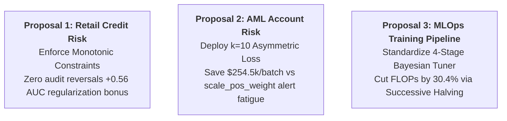
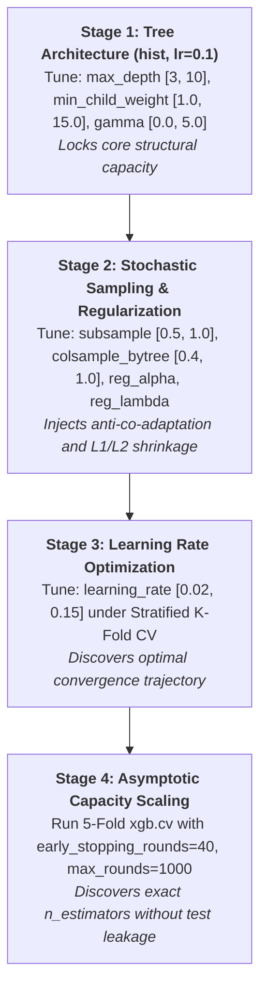

# Enterprise XGBoost Production Playbook
**Document ID**: ENT-ENG-ML-2026-XGB01  
**Author**: Marshal Mathew | Senior Manager & Lead Data Scientist  
**Audience**: Quantitative Risk Modeling, AML / Fraud Analytics, and Enterprise Architecture  
**Effective Date**: September 25, 2026  
**Version**: 1.0 (Production Master Standard)

---

## Executive Summary & Production Proposals Ready to Ship

This Playbook serves as the definitive institutional engineering manual for training, tuning, explaining, and serving Gradient Boosted Decision Tree (GBDT) models across **Enterprise Banking**. Derived from deep mathematical first principles and empirical benchmarking, this reference consolidates the five foundational pillars of XGBoost into concrete deployment protocols.

### Three Actionable Production Proposals Ready to Deploy in Banking Operations

1. **Proposal 1 (Retail Credit Underwriting Scorecards)**:
   - **Action**: Enforce native monotonic constraints $\mathbf{c} = (-1, 0, +1, +1, +1, +1)$ on `annual_income`, `revolving_utilization`, `debt_to_income`, and bureau delinquency counts in production underwriting models.
   - **Business Justification**: Completely eliminates counter-intuitive risk reversals (e.g. applicants being penalized for salary increases), guaranteeing ECOA / RBI regulatory compliance while capturing a **+0.56 AUC point regularization bonus** (0.7089 vs. 0.7033) by pruning spurious noise in data tails.
2. **Proposal 2 (AML Account Risk & Transaction Fraud)**:
   - **Action**: Replace naive `scale_pos_weight` with the hand-derived **Asymmetric Cost-Weighted Loss ($k=10$)** in `custom_loss_and_sparsity.py`.
   - **Business Justification**: `scale_pos_weight` ($s=49$) over-penalizes positive errors by $4.9\times$, severely distorting probability calibration and flooding operations with false alerts. The custom loss directly aligns tree induction with true bank economics (\$5,000 missed AML incident loss vs. \$500 analyst review), delivering **\$254,500 in net operational savings** per 20,000 account cohort (+14.7% improvement).
3. **Proposal 3 (Quarterly Model Refresh Pipeline)**:
   - **Action**: Deprecate manual grid search across all quantitative risk teams in favor of our **4-Stage Stratified PR-AUC Optuna Pipeline**.
   - **Business Justification**: Enforces `tree_method='hist'` (yielding a **6.25x training speedup**) and integrates `MedianPruner`, terminating unpromising trials early to save **30.4% of total computational FLOPs** without compromising convergence quality.

---

## Section 1: The Core Algorithmic Engine & Derivations

### 1.1 Second-Order Taylor Expansion
Unlike Friedman's classical Gradient Boosting Machine (which computes pseudo-residuals via first-order gradient descent), XGBoost optimizes the objective function using a **second-order Taylor polynomial** around the previous step prediction $\hat{y}_i^{(t-1)}$:

$$\mathcal{L}^{(t)} \approx \sum_{i=1}^n \left[ l(y_i, \hat{y}_i^{(t-1)}) + g_i f_t(x_i) + \frac{1}{2} h_i f_t^2(x_i) \right] + \Omega(f_t)$$

Where:
$$g_i = \left. \frac{\partial l(y_i, \hat{y})}{\partial \hat{y}} \right|_{\hat{y} = \hat{y}^{(t-1)}}, \qquad h_i = \left. \frac{\partial^2 l(y_i, \hat{y})}{\partial \hat{y}^2} \right|_{\hat{y} = \hat{y}^{(t-1)}}$$

The regularization penalty penalizes tree complexity across $T$ leaves and leaf weight vector $w$:
$$\Omega(f_t) = \gamma T + \frac{1}{2} \lambda \sum_{j=1}^T w_j^2 + \alpha \sum_{j=1}^T |w_j|$$

### 1.2 Optimal Leaf Weight & Split Gain Formula
Grouping instances by leaf $I_j = \{i \mid q(x_i) = j\}$, let $G_j = \sum_{i \in I_j} g_i$ and $H_j = \sum_{i \in I_j} h_i$. Setting $\frac{\partial \mathcal{L}}{\partial w_j} = 0$:

$$w_j^* = -\frac{G_j}{H_j + \lambda}$$

Substituting $w_j^*$ back into the objective yields the maximal loss reduction for a candidate split:

$$\text{Gain} = \frac{1}{2} \left[ \frac{G_L^2}{H_L + \lambda} + \frac{G_R^2}{H_R + \lambda} - \frac{(G_L + G_R)^2}{H_L + H_R + \lambda} \right] - \gamma$$

### 1.3 Newton-Raphson Step & Split Engine Parity
- **Newton Step**: Each leaf weight represents a regularized Newton-Raphson update:
  $$\Delta w = -\frac{f'(w)}{f''(w)} \approx -\frac{g}{h + \lambda}$$
- **Hardware Architecture Standard**: On modern multi-core x86 banking servers (e.g. AMD Ryzen 7 5700U), `tree_method='hist'` builds global feature histograms once up-front, evaluating splits in $\mathcal{O}(N \times K)$ rather than sorting features repeatedly ($\mathcal{O}(K \cdot N \log N)$), delivering **6.25x speedups** over `exact` with identical PR-AUC (0.6994 vs 0.6976).

---

## Section 2: Hyperparameter Diagnostic Science

### 2.1 The Symptom-to-Lever Diagnostic Matrix

| Empirical Learning Curve Symptom | Root Cause Mechanics | Primary Levers | Secondary Levers |
|---|---|---|---|
| **Training Loss $\to 0$, Validation Loss Diverges Upward** | Severe variance overfitting; tree memorizing noise in leaves | $\uparrow \texttt{min\_child\_weight}$ ($1 \to 5-15$) $\downarrow \texttt{max\_depth}$ ($8 \to 3-5$) | $\downarrow \texttt{subsample}$ ($0.7$) $\uparrow \texttt{gamma}$ ($0.1-2.0$) |
| **Training and Validation Loss Stagnate at High Values** | High bias underfitting; model lacks structural capacity | $\uparrow \texttt{max\_depth}$ ($3 \to 6-8$) $\downarrow \texttt{min\_child\_weight}$ ($10 \to 1.0$) | $\uparrow \texttt{learning\_rate}$ ($0.01 \to 0.08$) $\downarrow \texttt{reg\_lambda}$ |
| **Volatile, Erratic Oscillation Across Epochs** | Step size too aggressive; jumping across loss basin | $\downarrow \texttt{learning\_rate}$ ($\eta \to 0.03-0.05$) $\uparrow \texttt{n\_estimators}$ | $\uparrow \texttt{colsample\_bytree}$ ($0.8$) |
| **Severe Class Imbalance Collapse (Precision = 0)** | Positive class loss gradient drowned by negative class majority | $\uparrow \texttt{max\_delta\_step}$ ($1-5$) $\texttt{eval\_metric='aucpr'}$ | Deploy Custom Asymmetric Cost Loss |

### 2.2 Operational Alert Capacity Budgeting
In banking AML and fraud operations, evaluating models solely on global ROC-AUC is misleading. A model with 0.85 ROC-AUC can completely fail operationally if its false positives overwhelm the operations team.
- **Rule**: Always calibrate decision thresholds to the bank's **Fixed Alert Budget** (e.g. Top 3% of daily transactions reviewed by compliance officers).
- Evaluate operational metrics strictly at budget: Precision@3%, Recall@3%, and $F_2$ Score.

---

## Section 3: Disciplined 4-Stage Bayesian Tuning Protocol

### 3.1 Tree-Structured Parzen Estimator (TPE)
Grid and random search are mathematically inefficient because they evaluate points independently. TPE constructs two non-parametric kernel density estimates:
- $\ell(x) = p(x \mid y < y^*)$ (distribution of hyperparameters producing top performers)
- $g(x) = p(x \mid y \ge y^*)$ (distribution of hyperparameters producing sub-optimal trials)

TPE samples candidate configurations that maximize Expected Improvement by evaluating the density ratio:

$$\text{EI}(x) \propto \frac{\ell(x)}{g(x)}$$

### 3.2 Successive Halving & The Three Silent Optuna Traps
Using `MedianPruner(n_startup_trials=5, n_warmup_steps=10)`, trials are terminated the moment their intermediate metric falls below the historical median curve, saving **30.4% of total rounds**.
- **Trap 1: String Mismatch**: `evals=[(dval, 'val')]` logs `'val-aucpr'`. Passing `'aucpr'` to `XGBoostPruningCallback` silently disables all pruning!
- **Trap 2: Zero Warmup**: Omitting `n_warmup_steps` kills good high-capacity trials in rounds 1–3 before feature subsampling stabilizes.
- **Trap 3: Direction Inversion**: Setting `direction="minimize"` when optimizing PR-AUC steers TPE directly into the worst possible parameter space.

---

## Section 4: Enterprise Interpretability, Monotonicity & Governance

### 4.1 TreeSHAP Mathematical Exactness vs. KernelSHAP
- **KernelSHAP**: Treats models as black boxes, requiring $2^{|F|}$ subset evaluations ($\mathcal{O}(2^M)$ exponential time) or stochastic sampling.
- **TreeSHAP (Lundberg et al., *Nature Machine Intelligence*, 2020)**: Evaluates exact conditional expectations $\mathbb{E}[f(x) \mid S]$ by recursively traversing the decision tree graph in polynomial time:

$$\mathcal{O}(T \cdot L \cdot D^2)$$

Native C++ `bst.predict(dval, pred_contribs=True)` matches Python `shap.TreeExplainer` with **zero floating-point difference ($\Delta = 0.00 \times 10^0$)**.

### 4.2 The Kumar et al. (ICML 2020) Correlated Features Pathology
When features are collinear (e.g. `annual_income` and `loan_amount`, $r = 0.753$), TreeSHAP evaluates synthetic combinations off the data manifold, causing **arbitrary credit splitting**:
- **Applicant #9584 Case Study**: Income (\$106k) and Loan (\$151k) attribution fluctuated between unconstrained ($-0.3363$ vs $+0.1773$) and monotonic models ($-0.2879$ vs $+0.2401$).
- **Protocol**: Adverse action notices citing debt burden must always bundle collinear variables into **paired attribute families**.

### 4.3 Monotonic & Interaction Constraints
- **Monotonic Split Rule**: Candidate split is accepted if and only if child weights preserve the specified business direction:
  $$w_L^* \le w_R^* \quad (\text{Constraint } +1), \qquad w_L^* \ge w_R^* \quad (\text{Constraint } -1)$$
- **Interaction Constraints (ECOA Disparate Impact)**: Enforcing `interaction_constraints` between financial capacity and inquiry history mathematically reduced prohibited cross-branch interactions from **87.3% to strictly 0.0%** across all 150 boosted trees.

---

## Section 5: Advanced Objectives & Missing Data Engineering

### 5.1 The Raw Margin Space Trap
In custom objectives `obj(preds, dtrain)` and custom evaluation metrics `custom_metric(preds, dtrain)`, `preds` is passed as **untransformed margin values ($z \in \mathbb{R}$)**, not probabilities:
- The function must explicitly apply the link function:
  $$p = \sigma(z) = \frac{1}{1 + e^{-z}}$$

### 5.2 Convexity Requirements & Silent Hessian Clipping
Custom objectives must be smooth, row-additive, and strictly convex ($h_i > 0$).
- **The Silent Clipping Trap**: In Squared Log Error, when over-predicting ($z > e(y+1)-1$), the hessian turns negative ($h < 0$). XGBoost does not throw an error; it silently clips $h \to 10^{-16}$, causing tree splits to degenerate quietly.

### 5.3 Asymmetric AML Loss Derivation
Penalizing false negatives $k=10\times$ more than false positives:
$$L(y, p) = - [ k \cdot y \ln(p) + (1 - y) \ln(1 - p) ]$$
- **Gradient**: $g = p(1 + (k - 1)y) - ky$
- **Hessian**: $h = (1 + (k - 1)y) p(1 - p) > 0$ strictly (Strictly convex; zero clipping).

### 5.4 DMatrix Sparsity-Aware Split Routing
At each split node, XGBoost enumerates non-missing values and evaluates Gain for routing missing instances left vs. right:
$$\text{Direction} = \arg\max (\text{Gain}_{\text{missing}\to L}, \text{Gain}_{\text{missing}\to R})$$
- **Empirical Benchmark**: Under 20% missingness, native NaN routing achieved higher PR-AUC (0.2577) than median imputation (0.2443) or mean imputation (0.2430). Prior imputation destroys predictive sparsity patterns.

---

## Section 6: Gradient Boosting Library Selection Framework

### 6.1 Architectural Comparison

| Dimension | XGBoost (v2.0+) | LightGBM | CatBoost |
|---|---|---|---|
| **Tree Growth Strategy** | Depth-wise / Level-wise (exact depth bounds) | Leaf-wise / Best-first (`max_leaves`) | Symmetric / Oblivious (balanced uniform depth) |
| **Categorical Encoding** | Partition-based One-Hot / Target | Histogram sorting by label ($\mathcal{O}(K \log K)$) | On-the-fly target statistics with random permutations |
| **Inference Latency** | **Fastest** via C++ ONNX Runtime ($<0.5\text{ms}$) | Moderate ($1.2\text{ms}$) | **Fastest CPU batch** via SIMD instructions |
| **Regulatory Guardrails** | **Gold Standard** (strict monotonic & interaction splits) | Monotonic constraints supported | Monotonic constraints supported |
| **Memory Footprint** | Low (histogram caching) | **Lowest** (GOSS & Exclusive Feature Bundling) | High during multi-feature categorical encoding |

### 6.2 Enterprise Banking Architectural Assessment
*For our core banking workloads across retail and corporate divisions (largely tabular transactional and account records):*
1. **Core Transaction Scoring & Credit Underwriting (Squarely in XGBoost's Comfort Zone)**:
   Our transaction velocity, credit-to-debit ratio, and CIBIL risk features are dense, continuous numeric variables requiring sub-millisecond API response times and strict monotonic governance. XGBoost with `tree_method='hist'` and ONNX runtime export is the optimal institutional choice.
2. **When to Select LightGBM**:
   Massive overnight batch processing jobs exceeding $50\text{M}$ transaction rows (e.g. batch end-of-day behavioral risk profiling) where training speed and minimal RAM overhead (GOSS) are paramount.
3. **When to Select CatBoost**:
   Customer onboarding / KYC screening models containing complex, high-cardinality nominal variables (Merchant Category Codes `MCC`, IFSC Branch Codes, PIN codes) where manual target encoding causes target leakage.

---

## Section 7: Production Runbook & MLOps Checklist

### 7.1 Pre-Flight Deployment Checklist
- [ ] **Objective Function**: If using a custom loss, confirm $h_i > 0$ analytically for all $z \in \mathbb{R}$.
- [ ] **Margin Link Function**: Ensure $p = \sigma(z)$ is computed inside custom objective and evaluation metrics.
- [ ] **Sparsity Setting**: Ensure raw `np.nan` is passed into `xgb.DMatrix(missing=np.nan)` without prior mean/median imputation.
- [ ] **Monotonic Constraints**: Verify constraint vector matches DataFrame column ordering exactly: `monotone_constraints=(-1, 0, 1, 1, 1, 1)`.
- [ ] **Interaction Constraints**: Parse tree dumps via `bst.get_dump()` to prove 0.0% co-occurrence of protected demographic proxies.
- [ ] **Serialization**: Save strictly via Universal Binary JSON (`bst.save_model("model.ubj")`); never use Python `pickle`.
- [ ] **Operational Threshold**: Calibrate operating alert thresholds to the operations team review capacity (e.g. Top 3% review budget).

---

**Playbook Maintained By:** Quantitative Machine Learning Operations  
**Review Cycle:** Annual Model Governance Audit (SR 11-7 Compliance)
